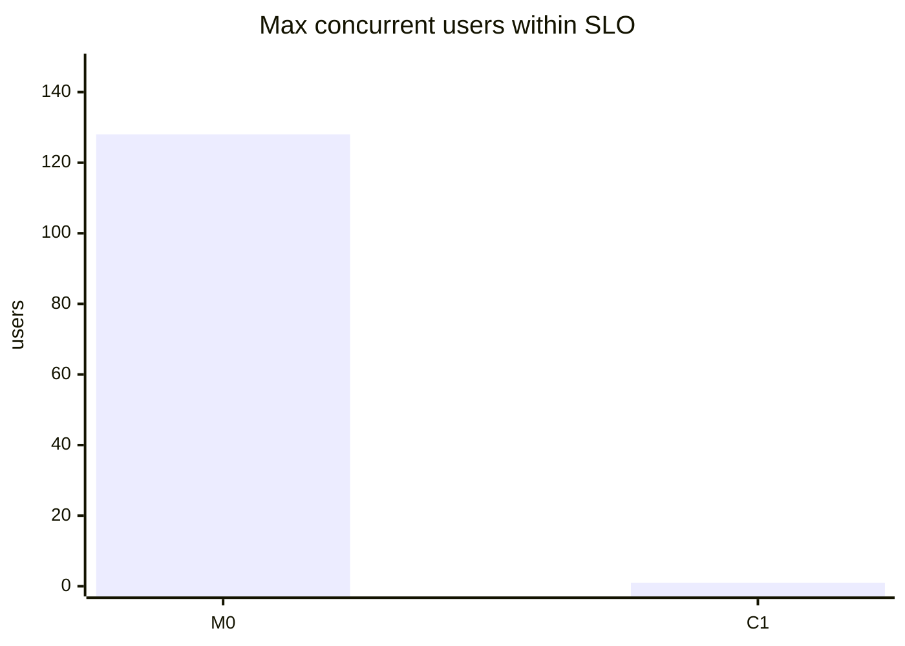
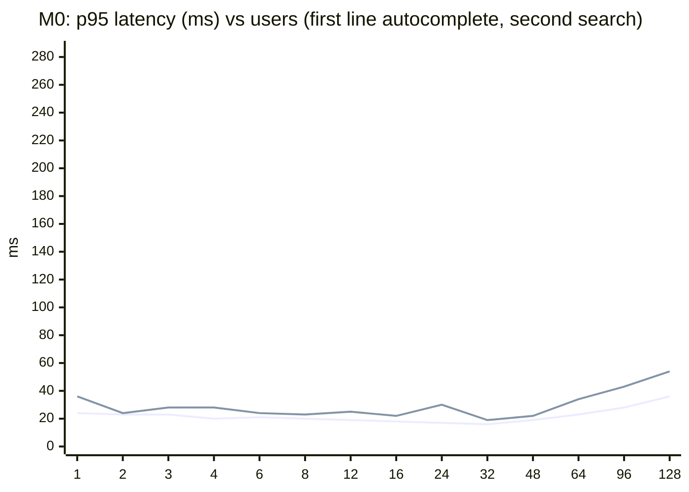
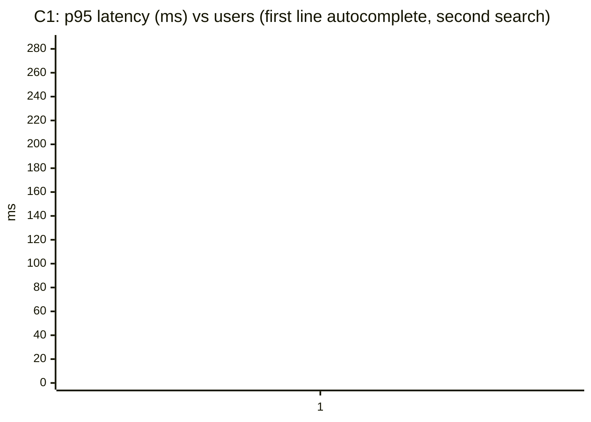

# Load Test Results: Pelias

Run `20260918-1814`; method and SLOs in [LOAD_TEST_PLAN.md](LOAD_TEST_PLAN.md). Latencies in ms (steady state, warm caches). Direct to the API, no edge rate limits.

## Summary

| Config | Resources | 3 users: pass | ac p95 | search p95 | struct p95 | rev p95 | Stack CPU p95 at 3 | Max users in SLO | Breaking point | First limit hit |
|---|---|---|---|---|---|---|---|---|---|---|
| M0 | all CPU / unlimited / heap 4g / 1 API worker(s) | yes | 24 | 32 | 29 | 20 | 25% | 128 | - | no SLO failure within the ramp |
| C1 | 1 CPU / 7.3 GB / heap 768m / 1 API worker(s) | **no** | 79 | 151 | 156 | 3,444 | 102% | 1 | 1 | container died at 1 users (pip, interpolation) |

## Latency and throughput vs users

## Query types at 3 users

p50 / p95 ms by query quality (exact, typo, off-name variant, complete miss).

| Config | exact | typo | variant | miss |
|---|---|---|---|---|
| M0 | - | - | - | - |
| C1 | - | - | - | - |

## Ramp detail per configuration

### M0: all CPU / unlimited / heap 4g / 1 API worker(s)

| Users | req/s | Errors | ac p95 | search p95 | struct p95 | rev p95 | miss p95 | Stack CPU p95 | Busiest service | Peak mem (MB) | Result |
|---|---|---|---|---|---|---|---|---|---|---|---|
| 1 | 0.8 | 0.0% | 24 | 36 | - | 24 | - | 7% | elasticsearch (4%) | 9,571 | pass |
| 2 | 2.3 | 0.0% | 23 | 24 | - | 21 | - | 14% | elasticsearch (4%) | 9,586 | pass |
| 3 | 2.5 | 0.0% | 23 | 28 | 18 | 20 | - | 25% | api (14%) | 9,611 | pass |
| 4 | 4.9 | 0.0% | 20 | 28 | 20 | 18 | - | 28% | elasticsearch (16%) | 9,639 | pass |
| 6 | 8.0 | 0.0% | 21 | 24 | 9 | 20 | - | 30% | api (18%) | 9,667 | pass |
| 8 | 7.4 | 0.0% | 20 | 23 | 20 | 18 | - | 42% | elasticsearch (29%) | 9,697 | pass |
| 12 | 13.9 | 0.0% | 19 | 25 | 26 | 19 | - | 46% | api (25%) | 9,739 | pass |
| 16 | 15.8 | 0.0% | 18 | 22 | 20 | 19 | - | 48% | api (23%) | 9,783 | pass |
| 24 | 28.5 | 0.0% | 17 | 30 | 16 | 16 | - | 64% | api (33%) | 9,841 | pass |
| 32 | 33.6 | 0.0% | 16 | 19 | 22 | 14 | - | 68% | elasticsearch (35%) | 9,918 | pass |
| 48 | 52.4 | 0.0% | 19 | 22 | 20 | 19 | - | 81% | api (42%) | 10,217 | pass |
| 64 | 65.2 | 0.0% | 23 | 34 | 24 | 19 | - | 109% | api (58%) | 10,274 | pass |
| 96 | 108.5 | 0.0% | 28 | 43 | 48 | 32 | - | 140% | api (84%) | 10,342 | pass |
| 128 | 142.3 | 0.0% | 36 | 54 | 62 | 38 | - | 165% | api (102%) | 10,408 | pass |

### C1: 1 CPU / 7.3 GB / heap 768m / 1 API worker(s)

| Users | req/s | Errors | ac p95 | search p95 | struct p95 | rev p95 | miss p95 | Stack CPU p95 | Busiest service | Peak mem (MB) | Result |
|---|---|---|---|---|---|---|---|---|---|---|---|
| 1 | 0.9 | 0.0% | 45 | - | 26 | 34 | - | 98% | interpolation (98%) | 5,235 | DIED |

