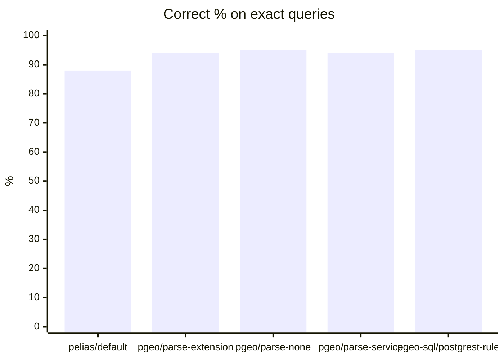
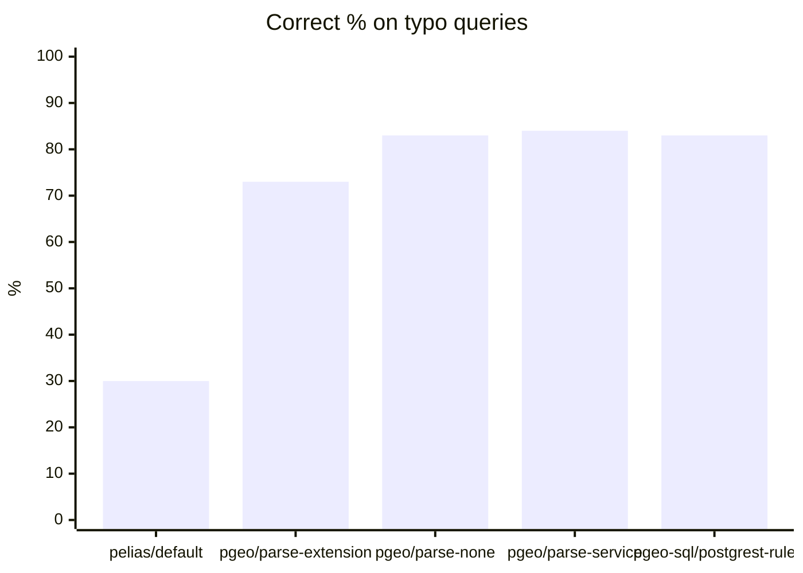
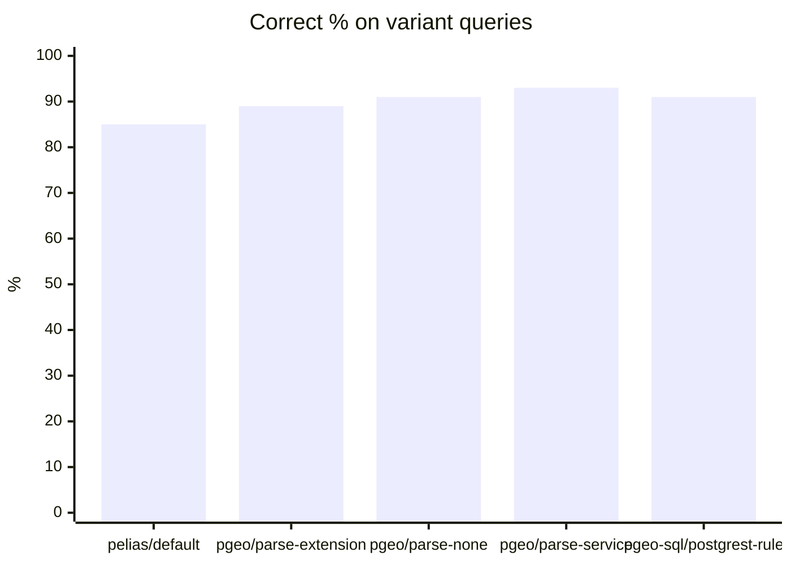
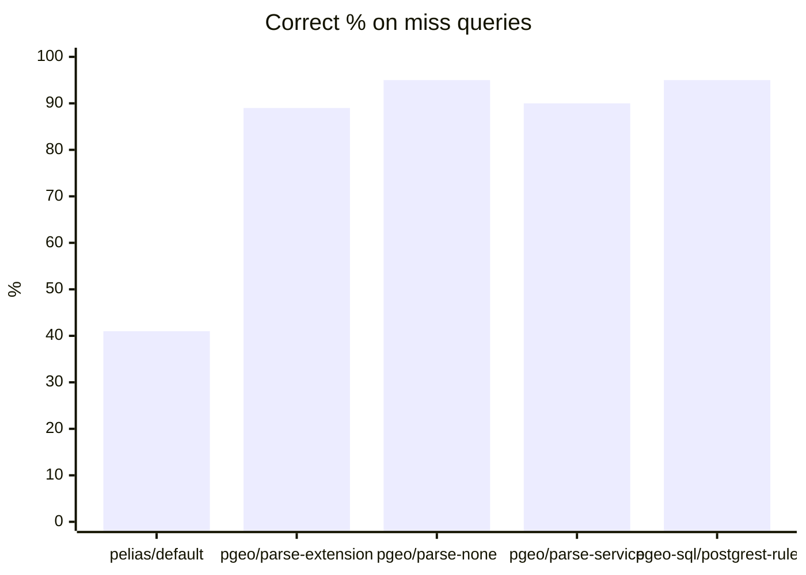
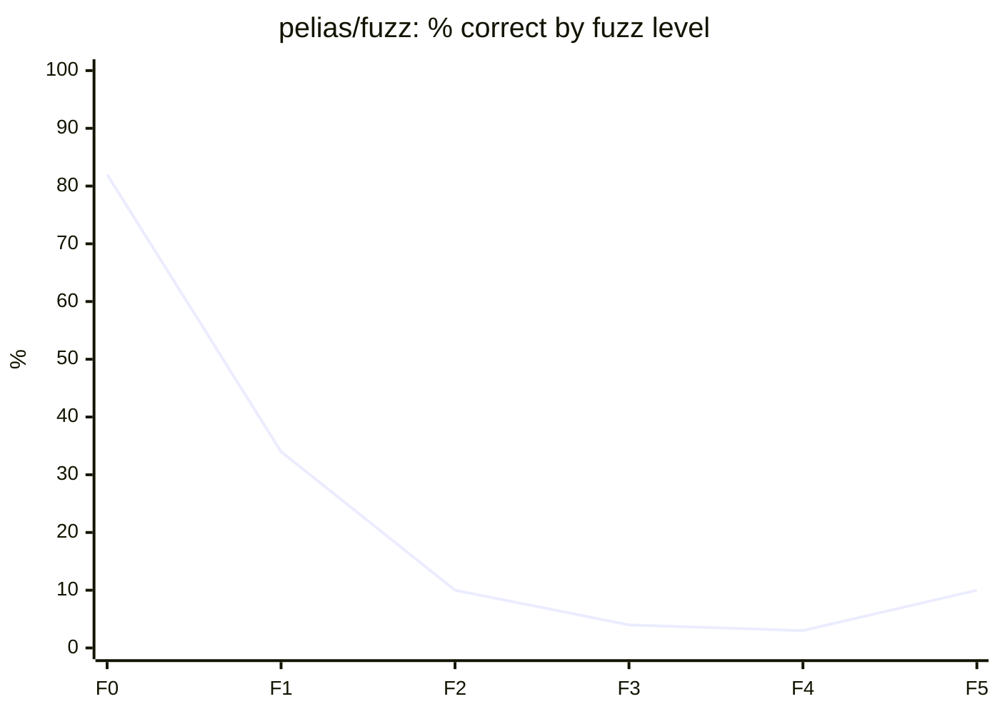
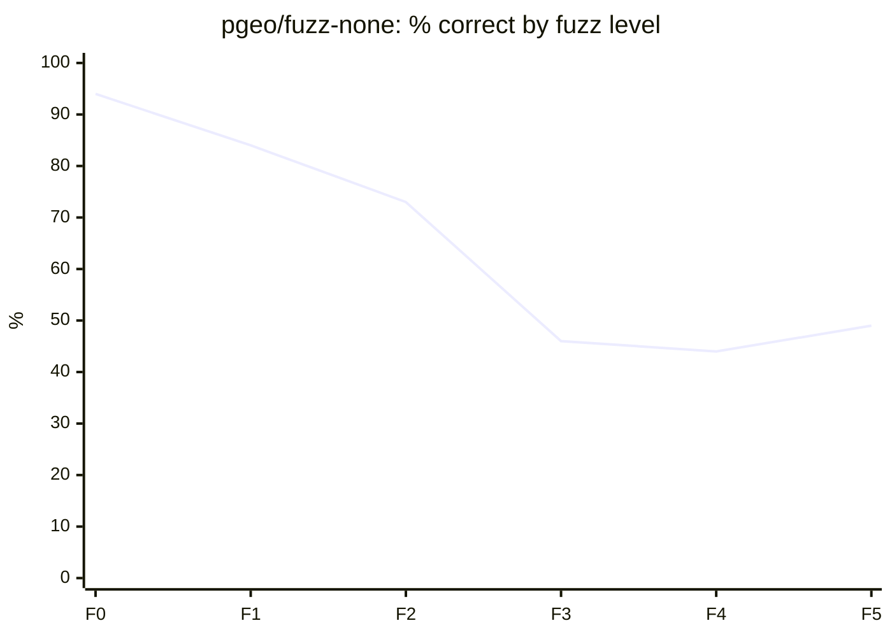
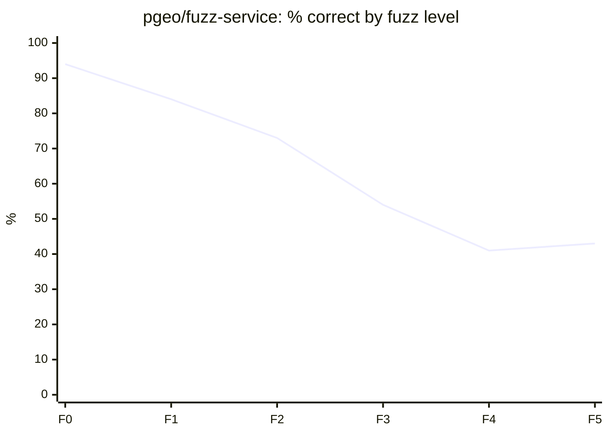

# Accuracy Results

Test set: `tests/accuracy/cases.json` (seeded; ground truth from the source data, independent of both engines). "Correct" = right place at rank 1 (autocomplete: in the top 5); misses are correct when nothing, or nothing with confidence >= 0.8, is returned.

## Overall

| Engine / config | Correct | hit@1 | hit@5 | Median error (m) | No result | Conf. when right | Conf. when wrong | p50 ms |
|---|---|---|---|---|---|---|---|---|
| pelias/default | 76% | 77% | 84% | 0.0 | 5% | 0.983 | 0.87 | 13.3 |
| pgeo/parse-extension | 90% | 89% | 96% | 0.0 | 4% | 0.937 | 0.907 | 79.1 |
| pgeo/parse-none | 93% | 91% | 97% | 0.0 | 5% | 0.91 | 0.702 | 87.8 |
| pgeo/parse-service | 93% | 91% | 96% | 0.0 | 4% | 0.898 | 0.581 | 88.5 |
| pgeo-sql/postgrest-rule | 93% | 91% | 97% | 0.0 | 5% | 0.91 | 0.702 | 92.7 |

## By query quality

| Engine / config | exact | typo | variant | miss |
|---|---|---|---|---|
| pelias/default | 88% | 30% | 85% | 41% |
| pgeo/parse-extension | 94% | 73% | 89% | 89% |
| pgeo/parse-none | 95% | 83% | 91% | 95% |
| pgeo/parse-service | 94% | 84% | 93% | 90% |
| pgeo-sql/postgrest-rule | 95% | 83% | 91% | 95% |

## By endpoint

| Engine / config | search | structured | autocomplete | reverse |
|---|---|---|---|---|
| pelias/default | 66% | 97% | 87% | 100% |
| pgeo/parse-extension | 87% | 100% | 93% | 100% |
| pgeo/parse-none | 90% | 100% | 95% | 100% |
| pgeo/parse-service | 90% | 100% | 95% | 100% |
| pgeo-sql/postgrest-rule | 90% | 100% | 95% | 100% |

## By kind of place

| Engine / config | address | town | lake_summit | venue | zip | reverse_address | miss |
|---|---|---|---|---|---|---|---|
| pelias/default | 88% | 81% | 37% | 60% | 100% | 100% | 41% |
| pgeo/parse-extension | 98% | 94% | 59% | 82% | 98% | 100% | 89% |
| pgeo/parse-none | 98% | 96% | 77% | 80% | 98% | 100% | 95% |
| pgeo/parse-service | 98% | 96% | 76% | 82% | 98% | 100% | 90% |
| pgeo-sql/postgrest-rule | 98% | 96% | 77% | 80% | 98% | 100% | 95% |

## Search detail (endpoint / query type)

| Engine / config | group | n | correct | hit@1 | hit@5 | median error (m) | no result |
|---|---|---|---|---|---|---|---|
| pelias/default | autocomplete/exact | 150 | 87% | 67% | 87% | 0.1 | 0% |
| pelias/default | reverse/exact | 200 | 100% | 100% | 100% | 0.0 | 0% |
| pelias/default | search/exact | 563 | 81% | 81% | 88% | 0.0 | 0% |
| pelias/default | search/miss | 150 | 41% | - | - | None | 39% |
| pelias/default | search/typo | 198 | 30% | 30% | 40% | 5249.5 | 13% |
| pelias/default | search/variant | 149 | 85% | 85% | 87% | 0.0 | 0% |
| pelias/default | structured/exact | 150 | 97% | 97% | 97% | 0.0 | 0% |
| pgeo/parse-extension | autocomplete/exact | 150 | 93% | 82% | 93% | 0.0 | 0% |
| pgeo/parse-extension | reverse/exact | 200 | 100% | 100% | 100% | 0.0 | 0% |
| pgeo/parse-extension | search/exact | 563 | 91% | 91% | 97% | 0.0 | 0% |
| pgeo/parse-extension | search/miss | 150 | 89% | - | - | None | 34% |
| pgeo/parse-extension | search/typo | 198 | 73% | 73% | 90% | 0.0 | 2% |
| pgeo/parse-extension | search/variant | 149 | 89% | 89% | 94% | 0.0 | 3% |
| pgeo/parse-extension | structured/exact | 150 | 100% | 100% | 100% | 0.0 | 0% |
| pgeo/parse-none | autocomplete/exact | 150 | 95% | 81% | 95% | 0.0 | 0% |
| pgeo/parse-none | reverse/exact | 200 | 100% | 100% | 100% | 0.0 | 0% |
| pgeo/parse-none | search/exact | 563 | 91% | 91% | 96% | 0.0 | 0% |
| pgeo/parse-none | search/miss | 150 | 95% | - | - | None | 49% |
| pgeo/parse-none | search/typo | 198 | 83% | 83% | 92% | 0.0 | 2% |
| pgeo/parse-none | search/variant | 149 | 91% | 91% | 97% | 0.0 | 0% |
| pgeo/parse-none | structured/exact | 150 | 100% | 100% | 100% | 0.0 | 0% |
| pgeo/parse-service | autocomplete/exact | 150 | 95% | 81% | 95% | 0.0 | 0% |
| pgeo/parse-service | reverse/exact | 200 | 100% | 100% | 100% | 0.0 | 0% |
| pgeo/parse-service | search/exact | 563 | 91% | 91% | 96% | 0.0 | 0% |
| pgeo/parse-service | search/miss | 150 | 90% | - | - | None | 34% |
| pgeo/parse-service | search/typo | 198 | 84% | 84% | 92% | 0.0 | 2% |
| pgeo/parse-service | search/variant | 149 | 93% | 93% | 94% | 0.0 | 3% |
| pgeo/parse-service | structured/exact | 150 | 100% | 100% | 100% | 0.0 | 0% |
| pgeo-sql/postgrest-rule | autocomplete/exact | 150 | 95% | 81% | 95% | 0.0 | 0% |
| pgeo-sql/postgrest-rule | reverse/exact | 200 | 100% | 100% | 100% | 0.0 | 0% |
| pgeo-sql/postgrest-rule | search/exact | 563 | 91% | 91% | 96% | 0.0 | 0% |
| pgeo-sql/postgrest-rule | search/miss | 150 | 95% | - | - | None | 49% |
| pgeo-sql/postgrest-rule | search/typo | 198 | 83% | 83% | 92% | 0.0 | 2% |
| pgeo-sql/postgrest-rule | search/variant | 149 | 91% | 91% | 97% | 0.0 | 0% |
| pgeo-sql/postgrest-rule | structured/exact | 150 | 100% | 100% | 100% | 0.0 | 0% |

## Accuracy vs fuzziness (rounds F0-F5)

Same 300 base queries at every level: F0 exact, F1 one typo, F2 two, F3 three + abbreviation flips + no commas, F4 F3 + a dropped component / word order, F5 heavy phonetic corruption (tests/accuracy/build_fuzz_rounds.py).

| Engine / config | F0 | F1 | F2 | F3 | F4 | F5 |
|---|---|---|---|---|---|---|
| pelias/fuzz | 82% | 34% | 10% | 4% | 3% | 10% |
| pgeo/fuzz-none | 94% | 84% | 73% | 46% | 44% | 49% |
| pgeo/fuzz-service | 94% | 84% | 73% | 54% | 41% | 43% |

**address**

| Engine / config | F0 | F1 | F2 | F3 | F4 | F5 |
|---|---|---|---|---|---|---|
| pelias/fuzz | 97% | 45% | 15% | 7% | 4% | 13% |
| pgeo/fuzz-none | 99% | 95% | 88% | 47% | 42% | 59% |
| pgeo/fuzz-service | 98% | 94% | 90% | 62% | 36% | 49% |

**town**

| Engine / config | F0 | F1 | F2 | F3 | F4 | F5 |
|---|---|---|---|---|---|---|
| pelias/fuzz | 92% | 26% | 6% | 0% | 4% | 12% |
| pgeo/fuzz-none | 98% | 74% | 44% | 30% | 40% | 30% |
| pgeo/fuzz-service | 98% | 78% | 42% | 34% | 40% | 30% |

**lake_summit**

| Engine / config | F0 | F1 | F2 | F3 | F4 | F5 |
|---|---|---|---|---|---|---|
| pelias/fuzz | 38% | 18% | 4% | 0% | 2% | 2% |
| pgeo/fuzz-none | 84% | 70% | 72% | 60% | 52% | 38% |
| pgeo/fuzz-service | 86% | 72% | 70% | 56% | 52% | 38% |

**venue**

| Engine / config | F0 | F1 | F2 | F3 | F4 | F5 |
|---|---|---|---|---|---|---|
| pelias/fuzz | 72% | 22% | 6% | 2% | 0% | 4% |
| pgeo/fuzz-none | 86% | 74% | 60% | 48% | 48% | 46% |
| pgeo/fuzz-service | 86% | 74% | 58% | 46% | 48% | 44% |

