# Load Test Results: Pelias

Runs `20260918-1834`, `20260918-2051`, `20260919-0718`; method and SLOs in [LOAD_TEST_PLAN.md](LOAD_TEST_PLAN.md). Latencies in ms (steady state, warm caches). Direct to the API, no edge rate limits.

## Summary

| Config | Resources | 3 users: pass | ac p95 | search p95 | struct p95 | rev p95 | Stack CPU p95 at 3 | Max users in SLO | Breaking point | First limit hit |
|---|---|---|---|---|---|---|---|---|---|---|
| M0 | all CPU / unlimited / heap 4g / 1 API worker(s) | yes | 23 | 27 | 25 | 25 | 28% | 192 | 384 | p95 over target: autocomplete, reverse at 256 users; busiest service api (119% CPU) |
| C1 | 1 CPU / 8.3 GB / heap 768m / 1 API worker(s) | yes | 37 | 50 | 40 | 40 | 23% | 96 | 192 | p95 over target: autocomplete, search, reverse at 128 users; busiest service api (66% CPU) |
| C1s | 1 CPU / 9.1 GB / heap 768m / 1 API worker(s) | yes | 34 | 49 | 48 | 39 | 21% | 96 | 192 | p95 over target: autocomplete, reverse at 128 users; busiest service api (66% CPU) |
| C2 | 2 CPU / 8.4 GB / heap 768m / 2 API worker(s) | yes | 22 | 36 | 27 | 26 | 22% | 192 | 384 | p95 over target: autocomplete, reverse at 256 users; busiest service api (130% CPU) |
| C3 | 2 CPU / 9.5 GB / heap 1g / 2 API worker(s) | yes | 19 | 27 | 20 | 39 | 27% | 192 | 384 | p95 over target: autocomplete, reverse at 256 users; busiest service api (131% CPU) |
| C4 | 4 CPU / 10.8 GB / heap 2g / 4 API worker(s) | yes | 23 | 30 | 22 | 25 | 24% | 384 | - | p95 over target: autocomplete, search, structured, reverse at 512 users; busiest service api (266% CPU) |
| C4a | 4 CPU / 10.4 GB / heap 2g / 1 API worker(s) | yes | 23 | 32 | 22 | 22 | 25% | 192 | 384 | p95 over target: autocomplete, search, structured, reverse at 256 users; busiest service api (123% CPU) |

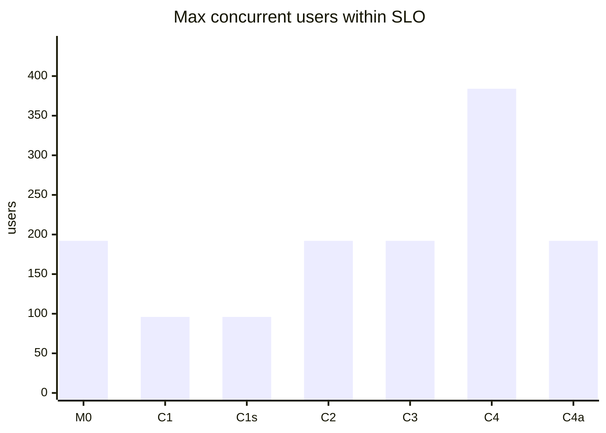
```mermaid
xychart-beta
    title "Max concurrent users within SLO"
    x-axis ["M0", "C1", "C1s", "C2", "C3", "C4", "C4a"]
    y-axis "users" 0 --> 442
    bar [192, 96, 96, 192, 192, 384, 192]
```

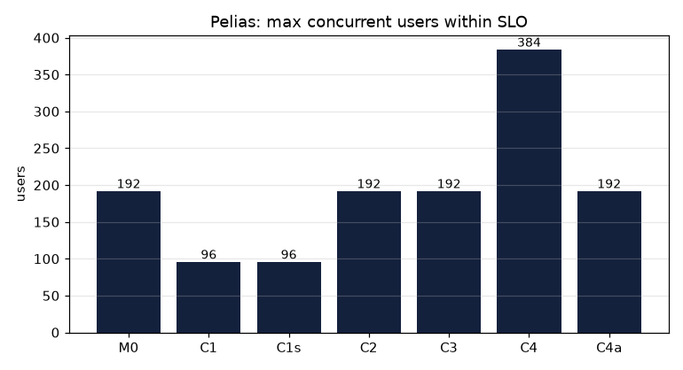

## Latency and throughput vs users

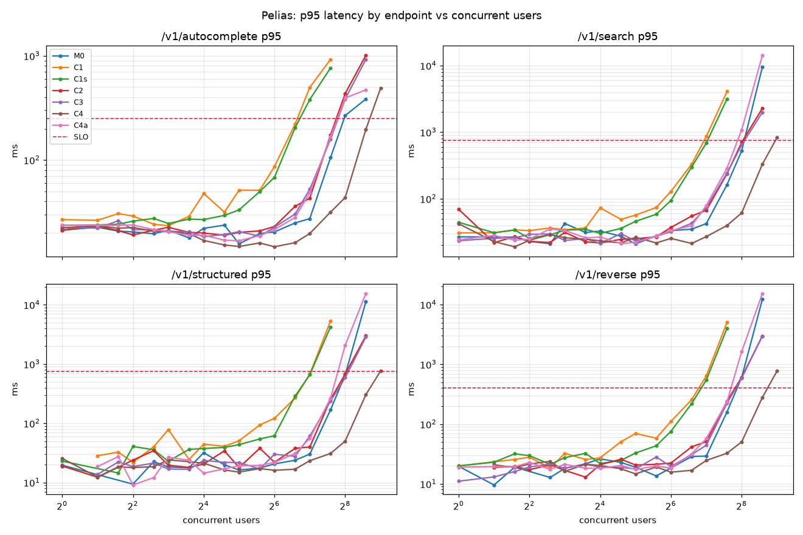

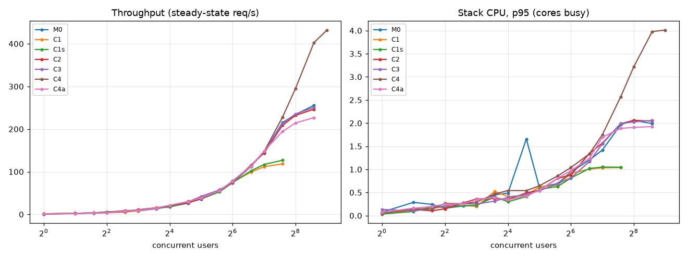

## Query types at 3 users

p50 / p95 ms by query quality (exact, typo, off-name variant, complete miss).

| Config | exact | typo | variant | miss |
|---|---|---|---|---|
| M0 | 8 / 24 | 5 / 21 | 9 / 24 | 5 / 20 |
| C1 | 16 / 38 | 8 / 35 | 16 / 40 | 5 / 27 |
| C1s | 14 / 38 | 8 / 31 | 14 / 47 | 6 / 38 |
| C2 | 10 / 24 | 7 / 19 | 10 / 29 | 7 / 27 |
| C3 | 9 / 19 | 8 / 17 | 11 / 22 | 5 / 12 |
| C4 | 8 / 24 | 7 / 23 | 8 / 24 | 6 / 28 |
| C4a | 8 / 24 | 7 / 21 | 8 / 23 | 5 / 24 |

## Data volume: how more data layers affect performance

Fixed resources (2 CPU / 9.5 GB / heap 1g / 2 API worker(s)); each dataset adds sources (see LOAD_TEST_PLAN.md). p95 ms at 3 users.

| Dataset | Documents | Index (MB) | 3 users: pass | ac p95 | search p95 | struct p95 | rev p95 | miss p95 | ES mem peak (MB) | Max users in SLO | Breaking point |
|---|---|---|---|---|---|---|---|---|---|---|---|
| D1 | 3,280 | 3 | yes | 16 | 21 | 33 | 25 | 10 | 1,540 | 384 | - |
| D2 | 783,540 | 196 | yes | 16 | 37 | 29 | 31 | 16 | 1,551 | 384 | - |
| D3 | 1,552,532 | 371 | yes | 23 | 35 | 50 | 33 | 31 | 1,607 | 256 | 512 |
| D4 | 1,573,062 | 378 | yes | 21 | 28 | 30 | 30 | 17 | 1,479 | 256 | 512 |
| D5 | 1,649,644 | 435 | yes | 26 | 50 | 30 | 23 | 23 | 1,612 | 192 | 384 |

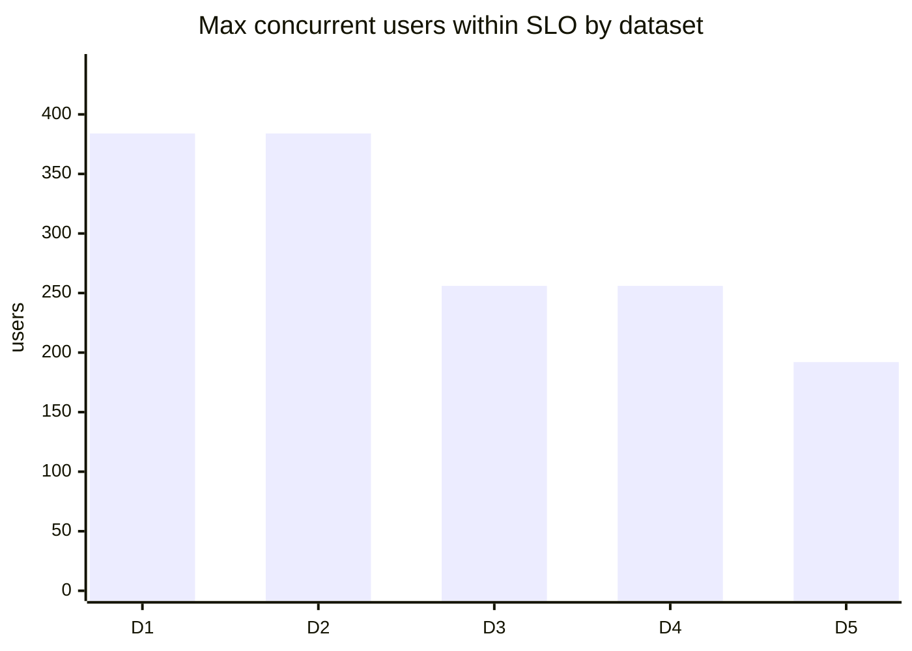
```mermaid
xychart-beta
    title "Max concurrent users within SLO by dataset"
    x-axis ["D1", "D2", "D3", "D4", "D5"]
    y-axis "users" 0 --> 442
    bar [384, 384, 256, 256, 192]
```

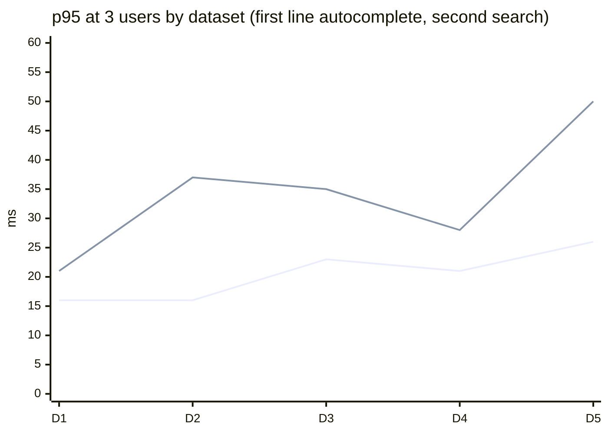
```mermaid
xychart-beta
    title "p95 at 3 users by dataset (first line autocomplete, second search)"
    x-axis ["D1", "D2", "D3", "D4", "D5"]
    y-axis "ms" 0 --> 60
    line [16, 16, 23, 21, 26]
    line [21, 37, 35, 28, 50]
```

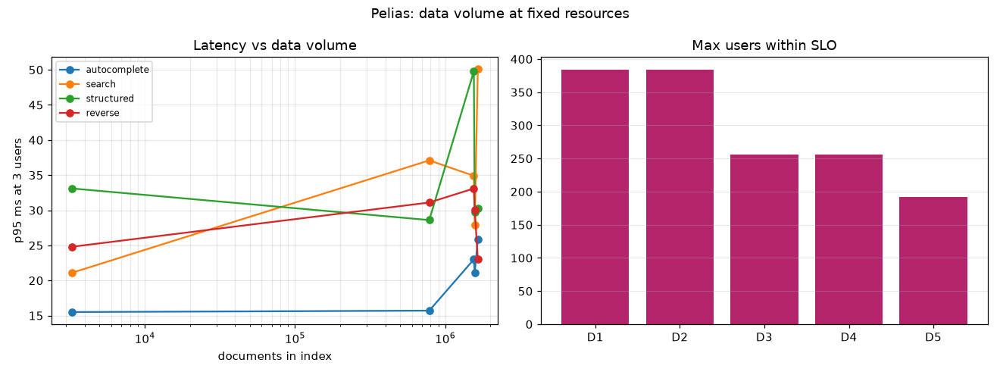

## Ramp detail per configuration

### M0: all CPU / unlimited / heap 4g / 1 API worker(s)

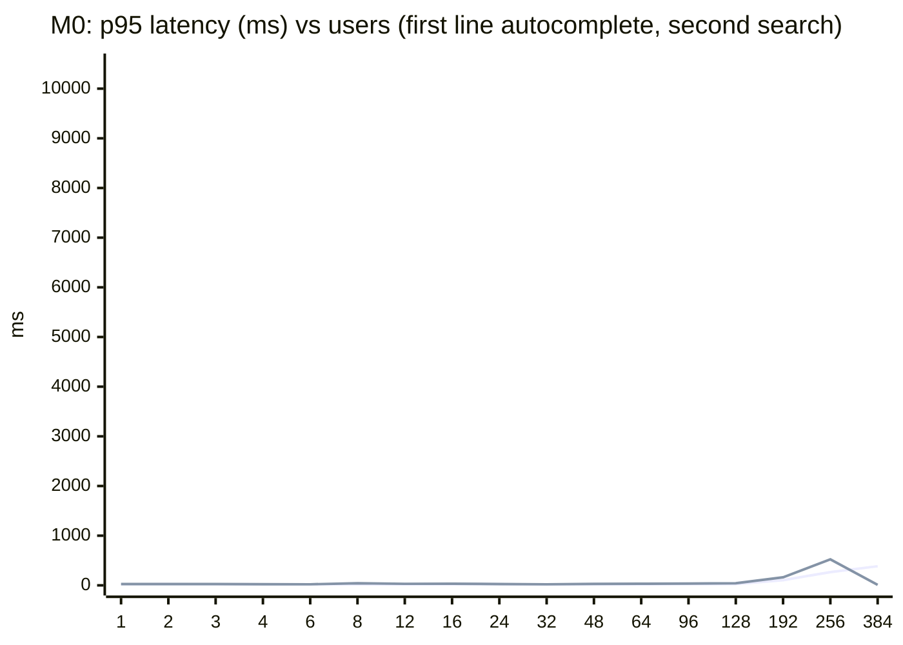
```mermaid
xychart-beta
    title "M0: p95 latency (ms) vs users (first line autocomplete, second search)"
    x-axis [1, 2, 3, 4, 6, 8, 12, 16, 24, 32, 48, 64, 96, 128, 192, 256, 384]
    y-axis "ms" 0 --> 10501
    line [21, 23, 21, 20, 20, 21, 18, 22, 24, 16, 20, 20, 25, 27, 105, 267, 385]
    line [27, 27, 26, 23, 21, 42, 31, 33, 27, 21, 28, 33, 35, 42, 162, 524, 9,547]
```

| Users | req/s | Errors | ac p95 | search p95 | struct p95 | rev p95 | miss p95 | Stack CPU p95 | Busiest service | Peak mem (MB) | Result |
|---|---|---|---|---|---|---|---|---|---|---|---|
| 1 | 1.2 | 0.0% | 21 | 27 | 20 | 20 | 12 | 8% | elasticsearch (4%) | 9,514 | pass |
| 2 | 2.7 | 0.0% | 23 | 27 | - | 10 | 21 | 29% | api (16%) | 9,522 | pass |
| 3 | 3.1 | 0.0% | 21 | 26 | - | 19 | 12 | 24% | api (9%) | 9,532 | pass |
| 4 | 5.6 | 0.0% | 20 | 23 | 9 | - | 15 | 16% | api (6%) | 9,512 | pass |
| 6 | 7.4 | 0.0% | 20 | 21 | 22 | 13 | 23 | 21% | api (12%) | 9,558 | pass |
| 8 | 8.1 | 0.0% | 21 | 42 | 18 | 18 | 21 | 22% | api (12%) | 9,321 | pass |
| 12 | 13.7 | 0.0% | 18 | 31 | 18 | 22 | 15 | 45% | api (21%) | 8,775 | pass |
| 16 | 18.4 | 0.0% | 22 | 33 | 32 | 26 | 22 | 48% | api (32%) | 8,860 | pass |
| 24 | 26.3 | 0.0% | 24 | 27 | 20 | 23 | 20 | 166% | api (74%) | 8,620 | pass |
| 32 | 39.3 | 0.0% | 16 | 21 | 16 | 19 | 15 | 61% | api (42%) | 8,477 | pass |
| 48 | 55.7 | 0.0% | 20 | 28 | 18 | 14 | 16 | 70% | api (36%) | 8,255 | pass |
| 64 | 78.3 | 0.0% | 20 | 33 | 21 | 18 | 15 | 94% | api (56%) | 7,935 | pass |
| 96 | 113.6 | 0.0% | 25 | 35 | 24 | 29 | 21 | 120% | api (69%) | 7,554 | pass |
| 128 | 146.4 | 0.0% | 27 | 42 | 30 | 29 | 26 | 142% | api (85%) | 7,096 | pass |
| 192 | 215.2 | 0.0% | 105 | 162 | 168 | 160 | 95 | 197% | api (114%) | 7,168 | pass |
| 256 | 234.3 | 0.0% | 267 | 524 | 659 | 604 | 279 | 206% | api (119%) | 7,282 | fail |
| 384 | 255.5 | 0.0% | 385 | 9,547 | 11,309 | 12,228 | 545 | 199% | api (121%) | 7,354 | broken |

### C1: 1 CPU / 8.3 GB / heap 768m / 1 API worker(s)

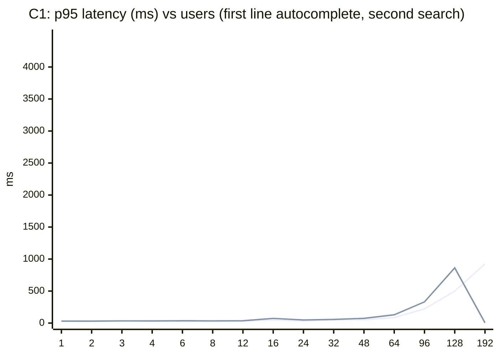
```mermaid
xychart-beta
    title "C1: p95 latency (ms) vs users (first line autocomplete, second search)"
    x-axis [1, 2, 3, 4, 6, 8, 12, 16, 24, 32, 48, 64, 96, 128, 192]
    y-axis "ms" 0 --> 4497
    line [27, 26, 31, 29, 24, 23, 29, 48, 32, 51, 51, 86, 221, 499, 924]
    line [31, 31, 34, 33, 36, 34, 36, 73, 49, 57, 74, 129, 331, 862, 4,089]
```

| Users | req/s | Errors | ac p95 | search p95 | struct p95 | rev p95 | miss p95 | Stack CPU p95 | Busiest service | Peak mem (MB) | Result |
|---|---|---|---|---|---|---|---|---|---|---|---|
| 1 | 1.5 | 0.0% | 27 | 31 | - | 20 | - | 8% | api (5%) | 5,959 | pass |
| 2 | 2.4 | 0.0% | 26 | 31 | 28 | - | 24 | 11% | api (5%) | 5,976 | pass |
| 3 | 3.0 | 0.0% | 31 | 34 | 33 | 26 | 26 | 18% | api (8%) | 6,001 | pass |
| 4 | 4.0 | 0.0% | 29 | 33 | 22 | 28 | - | 19% | elasticsearch (10%) | 6,020 | pass |
| 6 | 5.8 | 0.0% | 24 | 36 | 40 | 18 | 30 | 22% | elasticsearch (18%) | 6,053 | pass |
| 8 | 8.2 | 0.0% | 23 | 34 | 78 | 32 | 25 | 20% | elasticsearch (11%) | 6,093 | pass |
| 12 | 16.0 | 0.0% | 29 | 36 | 25 | 26 | 27 | 52% | elasticsearch (22%) | 6,129 | pass |
| 16 | 19.3 | 0.0% | 48 | 73 | 44 | 27 | 41 | 41% | api (25%) | 6,174 | pass |
| 24 | 28.8 | 0.0% | 32 | 49 | 41 | 51 | 24 | 44% | api (30%) | 6,222 | pass |
| 32 | 37.4 | 0.0% | 51 | 57 | 51 | 70 | 36 | 62% | api (38%) | 6,257 | pass |
| 48 | 54.4 | 0.0% | 51 | 74 | 94 | 58 | 45 | 66% | api (43%) | 6,285 | pass |
| 64 | 75.5 | 0.0% | 86 | 129 | 121 | 111 | 66 | 91% | api (56%) | 6,310 | pass |
| 96 | 99.3 | 0.0% | 221 | 331 | 268 | 257 | 199 | 101% | api (63%) | 6,367 | pass |
| 128 | 111.8 | 0.0% | 499 | 862 | 674 | 642 | 505 | 103% | api (66%) | 6,384 | fail |
| 192 | 118.4 | 0.0% | 924 | 4,089 | 5,336 | 5,071 | 1,119 | 104% | api (68%) | 6,230 | broken |

### C1s: 1 CPU / 9.1 GB / heap 768m / 1 API worker(s)

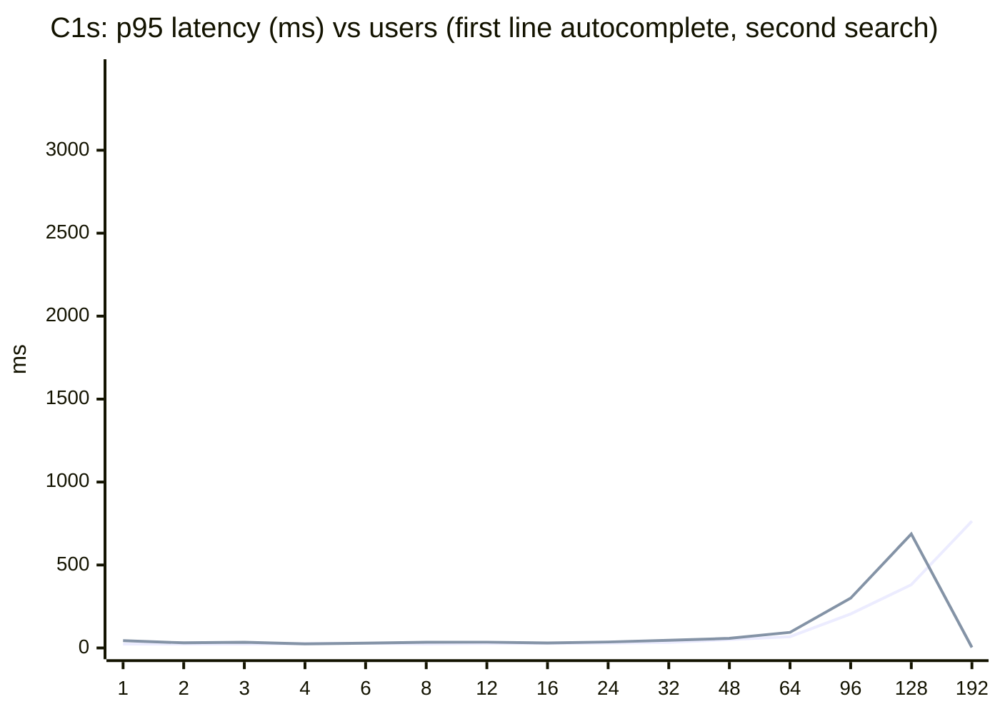
```mermaid
xychart-beta
    title "C1s: p95 latency (ms) vs users (first line autocomplete, second search)"
    x-axis [1, 2, 3, 4, 6, 8, 12, 16, 24, 32, 48, 64, 96, 128, 192]
    y-axis "ms" 0 --> 3480
    line [24, 24, 24, 26, 28, 25, 27, 27, 29, 33, 50, 68, 205, 381, 764]
    line [44, 31, 34, 25, 29, 34, 35, 30, 36, 46, 58, 94, 300, 687, 3,164]
```

| Users | req/s | Errors | ac p95 | search p95 | struct p95 | rev p95 | miss p95 | Stack CPU p95 | Busiest service | Peak mem (MB) | Result |
|---|---|---|---|---|---|---|---|---|---|---|---|
| 1 | 0.7 | 0.0% | 24 | 44 | 23 | 20 | - | 3% | api (2%) | 5,879 | pass |
| 2 | 2.1 | 0.0% | 24 | 31 | - | 23 | 21 | 9% | elasticsearch (5%) | 5,899 | pass |
| 3 | 3.6 | 0.0% | 24 | 34 | 14 | 32 | - | 19% | elasticsearch (13%) | 5,922 | pass |
| 4 | 5.8 | 0.0% | 26 | 25 | 41 | 30 | 26 | 18% | api (9%) | 5,958 | pass |
| 6 | 6.7 | 0.0% | 28 | 29 | 36 | 21 | 24 | 22% | api (13%) | 5,977 | pass |
| 8 | 10.4 | 0.0% | 25 | 34 | 23 | 28 | 18 | 22% | api (15%) | 6,006 | pass |
| 12 | 15.0 | 0.0% | 27 | 35 | 36 | 32 | 26 | 41% | elasticsearch (20%) | 6,002 | pass |
| 16 | 17.4 | 0.0% | 27 | 30 | 38 | 22 | 27 | 30% | api (15%) | 6,051 | pass |
| 24 | 27.5 | 0.0% | 29 | 36 | 39 | 25 | 28 | 41% | api (28%) | 6,099 | pass |
| 32 | 36.2 | 0.0% | 33 | 46 | 44 | 33 | 30 | 57% | api (31%) | 6,147 | pass |
| 48 | 52.9 | 0.0% | 50 | 58 | 54 | 43 | 50 | 63% | api (41%) | 6,195 | pass |
| 64 | 74.5 | 0.0% | 68 | 94 | 62 | 76 | 60 | 81% | api (49%) | 6,230 | pass |
| 96 | 102.2 | 0.0% | 205 | 300 | 288 | 220 | 180 | 102% | api (63%) | 6,268 | pass |
| 128 | 117.0 | 0.0% | 381 | 687 | 661 | 547 | 363 | 105% | api (66%) | 6,318 | fail |
| 192 | 126.9 | 0.0% | 764 | 3,164 | 4,239 | 4,006 | 1,208 | 105% | api (69%) | 6,334 | broken |

### C2: 2 CPU / 8.4 GB / heap 768m / 2 API worker(s)

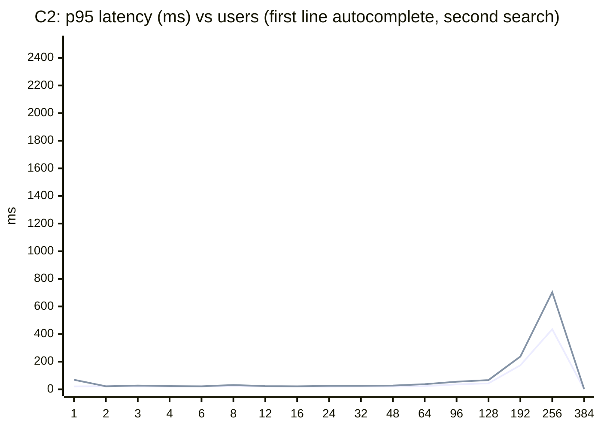
```mermaid
xychart-beta
    title "C2: p95 latency (ms) vs users (first line autocomplete, second search)"
    x-axis [1, 2, 3, 4, 6, 8, 12, 16, 24, 32, 48, 64, 96, 128, 192, 256, 384]
    y-axis "ms" 0 --> 2512
    line [21, 23, 21, 19, 21, 23, 20, 20, 19, 20, 21, 23, 36, 43, 174, 435, 1,012]
    line [69, 22, 27, 23, 22, 31, 23, 22, 25, 25, 27, 37, 55, 67, 237, 703, 2,284]
```

| Users | req/s | Errors | ac p95 | search p95 | struct p95 | rev p95 | miss p95 | Stack CPU p95 | Busiest service | Peak mem (MB) | Result |
|---|---|---|---|---|---|---|---|---|---|---|---|
| 1 | 0.8 | 0.0% | 21 | 69 | 19 | - | 25 | 5% | elasticsearch (4%) | 6,173 | pass |
| 2 | 2.4 | 0.0% | 23 | 22 | 12 | 19 | 16 | 13% | api (10%) | 6,194 | pass |
| 3 | 3.6 | 0.0% | 21 | 27 | - | 20 | 11 | 10% | api (6%) | 6,214 | pass |
| 4 | 4.2 | 0.0% | 19 | 23 | 24 | 17 | 19 | 15% | api (10%) | 6,229 | pass |
| 6 | 6.5 | 0.0% | 21 | 22 | 34 | 21 | 18 | 28% | api (14%) | 6,256 | pass |
| 8 | 11.0 | 0.0% | 23 | 31 | 20 | 17 | 23 | 36% | api (23%) | 6,299 | pass |
| 12 | 15.5 | 0.0% | 20 | 23 | 18 | 13 | 20 | 37% | api (17%) | 6,351 | pass |
| 16 | 19.9 | 0.0% | 20 | 22 | 20 | 21 | 14 | 35% | api (22%) | 6,407 | pass |
| 24 | 27.4 | 0.0% | 19 | 25 | 34 | 26 | 12 | 49% | api (31%) | 6,446 | pass |
| 32 | 36.2 | 0.0% | 20 | 25 | 18 | 21 | 15 | 55% | api (34%) | 6,481 | pass |
| 48 | 58.0 | 0.0% | 21 | 27 | 38 | 21 | 17 | 81% | api (52%) | 6,516 | pass |
| 64 | 73.8 | 0.0% | 23 | 37 | 22 | 22 | 20 | 88% | api (56%) | 6,541 | pass |
| 96 | 115.7 | 0.0% | 36 | 55 | 38 | 42 | 30 | 134% | api (86%) | 6,599 | pass |
| 128 | 144.0 | 0.0% | 43 | 67 | 40 | 51 | 41 | 157% | api (97%) | 6,679 | pass |
| 192 | 208.8 | 0.0% | 174 | 237 | 252 | 242 | 150 | 199% | api (124%) | 6,711 | pass |
| 256 | 232.2 | 0.0% | 435 | 703 | 679 | 609 | 416 | 206% | api (130%) | 6,728 | fail |
| 384 | 246.6 | 0.0% | 1,012 | 2,284 | 2,997 | 2,987 | 1,293 | 204% | api (134%) | 6,753 | broken |

### C3: 2 CPU / 9.5 GB / heap 1g / 2 API worker(s)

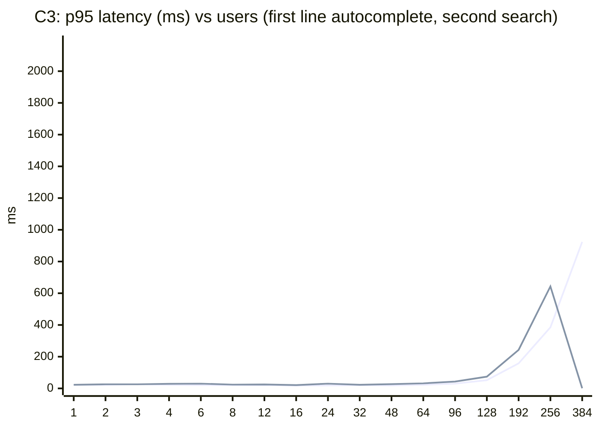
```mermaid
xychart-beta
    title "C3: p95 latency (ms) vs users (first line autocomplete, second search)"
    x-axis [1, 2, 3, 4, 6, 8, 12, 16, 24, 32, 48, 64, 96, 128, 192, 256, 384]
    y-axis "ms" 0 --> 2182
    line [22, 22, 26, 22, 21, 21, 20, 18, 19, 20, 19, 23, 30, 52, 158, 385, 924]
    line [23, 26, 26, 29, 30, 24, 25, 21, 30, 23, 27, 32, 43, 74, 243, 643, 1,984]
```

| Users | req/s | Errors | ac p95 | search p95 | struct p95 | rev p95 | miss p95 | Stack CPU p95 | Busiest service | Peak mem (MB) | Result |
|---|---|---|---|---|---|---|---|---|---|---|---|
| 1 | 1.2 | 0.0% | 22 | 23 | - | 11 | - | 14% | api (6%) | 6,375 | pass |
| 2 | 2.3 | 0.0% | 22 | 26 | 14 | 13 | - | 10% | api (6%) | 6,384 | pass |
| 3 | 3.0 | 0.0% | 26 | 26 | 22 | 16 | - | 15% | elasticsearch (7%) | 6,396 | pass |
| 4 | 4.8 | 0.0% | 22 | 29 | 19 | 19 | 19 | 22% | api (12%) | 6,419 | pass |
| 6 | 7.9 | 0.0% | 21 | 30 | 21 | 22 | 21 | 26% | elasticsearch (13%) | 6,443 | pass |
| 8 | 10.2 | 0.0% | 21 | 24 | 17 | 18 | 16 | 25% | api (14%) | 6,480 | pass |
| 12 | 13.1 | 0.0% | 20 | 25 | 17 | 21 | 14 | 32% | api (19%) | 6,531 | pass |
| 16 | 20.1 | 0.0% | 18 | 21 | 24 | 19 | 16 | 40% | api (25%) | 6,580 | pass |
| 24 | 29.5 | 0.0% | 19 | 30 | 22 | 19 | 14 | 46% | api (32%) | 6,644 | pass |
| 32 | 42.3 | 0.0% | 20 | 23 | 22 | 18 | 14 | 54% | api (40%) | 6,674 | pass |
| 48 | 57.4 | 0.0% | 19 | 27 | 17 | 28 | 17 | 69% | api (42%) | 6,714 | pass |
| 64 | 74.3 | 0.0% | 23 | 32 | 30 | 20 | 18 | 82% | api (51%) | 6,753 | pass |
| 96 | 112.1 | 0.0% | 30 | 43 | 28 | 31 | 25 | 116% | api (77%) | 6,808 | pass |
| 128 | 147.0 | 0.0% | 52 | 74 | 61 | 44 | 46 | 155% | api (98%) | 6,843 | pass |
| 192 | 212.7 | 0.0% | 158 | 243 | 237 | 224 | 130 | 199% | api (127%) | 6,890 | pass |
| 256 | 235.5 | 0.0% | 385 | 643 | 588 | 587 | 370 | 203% | api (131%) | 6,913 | fail |
| 384 | 250.7 | 0.0% | 924 | 1,984 | 2,866 | 2,978 | 1,008 | 206% | api (132%) | 6,942 | broken |

### C4: 4 CPU / 10.8 GB / heap 2g / 4 API worker(s)

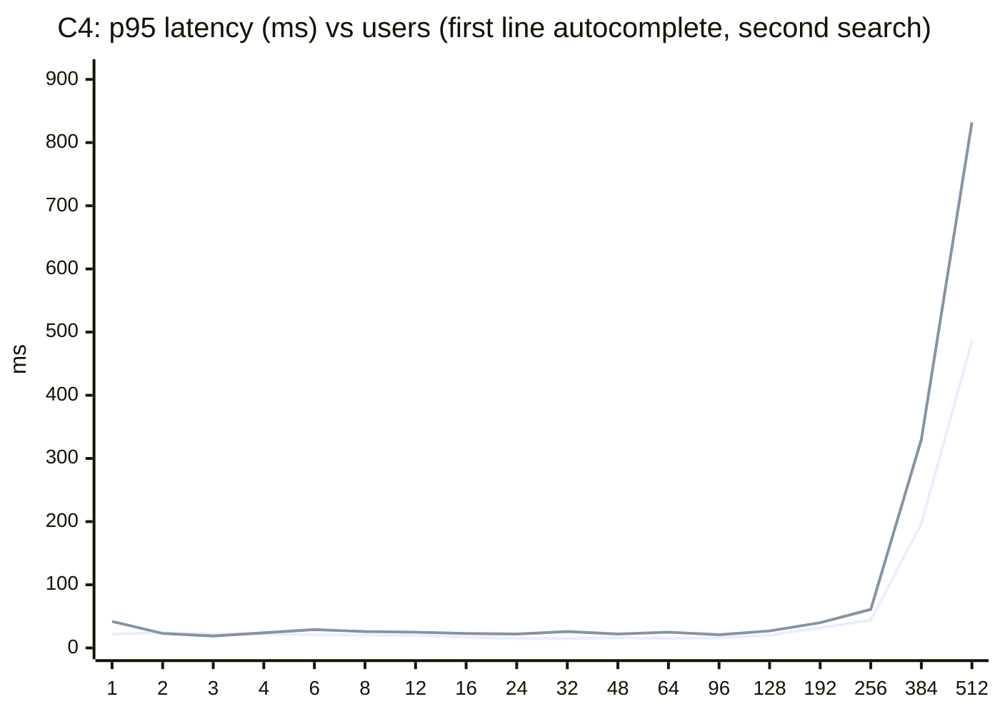
```mermaid
xychart-beta
    title "C4: p95 latency (ms) vs users (first line autocomplete, second search)"
    x-axis [1, 2, 3, 4, 6, 8, 12, 16, 24, 32, 48, 64, 96, 128, 192, 256, 384, 512]
    y-axis "ms" 0 --> 914
    line [22, 24, 22, 22, 21, 20, 20, 17, 15, 15, 16, 15, 16, 20, 32, 44, 197, 486]
    line [42, 23, 19, 24, 29, 26, 25, 23, 22, 26, 22, 25, 21, 27, 40, 61, 330, 832]
```

| Users | req/s | Errors | ac p95 | search p95 | struct p95 | rev p95 | miss p95 | Stack CPU p95 | Busiest service | Peak mem (MB) | Result |
|---|---|---|---|---|---|---|---|---|---|---|---|
| 1 | 1.4 | 0.0% | 22 | 42 | 26 | - | 6 | 5% | elasticsearch (4%) | 7,625 | pass |
| 2 | 2.3 | 0.0% | 24 | 23 | 12 | 21 | 9 | 15% | api (10%) | 7,635 | pass |
| 3 | 3.7 | 0.0% | 22 | 19 | 18 | 19 | 24 | 14% | elasticsearch (8%) | 7,652 | pass |
| 4 | 5.0 | 0.0% | 22 | 24 | 18 | 22 | 24 | 26% | elasticsearch (15%) | 7,673 | pass |
| 6 | 9.1 | 0.0% | 21 | 29 | 18 | 24 | 10 | 26% | api (16%) | 7,705 | pass |
| 8 | 9.6 | 0.0% | 20 | 26 | 24 | 16 | 13 | 30% | api (19%) | 7,733 | pass |
| 12 | 14.5 | 0.0% | 20 | 25 | 22 | 21 | 10 | 47% | elasticsearch (26%) | 7,774 | pass |
| 16 | 19.5 | 0.0% | 17 | 23 | 21 | 20 | 14 | 54% | api (39%) | 7,822 | pass |
| 24 | 30.4 | 0.0% | 15 | 22 | 16 | 18 | 16 | 54% | api (37%) | 7,868 | pass |
| 32 | 36.4 | 0.0% | 15 | 26 | 15 | 15 | 12 | 64% | api (42%) | 7,909 | pass |
| 48 | 55.5 | 0.0% | 16 | 22 | 17 | 19 | 12 | 86% | api (59%) | 7,965 | pass |
| 64 | 74.4 | 0.0% | 15 | 25 | 16 | 16 | 13 | 104% | api (66%) | 7,997 | pass |
| 96 | 113.9 | 0.0% | 16 | 21 | 17 | 17 | 13 | 133% | api (87%) | 8,033 | pass |
| 128 | 147.2 | 0.0% | 20 | 27 | 23 | 25 | 17 | 175% | api (108%) | 8,075 | pass |
| 192 | 227.7 | 0.0% | 32 | 40 | 31 | 33 | 25 | 257% | api (171%) | 8,094 | pass |
| 256 | 295.2 | 0.0% | 44 | 61 | 50 | 51 | 37 | 322% | api (213%) | 8,120 | pass |
| 384 | 402.6 | 0.0% | 197 | 330 | 304 | 280 | 187 | 398% | api (263%) | 8,164 | pass |
| 512 | 432.2 | 0.0% | 486 | 832 | 762 | 774 | 485 | 401% | api (266%) | 8,194 | fail |

### C4a: 4 CPU / 10.4 GB / heap 2g / 1 API worker(s)

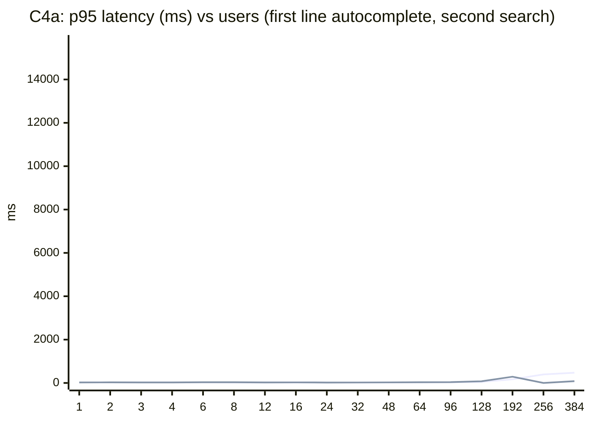
```mermaid
xychart-beta
    title "C4a: p95 latency (ms) vs users (first line autocomplete, second search)"
    x-axis [1, 2, 3, 4, 6, 8, 12, 16, 24, 32, 48, 64, 96, 128, 192, 256, 384]
    y-axis "ms" 0 --> 15742
    line [24, 24, 24, 24, 22, 20, 19, 19, 17, 17, 19, 22, 28, 49, 168, 393, 471]
    line [24, 28, 24, 25, 35, 33, 26, 27, 21, 22, 27, 33, 39, 79, 289, 1,084, 14,311]
```

| Users | req/s | Errors | ac p95 | search p95 | struct p95 | rev p95 | miss p95 | Stack CPU p95 | Busiest service | Peak mem (MB) | Result |
|---|---|---|---|---|---|---|---|---|---|---|---|
| 1 | 1.1 | 0.0% | 24 | 24 | - | 19 | 5 | 7% | api (4%) | 7,304 | pass |
| 2 | 2.2 | 0.0% | 24 | 28 | 19 | 20 | 14 | 16% | api (10%) | 7,315 | pass |
| 3 | 3.5 | 0.0% | 24 | 24 | 27 | 19 | - | 20% | api (13%) | 7,325 | pass |
| 4 | 3.6 | 0.0% | 24 | 25 | 9 | 23 | 21 | 25% | api (17%) | 7,336 | pass |
| 6 | 8.2 | 0.0% | 22 | 35 | 12 | 18 | 18 | 26% | api (14%) | 7,363 | pass |
| 8 | 9.3 | 0.0% | 20 | 33 | 27 | 21 | 12 | 34% | api (20%) | 7,395 | pass |
| 12 | 14.9 | 0.0% | 19 | 26 | 24 | 18 | 12 | 39% | elasticsearch (22%) | 7,427 | pass |
| 16 | 21.6 | 0.0% | 19 | 27 | 14 | 18 | 16 | 34% | api (18%) | 7,466 | pass |
| 24 | 30.0 | 0.0% | 17 | 21 | 17 | 20 | 12 | 43% | api (29%) | 7,513 | pass |
| 32 | 38.8 | 0.0% | 17 | 22 | 19 | 17 | 12 | 55% | api (36%) | 7,536 | pass |
| 48 | 55.6 | 0.0% | 19 | 27 | 19 | 20 | 12 | 81% | api (49%) | 7,581 | pass |
| 64 | 77.7 | 0.0% | 22 | 33 | 22 | 18 | 19 | 97% | api (58%) | 7,622 | pass |
| 96 | 113.4 | 0.0% | 28 | 39 | 31 | 32 | 22 | 123% | api (75%) | 7,639 | pass |
| 128 | 148.5 | 0.0% | 49 | 79 | 56 | 57 | 40 | 169% | api (101%) | 7,665 | pass |
| 192 | 194.2 | 0.0% | 168 | 289 | 264 | 238 | 160 | 189% | api (121%) | 7,714 | pass |
| 256 | 214.4 | 0.0% | 393 | 1,084 | 2,073 | 1,637 | 440 | 191% | api (123%) | 7,748 | fail |
| 384 | 226.9 | 0.0% | 471 | 14,311 | 15,518 | 15,353 | 821 | 192% | api (124%) | 7,773 | broken |

### C3-D1: 2 CPU / 9.5 GB / heap 1g / 2 API worker(s)

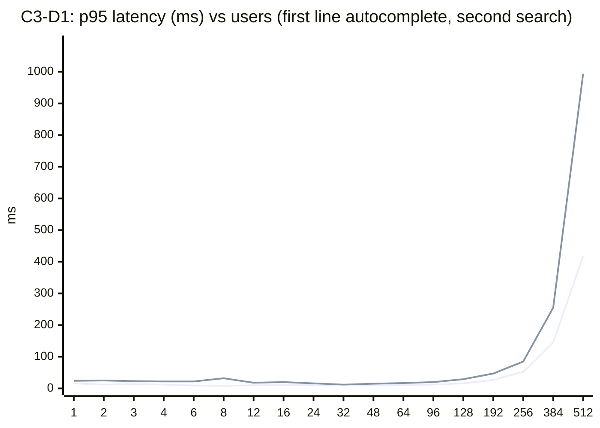
```mermaid
xychart-beta
    title "C3-D1: p95 latency (ms) vs users (first line autocomplete, second search)"
    x-axis [1, 2, 3, 4, 6, 8, 12, 16, 24, 32, 48, 64, 96, 128, 192, 256, 384, 512]
    y-axis "ms" 0 --> 1093
    line [16, 12, 14, 12, 9, 8, 10, 10, 10, 10, 10, 10, 12, 16, 27, 52, 145, 418]
    line [24, 25, 23, 22, 22, 32, 18, 20, 16, 12, 15, 17, 20, 29, 47, 85, 255, 994]
```

| Users | req/s | Errors | ac p95 | search p95 | struct p95 | rev p95 | miss p95 | Stack CPU p95 | Busiest service | Peak mem (MB) | Result |
|---|---|---|---|---|---|---|---|---|---|---|---|
| 1 | 1.1 | 0.0% | 16 | 24 | - | 12 | 17 | 8% | api (4%) | 6,422 | pass |
| 2 | 3.5 | 0.0% | 12 | 25 | 15 | - | 8 | 7% | elasticsearch (4%) | 6,423 | pass |
| 3 | 3.8 | 0.0% | 14 | 23 | 12 | 16 | 8 | 15% | elasticsearch (6%) | 6,421 | pass |
| 4 | 4.3 | 0.0% | 12 | 22 | 13 | 18 | 8 | 12% | elasticsearch (11%) | 6,422 | pass |
| 6 | 7.4 | 0.0% | 9 | 22 | 16 | 17 | 8 | 20% | elasticsearch (12%) | 6,420 | pass |
| 8 | 11.1 | 0.0% | 8 | 32 | 8 | 14 | 16 | 20% | api (12%) | 6,426 | pass |
| 12 | 14.7 | 0.0% | 10 | 18 | 13 | 16 | 6 | 29% | elasticsearch (23%) | 6,440 | pass |
| 16 | 19.0 | 0.0% | 10 | 20 | 10 | 12 | 9 | 32% | api (16%) | 6,452 | pass |
| 24 | 28.3 | 0.0% | 10 | 16 | 10 | 12 | 9 | 36% | api (24%) | 6,481 | pass |
| 32 | 38.0 | 0.0% | 10 | 12 | 10 | 12 | 7 | 30% | api (23%) | 6,500 | pass |
| 48 | 53.2 | 0.0% | 10 | 15 | 13 | 11 | 10 | 42% | api (26%) | 6,535 | pass |
| 64 | 77.9 | 0.0% | 10 | 17 | 25 | 12 | 11 | 54% | api (39%) | 6,565 | pass |
| 96 | 109.8 | 0.0% | 12 | 20 | 14 | 25 | 12 | 73% | api (50%) | 6,607 | pass |
| 128 | 149.4 | 0.0% | 16 | 29 | 19 | 34 | 16 | 89% | api (62%) | 6,644 | pass |
| 192 | 228.4 | 0.0% | 27 | 47 | 48 | 39 | 26 | 125% | api (90%) | 6,683 | pass |
| 256 | 301.1 | 0.0% | 52 | 85 | 62 | 83 | 53 | 166% | api (120%) | 6,722 | pass |
| 384 | 423.5 | 0.0% | 145 | 255 | 274 | 262 | 155 | 203% | api (140%) | 6,742 | pass |
| 512 | 452.8 | 0.0% | 418 | 994 | 1,311 | 1,324 | 494 | 209% | api (145%) | 6,770 | fail |

### C3-D2: 2 CPU / 9.5 GB / heap 1g / 2 API worker(s)

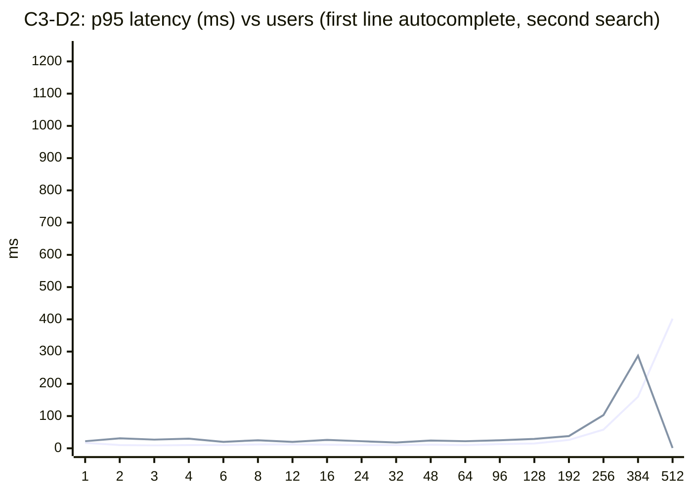
```mermaid
xychart-beta
    title "C3-D2: p95 latency (ms) vs users (first line autocomplete, second search)"
    x-axis [1, 2, 3, 4, 6, 8, 12, 16, 24, 32, 48, 64, 96, 128, 192, 256, 384, 512]
    y-axis "ms" 0 --> 1239
    line [17, 10, 9, 10, 10, 12, 12, 11, 10, 10, 11, 10, 13, 15, 26, 58, 160, 402]
    line [22, 31, 27, 30, 20, 25, 20, 26, 22, 18, 24, 22, 25, 29, 38, 103, 287, 1,126]
```

| Users | req/s | Errors | ac p95 | search p95 | struct p95 | rev p95 | miss p95 | Stack CPU p95 | Busiest service | Peak mem (MB) | Result |
|---|---|---|---|---|---|---|---|---|---|---|---|
| 1 | 1.2 | 0.0% | 17 | 22 | - | 15 | 11 | 5% | elasticsearch (4%) | 6,464 | pass |
| 2 | 3.0 | 0.0% | 10 | 31 | 23 | 21 | 13 | 6% | elasticsearch (4%) | 6,468 | pass |
| 3 | 2.9 | 0.0% | 9 | 27 | 20 | 25 | 10 | 7% | elasticsearch (4%) | 6,472 | pass |
| 4 | 4.6 | 0.0% | 10 | 30 | 33 | 21 | 10 | 13% | elasticsearch (7%) | 6,482 | pass |
| 6 | 6.3 | 0.0% | 10 | 20 | 19 | 23 | 9 | 13% | api (6%) | 6,490 | pass |
| 8 | 9.1 | 0.0% | 12 | 25 | 19 | 22 | 13 | 18% | api (11%) | 6,499 | pass |
| 12 | 12.7 | 0.0% | 12 | 20 | 30 | 23 | 9 | 38% | api (23%) | 6,511 | pass |
| 16 | 21.5 | 0.0% | 11 | 26 | 25 | 21 | 11 | 36% | elasticsearch (16%) | 6,530 | pass |
| 24 | 28.0 | 0.0% | 10 | 22 | 24 | 24 | 9 | 32% | api (20%) | 6,544 | pass |
| 32 | 36.7 | 0.0% | 10 | 18 | 19 | 24 | 9 | 31% | api (19%) | 6,576 | pass |
| 48 | 58.4 | 0.0% | 11 | 24 | 21 | 21 | 11 | 39% | api (29%) | 6,594 | pass |
| 64 | 74.9 | 0.0% | 10 | 22 | 22 | 21 | 11 | 50% | api (36%) | 6,637 | pass |
| 96 | 116.5 | 0.0% | 13 | 25 | 28 | 22 | 14 | 63% | api (46%) | 6,680 | pass |
| 128 | 152.7 | 0.0% | 15 | 29 | 28 | 24 | 14 | 86% | api (58%) | 6,708 | pass |
| 192 | 222.1 | 0.0% | 26 | 38 | 30 | 40 | 29 | 130% | api (90%) | 6,744 | pass |
| 256 | 301.8 | 0.0% | 58 | 103 | 95 | 94 | 58 | 160% | api (110%) | 6,793 | pass |
| 384 | 415.6 | 0.0% | 160 | 287 | 316 | 302 | 162 | 201% | api (141%) | 6,821 | pass |
| 512 | 439.5 | 0.0% | 402 | 1,126 | 1,506 | 1,419 | 524 | 209% | api (144%) | 6,838 | fail |

### C3-D3: 2 CPU / 9.5 GB / heap 1g / 2 API worker(s)

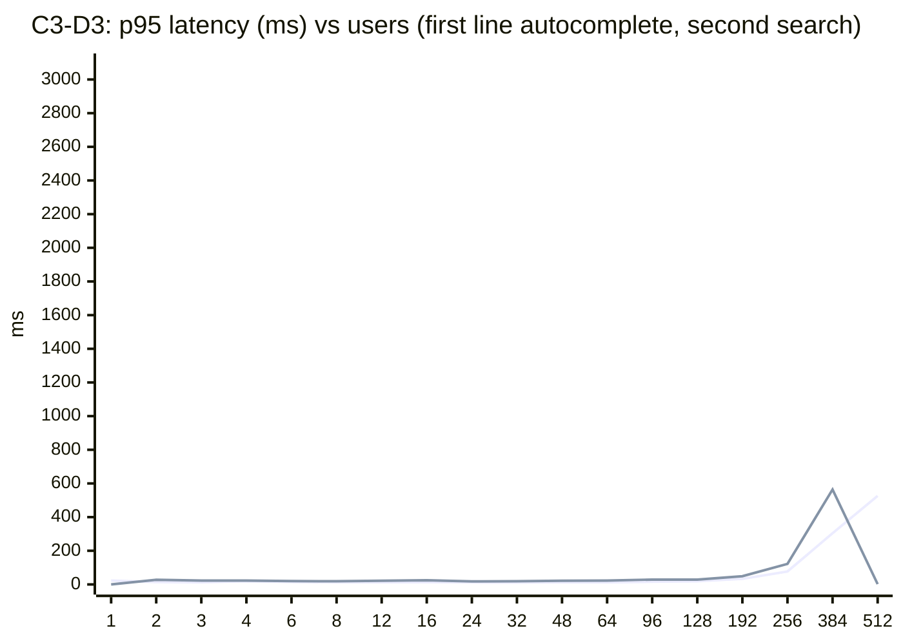
```mermaid
xychart-beta
    title "C3-D3: p95 latency (ms) vs users (first line autocomplete, second search)"
    x-axis [1, 2, 3, 4, 6, 8, 12, 16, 24, 32, 48, 64, 96, 128, 192, 256, 384, 512]
    y-axis "ms" 0 --> 3094
    line [23, 14, 12, 19, 14, 12, 12, 13, 12, 11, 12, 12, 16, 19, 33, 77, 304, 526]
    line [0, 28, 23, 23, 20, 19, 22, 25, 18, 19, 22, 23, 29, 29, 49, 122, 564, 2,813]
```

| Users | req/s | Errors | ac p95 | search p95 | struct p95 | rev p95 | miss p95 | Stack CPU p95 | Busiest service | Peak mem (MB) | Result |
|---|---|---|---|---|---|---|---|---|---|---|---|
| 1 | 0.9 | 0.0% | 23 | - | 23 | 14 | - | 7% | elasticsearch (4%) | 6,528 | pass |
| 2 | 3.3 | 0.0% | 14 | 28 | - | 22 | - | 10% | elasticsearch (6%) | 6,538 | pass |
| 3 | 4.7 | 0.0% | 12 | 23 | 21 | 20 | 20 | 10% | api (5%) | 6,549 | pass |
| 4 | 4.9 | 0.0% | 19 | 23 | - | 20 | 9 | 22% | elasticsearch (18%) | 6,558 | pass |
| 6 | 7.1 | 0.0% | 14 | 20 | 22 | 20 | 14 | 21% | elasticsearch (13%) | 6,573 | pass |
| 8 | 10.4 | 0.0% | 12 | 19 | 24 | 20 | 15 | 22% | api (15%) | 6,583 | pass |
| 12 | 15.5 | 0.0% | 12 | 22 | 22 | 20 | 16 | 32% | api (18%) | 6,622 | pass |
| 16 | 18.7 | 0.0% | 13 | 25 | 29 | 19 | 12 | 36% | api (18%) | 6,642 | pass |
| 24 | 28.4 | 0.0% | 12 | 18 | 23 | 21 | 12 | 44% | api (32%) | 6,687 | pass |
| 32 | 35.6 | 0.0% | 11 | 19 | 23 | 19 | 9 | 33% | api (22%) | 6,720 | pass |
| 48 | 57.9 | 0.0% | 12 | 22 | 24 | 21 | 10 | 50% | api (34%) | 6,754 | pass |
| 64 | 76.0 | 0.0% | 12 | 23 | 28 | 20 | 11 | 61% | api (46%) | 6,810 | pass |
| 96 | 120.8 | 0.0% | 16 | 29 | 39 | 23 | 17 | 94% | api (64%) | 6,889 | pass |
| 128 | 153.7 | 0.0% | 19 | 29 | 32 | 31 | 17 | 95% | api (62%) | 6,937 | pass |
| 192 | 223.5 | 0.0% | 33 | 49 | 46 | 47 | 37 | 137% | api (88%) | 6,978 | pass |
| 256 | 293.8 | 0.0% | 77 | 122 | 129 | 101 | 75 | 178% | api (118%) | 6,996 | pass |
| 384 | 370.7 | 0.0% | 304 | 564 | 531 | 504 | 332 | 206% | api (139%) | 7,036 | fail |
| 512 | 402.7 | 0.0% | 526 | 2,813 | 3,185 | 3,211 | 842 | 205% | api (140%) | 7,084 | broken |

### C3-D4: 2 CPU / 9.5 GB / heap 1g / 2 API worker(s)

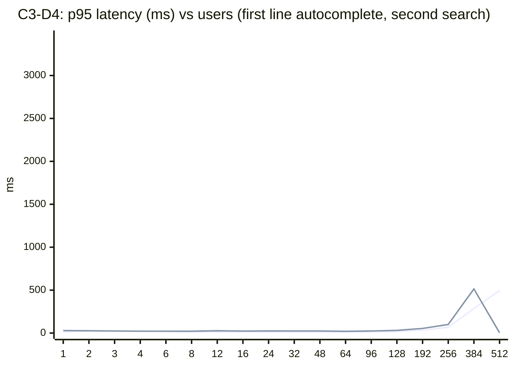
```mermaid
xychart-beta
    title "C3-D4: p95 latency (ms) vs users (first line autocomplete, second search)"
    x-axis [1, 2, 3, 4, 6, 8, 12, 16, 24, 32, 48, 64, 96, 128, 192, 256, 384, 512]
    y-axis "ms" 0 --> 3457
    line [14, 22, 21, 18, 16, 15, 13, 14, 13, 12, 11, 14, 14, 18, 33, 68, 286, 495]
    line [29, 27, 24, 22, 22, 21, 27, 23, 25, 24, 24, 20, 24, 31, 54, 100, 514, 3,143]
```

| Users | req/s | Errors | ac p95 | search p95 | struct p95 | rev p95 | miss p95 | Stack CPU p95 | Busiest service | Peak mem (MB) | Result |
|---|---|---|---|---|---|---|---|---|---|---|---|
| 1 | 1.4 | 0.0% | 14 | 29 | - | 21 | 5 | 5% | api (4%) | 6,382 | pass |
| 2 | 1.9 | 0.0% | 22 | 27 | - | 24 | - | 7% | api (4%) | 6,386 | pass |
| 3 | 4.6 | 0.0% | 21 | 24 | 26 | 21 | 20 | 15% | api (7%) | 6,332 | pass |
| 4 | 5.5 | 0.0% | 18 | 22 | 28 | 22 | 11 | 10% | api (8%) | 6,343 | pass |
| 6 | 8.4 | 0.0% | 16 | 22 | 26 | 20 | 9 | 24% | elasticsearch (18%) | 6,356 | pass |
| 8 | 8.8 | 0.0% | 15 | 21 | 28 | 28 | 17 | 19% | api (13%) | 6,369 | pass |
| 12 | 14.6 | 0.0% | 13 | 27 | 22 | 20 | 9 | 32% | elasticsearch (15%) | 6,386 | pass |
| 16 | 19.2 | 0.0% | 14 | 23 | 20 | 20 | 15 | 23% | api (14%) | 6,411 | pass |
| 24 | 27.3 | 0.0% | 13 | 25 | 19 | 21 | 16 | 49% | api (26%) | 6,460 | pass |
| 32 | 33.8 | 0.0% | 12 | 24 | 21 | 18 | 15 | 36% | api (22%) | 6,532 | pass |
| 48 | 57.9 | 0.0% | 11 | 24 | 19 | 18 | 11 | 47% | api (32%) | 6,571 | pass |
| 64 | 77.2 | 0.0% | 14 | 20 | 25 | 25 | 17 | 58% | api (39%) | 6,614 | pass |
| 96 | 112.3 | 0.0% | 14 | 24 | 24 | 22 | 14 | 71% | api (50%) | 6,662 | pass |
| 128 | 153.8 | 0.0% | 18 | 31 | 29 | 24 | 17 | 96% | api (64%) | 6,711 | pass |
| 192 | 232.3 | 0.0% | 33 | 54 | 45 | 47 | 37 | 140% | api (94%) | 6,791 | pass |
| 256 | 293.4 | 0.0% | 68 | 100 | 102 | 93 | 74 | 177% | api (118%) | 6,819 | pass |
| 384 | 378.9 | 0.0% | 286 | 514 | 535 | 487 | 322 | 202% | api (138%) | 6,872 | fail |
| 512 | 396.9 | 0.0% | 495 | 3,143 | 3,646 | 3,788 | 670 | 205% | api (138%) | 6,919 | broken |

### C3-D5: 2 CPU / 9.5 GB / heap 1g / 2 API worker(s)

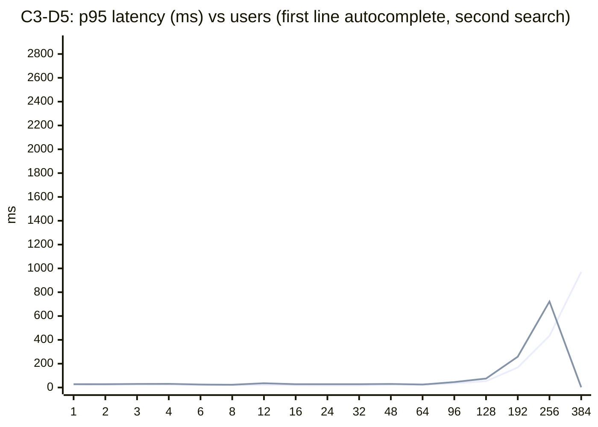
```mermaid
xychart-beta
    title "C3-D5: p95 latency (ms) vs users (first line autocomplete, second search)"
    x-axis [1, 2, 3, 4, 6, 8, 12, 16, 24, 32, 48, 64, 96, 128, 192, 256, 384]
    y-axis "ms" 0 --> 2899
    line [24, 22, 22, 22, 20, 20, 21, 19, 18, 18, 22, 21, 36, 53, 168, 434, 970]
    line [28, 28, 30, 31, 25, 23, 36, 28, 28, 28, 30, 25, 46, 75, 259, 722, 2,636]
```

| Users | req/s | Errors | ac p95 | search p95 | struct p95 | rev p95 | miss p95 | Stack CPU p95 | Busiest service | Peak mem (MB) | Result |
|---|---|---|---|---|---|---|---|---|---|---|---|
| 1 | 1.6 | 0.0% | 24 | 28 | 12 | - | - | 12% | api (9%) | 6,536 | pass |
| 2 | 3.2 | 0.0% | 22 | 28 | 18 | - | - | 14% | api (11%) | 6,549 | pass |
| 3 | 3.6 | 0.0% | 22 | 30 | 29 | 18 | 24 | 21% | elasticsearch (15%) | 6,568 | pass |
| 4 | 5.5 | 0.0% | 22 | 31 | 31 | 26 | 31 | 23% | elasticsearch (18%) | 6,586 | pass |
| 6 | 6.9 | 0.0% | 20 | 25 | 18 | 18 | 15 | 21% | api (16%) | 6,604 | pass |
| 8 | 11.1 | 0.0% | 20 | 23 | 17 | 18 | 16 | 20% | api (12%) | 6,637 | pass |
| 12 | 14.1 | 0.0% | 21 | 36 | 21 | 23 | 18 | 36% | api (21%) | 6,678 | pass |
| 16 | 18.3 | 0.0% | 19 | 28 | 22 | 18 | 19 | 37% | api (24%) | 6,730 | pass |
| 24 | 27.8 | 0.0% | 18 | 28 | 26 | 18 | 17 | 43% | api (30%) | 6,757 | pass |
| 32 | 37.2 | 0.0% | 18 | 28 | 19 | 16 | 16 | 56% | api (39%) | 6,786 | pass |
| 48 | 55.1 | 0.0% | 22 | 30 | 17 | 17 | 18 | 69% | api (44%) | 6,825 | pass |
| 64 | 74.6 | 0.0% | 21 | 25 | 19 | 22 | 19 | 90% | api (58%) | 6,821 | pass |
| 96 | 112.2 | 0.0% | 36 | 46 | 42 | 32 | 27 | 130% | api (79%) | 6,859 | pass |
| 128 | 141.0 | 0.0% | 53 | 75 | 53 | 58 | 42 | 155% | api (96%) | 6,919 | pass |
| 192 | 205.2 | 0.0% | 168 | 259 | 229 | 228 | 134 | 200% | api (124%) | 6,932 | pass |
| 256 | 225.1 | 0.0% | 434 | 722 | 628 | 589 | 445 | 203% | api (132%) | 6,961 | fail |
| 384 | 239.4 | 0.0% | 970 | 2,636 | 2,754 | 2,878 | 1,206 | 206% | api (135%) | 6,978 | broken |

