# Load Test Results: pgeo

These runs are **after** the reverse-geocoding index fix (`feature_admin_idx`, pgeo 0.7.0).
The before/after comparison is in the study report ([REPORT.md](REPORT.md), Section 3.4, "Effect of
the reverse-geocoding index"); the raw pre-fix runs are `data/loadtest/20260918-2343-pgeo` and
`20260919-0350-pgeo`.

Runs `20260919-1135-pgeo`, `20260919-1543-pgeo`; method and SLOs in [LOAD_TEST_PLAN.md](LOAD_TEST_PLAN.md). Latencies in ms (steady state, warm caches). Direct to the API, no edge rate limits.

## Summary

| Config | Resources | 3 users: pass | ac p95 | search p95 | struct p95 | rev p95 | Stack CPU p95 at 3 | Max users in SLO | Breaking point | First limit hit |
|---|---|---|---|---|---|---|---|---|---|---|
| api-P1 | 1 CPU / 2.0 GB / shared_buffers 256MB / 4 connections | yes | 59 | 109 | 127 | 14 | 25% | 24 | 96 | p95 over target: autocomplete at 32 users; busiest service db (94% CPU) |
| api-P2 | 2 CPU / 2.7 GB / shared_buffers 384MB / 6 connections | yes | 54 | 95 | 106 | 14 | 27% | 48 | 128 | p95 over target: autocomplete at 64 users; busiest service db (188% CPU) |
| api-P4 | 4 CPU / 3.3 GB / shared_buffers 512MB / 10 connections | yes | 49 | 108 | 116 | 15 | 29% | 96 | 256 | p95 over target: autocomplete, reverse at 128 users; busiest service db (372% CPU) |
| api-PM | all CPU / unlimited / shared_buffers 1GB / 16 connections | yes | 57 | 99 | 104 | 15 | 30% | 192 | 384 | p95 over target: autocomplete at 256 users; busiest service db (1037% CPU) |
| api-Pmin | 1 CPU / 1.6 GB / shared_buffers 128MB / 4 connections | yes | 62 | 112 | 117 | 15 | 27% | 24 | 96 | p95 over target: autocomplete at 32 users; busiest service db (94% CPU) |
| api-svc-P2 | 2 CPU / 4.7 GB / shared_buffers 384MB / 6 connections | yes | 47 | 101 | 93 | 16 | 26% | 48 | 128 | p95 over target: autocomplete at 64 users; busiest service db (186% CPU) |
| api-svc-P4 | 4 CPU / 5.3 GB / shared_buffers 512MB / 10 connections | yes | 51 | 111 | 101 | 14 | 26% | 96 | 192 | p95 over target: autocomplete at 128 users; busiest service db (371% CPU) |
| rest-P1 | 1 CPU / 2.0 GB / shared_buffers 256MB / 4 connections | yes | 59 | 111 | 100 | 12 | 30% | 24 | 96 | p95 over target: autocomplete at 32 users; busiest service db (97% CPU) |
| rest-P2 | 2 CPU / 2.5 GB / shared_buffers 384MB / 6 connections | yes | 44 | 97 | 105 | 5 | 26% | 48 | 96 | p95 over target: autocomplete, reverse at 64 users; busiest service db (191% CPU) |
| rest-P4 | 4 CPU / 3.0 GB / shared_buffers 512MB / 10 connections | yes | 43 | 101 | 98 | 6 | 27% | 96 | 192 | p95 over target: autocomplete at 128 users; busiest service db (365% CPU) |
| rest-PM | all CPU / unlimited / shared_buffers 1GB / 16 connections | yes | 46 | 100 | 85 | 6 | 34% | 128 | 256 | p95 over target: autocomplete at 192 users; busiest service db (880% CPU) |
| rest-Pmin | 1 CPU / 1.6 GB / shared_buffers 128MB / 4 connections | yes | 52 | 114 | 120 | 18 | 27% | 24 | 64 | p95 over target: autocomplete at 32 users; busiest service db (97% CPU) |

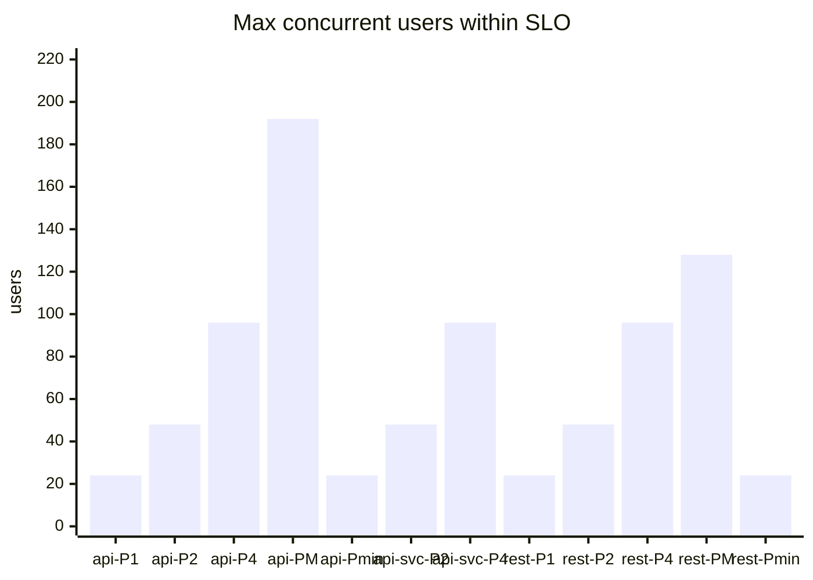

## Latency and throughput vs users

## Query types at 3 users

p50 / p95 ms by query quality (exact, typo, off-name variant, complete miss).

| Config | exact | typo | variant | miss |
|---|---|---|---|---|
| api-P1 | 21 / 66 | 18 / 79 | 12 / 58 | 7 / 34 |
| api-P2 | 17 / 66 | 16 / 72 | 18 / 47 | 8 / 24 |
| api-P4 | 18 / 59 | 16 / 39 | 20 / 59 | 16 / 48 |
| api-PM | 19 / 75 | 14 / 79 | 12 / 50 | 9 / 57 |
| api-Pmin | 18 / 75 | 15 / 66 | 14 / 53 | 12 / 43 |
| api-svc-P2 | 16 / 56 | 16 / 40 | 21 / 75 | 9 / 42 |
| api-svc-P4 | 19 / 64 | 13 / 21 | 14 / 38 | 8 / 26 |
| rest-P1 | 20 / 62 | 13 / 60 | 30 / 71 | 11 / 42 |
| rest-P2 | 17 / 48 | 14 / 57 | 14 / 54 | 8 / 28 |
| rest-P4 | 16 / 50 | 16 / 46 | 15 / 58 | 10 / 28 |
| rest-PM | 17 / 52 | 18 / 45 | 20 / 68 | 8 / 48 |
| rest-Pmin | 19 / 57 | 20 / 77 | 20 / 48 | 15 / 28 |

## Ramp detail per configuration

### api-P1: 1 CPU / 2.0 GB / shared_buffers 256MB / 4 connections

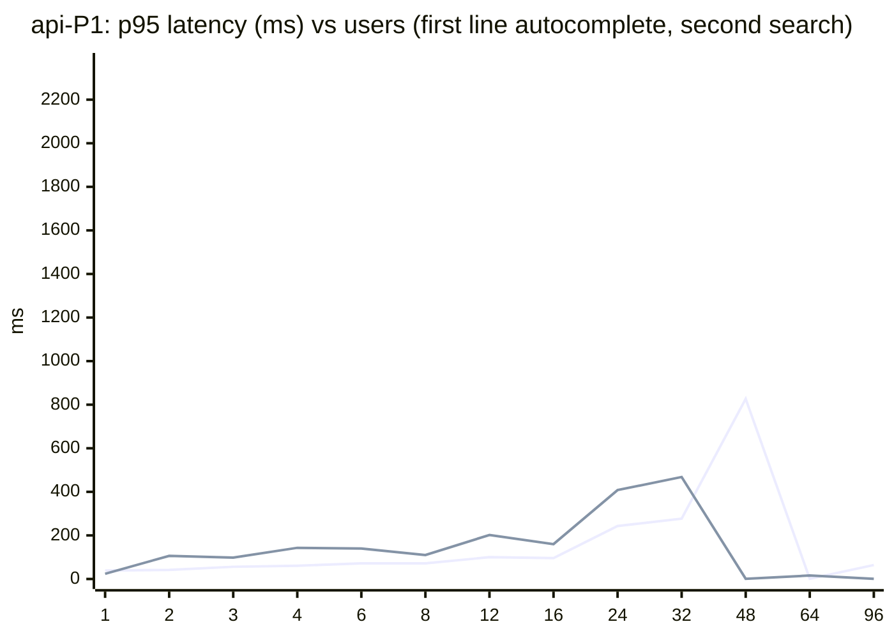

| Users | req/s | Errors | ac p95 | search p95 | struct p95 | rev p95 | miss p95 | Stack CPU p95 | Busiest service | Peak mem (MB) | Result |
|---|---|---|---|---|---|---|---|---|---|---|---|
| 1 | 1.4 | 0.0% | 39 | 24 | - | 13 | - | 11% | db (10%) | 438 | pass |
| 2 | 2.5 | 0.0% | 42 | 106 | 67 | 6 | 24 | 16% | db (15%) | 436 | pass |
| 3 | 3.6 | 0.0% | 56 | 98 | 100 | 13 | - | 21% | db (20%) | 437 | pass |
| 4 | 5.6 | 0.0% | 61 | 143 | 109 | 16 | 115 | 28% | db (26%) | 480 | pass |
| 6 | 6.9 | 0.0% | 72 | 140 | 127 | 16 | 43 | 37% | db (34%) | 468 | pass |
| 8 | 9.3 | 0.0% | 72 | 110 | 160 | 15 | 30 | 44% | db (42%) | 468 | pass |
| 12 | 13.7 | 0.0% | 100 | 202 | 311 | 17 | 48 | 65% | db (59%) | 468 | pass |
| 16 | 17.8 | 0.0% | 96 | 160 | 141 | 17 | 38 | 71% | db (67%) | 469 | pass |
| 24 | 27.0 | 0.0% | 243 | 408 | 541 | 96 | 73 | 100% | db (94%) | 477 | pass |
| 32 | 31.8 | 0.0% | 277 | 468 | 440 | 158 | 208 | 101% | db (94%) | 481 | fail |
| 48 | 32.8 | 0.0% | 827 | 1,016 | 960 | 631 | 764 | 101% | db (95%) | 488 | fail |
| 64 | 34.9 | 0.0% | 1,064 | 1,235 | 1,110 | 888 | 1,028 | 101% | db (95%) | 486 | fail |
| 96 | 35.1 | 0.0% | 2,022 | 2,153 | 2,302 | 1,888 | 1,960 | 102% | db (95%) | 484 | broken |

### api-P2: 2 CPU / 2.7 GB / shared_buffers 384MB / 6 connections

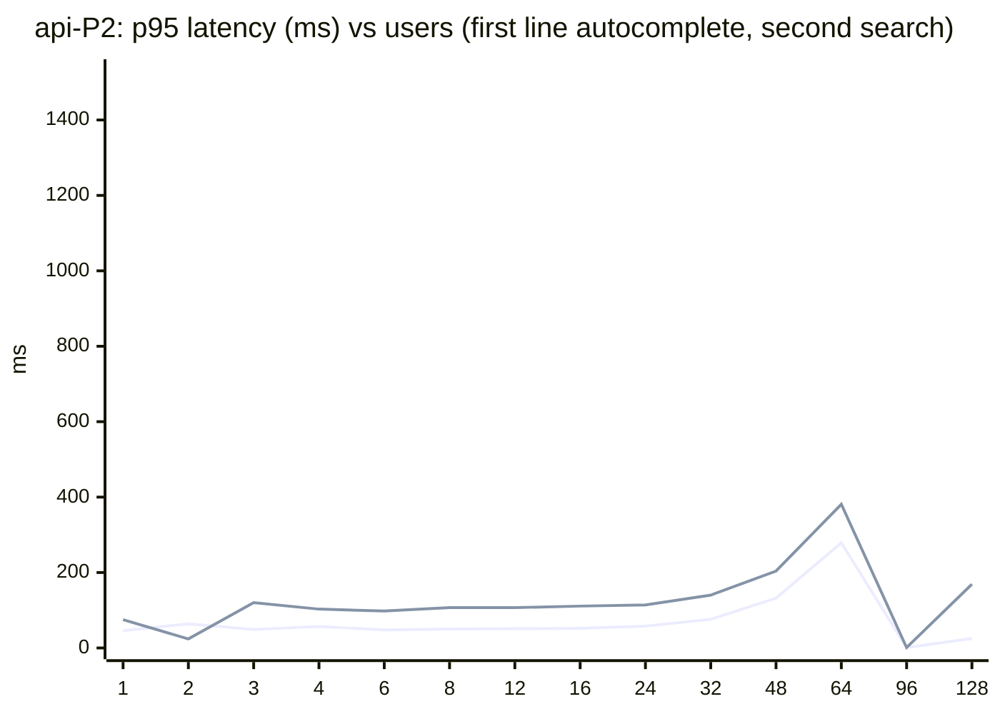

| Users | req/s | Errors | ac p95 | search p95 | struct p95 | rev p95 | miss p95 | Stack CPU p95 | Busiest service | Peak mem (MB) | Result |
|---|---|---|---|---|---|---|---|---|---|---|---|
| 1 | 0.9 | 0.0% | 46 | 75 | - | 4 | 4 | 8% | db (7%) | 674 | pass |
| 2 | 2.2 | 0.0% | 64 | 24 | 106 | 11 | 18 | 15% | db (14%) | 673 | pass |
| 3 | 3.5 | 0.0% | 49 | 120 | 90 | 13 | 22 | 23% | db (22%) | 703 | pass |
| 4 | 5.1 | 0.0% | 57 | 103 | 76 | 5 | 57 | 28% | db (27%) | 712 | pass |
| 6 | 7.3 | 0.0% | 48 | 98 | 96 | 12 | 36 | 41% | db (39%) | 745 | pass |
| 8 | 9.9 | 0.0% | 50 | 107 | 90 | 14 | 22 | 49% | db (44%) | 745 | pass |
| 12 | 14.1 | 0.0% | 51 | 107 | 111 | 13 | 31 | 59% | db (55%) | 747 | pass |
| 16 | 18.6 | 0.0% | 52 | 111 | 110 | 15 | 33 | 92% | db (86%) | 758 | pass |
| 24 | 28.0 | 0.0% | 58 | 114 | 142 | 14 | 34 | 117% | db (109%) | 763 | pass |
| 32 | 36.1 | 0.0% | 76 | 140 | 181 | 15 | 46 | 139% | db (128%) | 761 | pass |
| 48 | 52.4 | 0.0% | 132 | 204 | 278 | 109 | 113 | 198% | db (188%) | 778 | pass |
| 64 | 65.2 | 0.0% | 279 | 381 | 450 | 209 | 266 | 201% | db (188%) | 783 | fail |
| 96 | 69.1 | 0.0% | 1,025 | 1,169 | 1,182 | 965 | 1,025 | 202% | db (189%) | 781 | fail |
| 128 | 71.2 | 0.0% | 1,346 | 1,393 | 1,472 | 1,075 | 1,317 | 204% | db (189%) | 783 | broken |

### api-P4: 4 CPU / 3.3 GB / shared_buffers 512MB / 10 connections

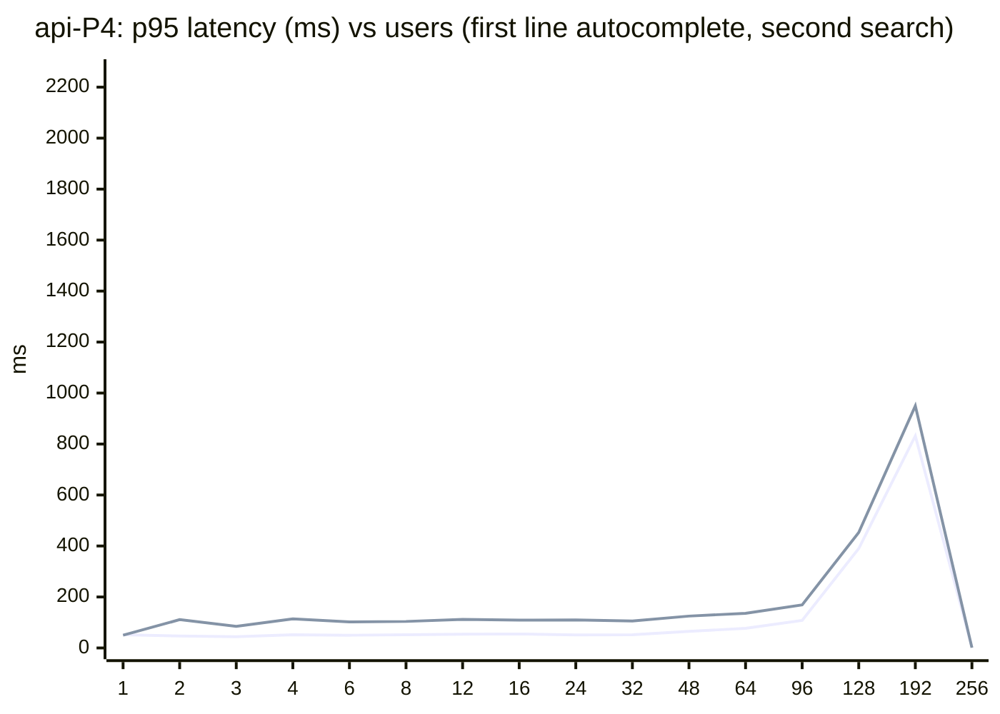

| Users | req/s | Errors | ac p95 | search p95 | struct p95 | rev p95 | miss p95 | Stack CPU p95 | Busiest service | Peak mem (MB) | Result |
|---|---|---|---|---|---|---|---|---|---|---|---|
| 1 | 1.3 | 0.0% | 52 | 50 | - | 4 | 56 | 12% | db (11%) | 828 | pass |
| 2 | 2.6 | 0.0% | 47 | 111 | 126 | 16 | 37 | 17% | db (16%) | 860 | pass |
| 3 | 3.9 | 0.0% | 44 | 85 | 47 | 13 | 29 | 32% | db (30%) | 896 | pass |
| 4 | 5.3 | 0.0% | 52 | 114 | 99 | 14 | 25 | 34% | db (32%) | 969 | pass |
| 6 | 8.0 | 0.0% | 50 | 102 | 86 | 15 | 59 | 38% | db (35%) | 991 | pass |
| 8 | 9.9 | 0.0% | 52 | 104 | 101 | 14 | 61 | 48% | db (45%) | 993 | pass |
| 12 | 12.6 | 0.0% | 54 | 112 | 134 | 13 | 12 | 58% | db (54%) | 1,036 | pass |
| 16 | 17.3 | 0.0% | 55 | 109 | 118 | 15 | 60 | 82% | db (75%) | 1,047 | pass |
| 24 | 29.1 | 0.0% | 51 | 110 | 106 | 16 | 60 | 108% | db (101%) | 1,059 | pass |
| 32 | 39.0 | 0.0% | 52 | 106 | 119 | 15 | 48 | 158% | db (145%) | 1,071 | pass |
| 48 | 54.1 | 0.0% | 65 | 125 | 128 | 36 | 46 | 217% | db (200%) | 1,074 | pass |
| 64 | 74.5 | 0.0% | 77 | 136 | 139 | 35 | 74 | 278% | db (259%) | 1,085 | pass |
| 96 | 103.0 | 0.0% | 108 | 169 | 185 | 102 | 96 | 343% | db (315%) | 1,086 | pass |
| 128 | 126.4 | 0.0% | 390 | 453 | 464 | 401 | 326 | 400% | db (372%) | 1,088 | fail |
| 192 | 140.7 | 0.0% | 832 | 950 | 961 | 809 | 784 | 404% | db (376%) | 1,093 | fail |
| 256 | 142.7 | 0.0% | 2,059 | 1,973 | 2,158 | 2,099 | 1,902 | 403% | db (374%) | 1,093 | broken |

### api-PM: all CPU / unlimited / shared_buffers 1GB / 16 connections

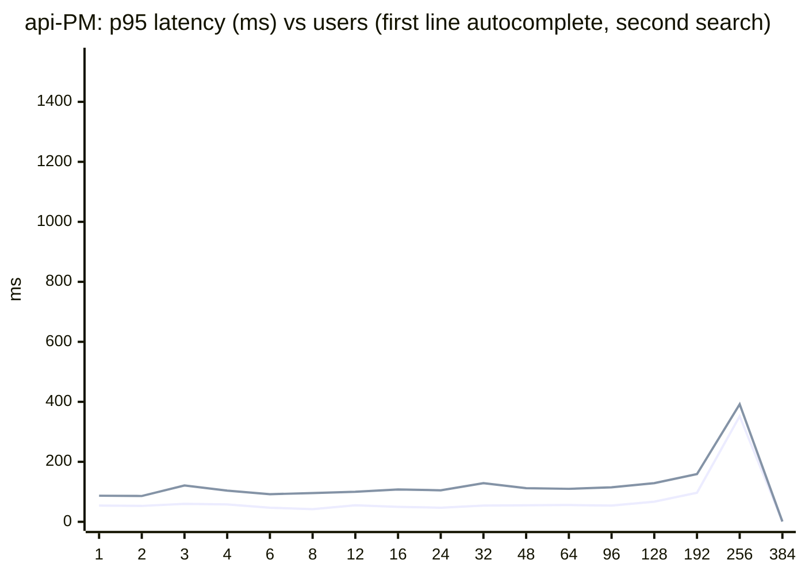

| Users | req/s | Errors | ac p95 | search p95 | struct p95 | rev p95 | miss p95 | Stack CPU p95 | Busiest service | Peak mem (MB) | Result |
|---|---|---|---|---|---|---|---|---|---|---|---|
| 1 | 0.8 | 0.0% | 54 | 87 | 112 | 4 | 9 | 13% | db (12%) | 829 | pass |
| 2 | 2.4 | 0.0% | 53 | 86 | - | 4 | 24 | 12% | db (11%) | 857 | pass |
| 3 | 3.7 | 0.0% | 60 | 121 | - | 12 | 30 | 26% | db (25%) | 945 | pass |
| 4 | 4.2 | 0.0% | 58 | 104 | 122 | 4 | 32 | 28% | db (26%) | 992 | pass |
| 6 | 7.4 | 0.0% | 47 | 92 | 100 | 13 | - | 49% | db (43%) | 1,101 | pass |
| 8 | 9.2 | 0.0% | 42 | 96 | 98 | 10 | 63 | 42% | db (38%) | 1,202 | pass |
| 12 | 13.8 | 0.0% | 55 | 100 | 102 | 13 | 55 | 59% | db (54%) | 1,390 | pass |
| 16 | 17.9 | 0.0% | 50 | 108 | 94 | 13 | 42 | 73% | db (67%) | 1,472 | pass |
| 24 | 27.6 | 0.0% | 47 | 105 | 100 | 13 | 26 | 101% | db (94%) | 1,519 | pass |
| 32 | 38.3 | 0.0% | 54 | 129 | 117 | 15 | 60 | 189% | db (178%) | 1,578 | pass |
| 48 | 58.2 | 0.0% | 55 | 112 | 117 | 13 | 51 | 235% | db (219%) | 1,592 | pass |
| 64 | 76.2 | 0.0% | 56 | 110 | 115 | 13 | 48 | 303% | db (279%) | 1,607 | pass |
| 96 | 104.2 | 0.0% | 54 | 115 | 113 | 14 | 36 | 401% | db (371%) | 1,616 | pass |
| 128 | 149.5 | 0.0% | 67 | 129 | 134 | 17 | 67 | 659% | db (612%) | 1,623 | pass |
| 192 | 212.7 | 0.0% | 97 | 159 | 198 | 50 | 86 | 948% | db (866%) | 1,644 | pass |
| 256 | 251.0 | 0.0% | 352 | 392 | 435 | 295 | 315 | 1,115% | db (1037%) | 1,662 | fail |
| 384 | 264.1 | 0.0% | 1,354 | 1,410 | 1,490 | 1,310 | 1,372 | 1,128% | db (1052%) | 1,676 | broken |

### api-Pmin: 1 CPU / 1.6 GB / shared_buffers 128MB / 4 connections

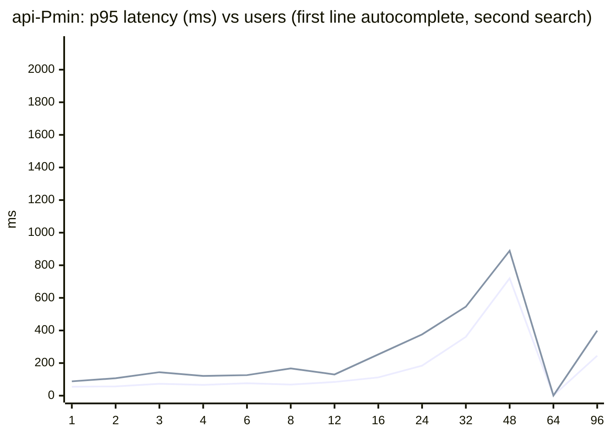

| Users | req/s | Errors | ac p95 | search p95 | struct p95 | rev p95 | miss p95 | Stack CPU p95 | Busiest service | Peak mem (MB) | Result |
|---|---|---|---|---|---|---|---|---|---|---|---|
| 1 | 1.6 | 0.0% | 55 | 88 | - | 9 | 9 | 9% | db (8%) | 284 | pass |
| 2 | 2.7 | 0.0% | 57 | 107 | - | 13 | 22 | 23% | db (22%) | 280 | pass |
| 3 | 2.9 | 0.0% | 73 | 144 | - | 11 | 16 | 21% | db (20%) | 293 | pass |
| 4 | 4.6 | 0.0% | 66 | 121 | 169 | 5 | 73 | 28% | db (26%) | 329 | pass |
| 6 | 5.6 | 0.0% | 76 | 126 | 143 | 8 | 14 | 38% | db (35%) | 337 | pass |
| 8 | 8.6 | 0.0% | 68 | 167 | 139 | 15 | 37 | 43% | db (40%) | 339 | pass |
| 12 | 14.0 | 0.0% | 84 | 130 | 172 | 15 | 64 | 60% | db (54%) | 351 | pass |
| 16 | 18.2 | 0.0% | 112 | 253 | 235 | 18 | 69 | 77% | db (71%) | 344 | pass |
| 24 | 25.5 | 0.0% | 184 | 376 | 410 | 90 | 160 | 97% | db (91%) | 345 | pass |
| 32 | 30.2 | 0.0% | 361 | 546 | 541 | 301 | 332 | 100% | db (94%) | 349 | fail |
| 48 | 34.9 | 0.0% | 720 | 889 | 896 | 599 | 681 | 102% | db (95%) | 350 | fail |
| 64 | 32.5 | 0.0% | 1,245 | 1,399 | 1,442 | 1,120 | 1,174 | 101% | db (95%) | 347 | fail |
| 96 | 35.7 | 0.0% | 1,856 | 1,967 | 2,106 | 1,662 | 1,841 | 102% | db (95%) | 358 | broken |

### api-svc-P2: 2 CPU / 4.7 GB / shared_buffers 384MB / 6 connections

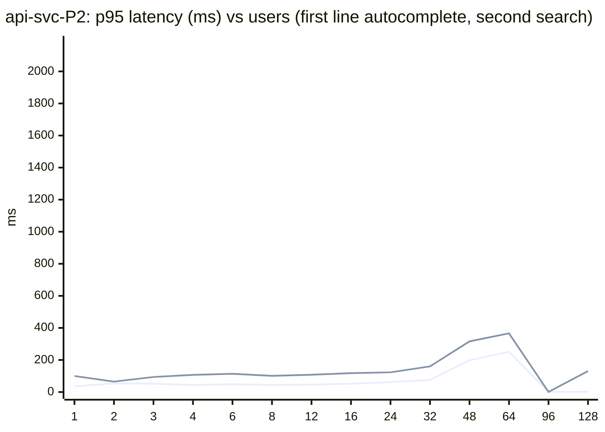

| Users | req/s | Errors | ac p95 | search p95 | struct p95 | rev p95 | miss p95 | Stack CPU p95 | Busiest service | Peak mem (MB) | Result |
|---|---|---|---|---|---|---|---|---|---|---|---|
| 1 | 1.8 | 0.0% | 36 | 100 | - | - | - | 11% | db (10%) | 2,622 | pass |
| 2 | 2.3 | 0.0% | 54 | 65 | 10 | 4 | 39 | 19% | db (17%) | 2,622 | pass |
| 3 | 3.0 | 0.0% | 52 | 94 | 96 | 13 | - | 25% | db (24%) | 2,622 | pass |
| 4 | 4.7 | 0.0% | 44 | 107 | 90 | 10 | 11 | 31% | db (28%) | 2,662 | pass |
| 6 | 7.6 | 0.0% | 49 | 114 | 93 | 5 | 18 | 34% | db (31%) | 2,663 | pass |
| 8 | 8.1 | 0.0% | 44 | 101 | 109 | 13 | 54 | 32% | db (31%) | 2,696 | pass |
| 12 | 13.1 | 0.0% | 46 | 108 | 124 | 12 | 41 | 60% | db (56%) | 2,705 | pass |
| 16 | 18.4 | 0.0% | 52 | 118 | 95 | 12 | 33 | 80% | db (74%) | 2,718 | pass |
| 24 | 23.7 | 0.0% | 62 | 123 | 112 | 16 | 34 | 144% | db (134%) | 2,720 | pass |
| 32 | 37.1 | 0.0% | 76 | 160 | 204 | 18 | 70 | 151% | db (142%) | 2,733 | pass |
| 48 | 52.4 | 0.0% | 198 | 316 | 405 | 173 | 114 | 199% | db (185%) | 2,734 | pass |
| 64 | 63.9 | 0.0% | 251 | 366 | 382 | 196 | 190 | 201% | db (186%) | 2,742 | fail |
| 96 | 70.8 | 0.0% | 1,002 | 1,131 | 1,192 | 893 | 977 | 201% | db (187%) | 2,750 | fail |
| 128 | 68.3 | 0.0% | 1,841 | 1,981 | 1,755 | 1,977 | 1,835 | 201% | db (188%) | 2,737 | broken |

### api-svc-P4: 4 CPU / 5.3 GB / shared_buffers 512MB / 10 connections

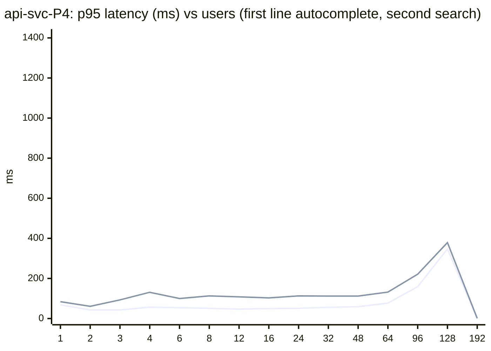

| Users | req/s | Errors | ac p95 | search p95 | struct p95 | rev p95 | miss p95 | Stack CPU p95 | Busiest service | Peak mem (MB) | Result |
|---|---|---|---|---|---|---|---|---|---|---|---|
| 1 | 1.4 | 0.0% | 68 | 84 | - | 12 | 12 | 23% | db (22%) | 2,917 | pass |
| 2 | 2.1 | 0.0% | 43 | 61 | 68 | 19 | 55 | 12% | db (10%) | 2,950 | pass |
| 3 | 3.1 | 0.0% | 43 | 93 | - | 13 | - | 17% | db (15%) | 2,986 | pass |
| 4 | 4.9 | 0.0% | 57 | 131 | 105 | 12 | 24 | 27% | db (25%) | 3,000 | pass |
| 6 | 6.8 | 0.0% | 54 | 100 | 109 | 14 | 38 | 27% | db (24%) | 3,038 | pass |
| 8 | 10.2 | 0.0% | 51 | 113 | 104 | 13 | 46 | 43% | db (38%) | 3,067 | pass |
| 12 | 14.4 | 0.0% | 47 | 108 | 80 | 14 | 29 | 66% | db (61%) | 3,073 | pass |
| 16 | 20.8 | 0.0% | 50 | 103 | 114 | 13 | 44 | 77% | db (69%) | 3,082 | pass |
| 24 | 26.6 | 0.0% | 51 | 113 | 118 | 14 | 58 | 108% | db (100%) | 3,084 | pass |
| 32 | 37.7 | 0.0% | 56 | 112 | 114 | 18 | 59 | 139% | db (129%) | 3,088 | pass |
| 48 | 52.7 | 0.0% | 59 | 112 | 121 | 32 | 58 | 206% | db (190%) | 3,089 | pass |
| 64 | 72.9 | 0.0% | 77 | 132 | 134 | 38 | 67 | 301% | db (272%) | 3,091 | pass |
| 96 | 106.5 | 0.0% | 159 | 221 | 221 | 153 | 146 | 371% | db (346%) | 3,091 | pass |
| 128 | 128.5 | 0.0% | 347 | 379 | 453 | 299 | 326 | 400% | db (371%) | 3,098 | fail |
| 192 | 136.8 | 0.0% | 1,261 | 1,288 | 1,316 | 1,202 | 1,242 | 405% | db (374%) | 3,109 | broken |

### rest-P1: 1 CPU / 2.0 GB / shared_buffers 256MB / 4 connections

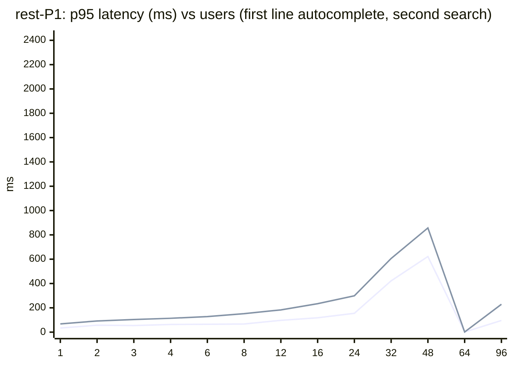

| Users | req/s | Errors | ac p95 | search p95 | struct p95 | rev p95 | miss p95 | Stack CPU p95 | Busiest service | Peak mem (MB) | Result |
|---|---|---|---|---|---|---|---|---|---|---|---|
| 1 | 0.7 | 0.0% | 34 | 68 | 117 | 4 | 4 | 8% | db (7%) | 409 | pass |
| 2 | 2.6 | 0.0% | 57 | 92 | 39 | 6 | 22 | 18% | db (18%) | 413 | pass |
| 3 | 4.0 | 0.0% | 54 | 104 | 98 | 9 | - | 21% | db (21%) | 416 | pass |
| 4 | 4.9 | 0.0% | 63 | 114 | 114 | 4 | 3 | 31% | db (30%) | 455 | pass |
| 6 | 7.6 | 0.0% | 65 | 128 | 75 | 11 | 38 | 34% | db (32%) | 457 | pass |
| 8 | 9.6 | 0.0% | 67 | 152 | 234 | 10 | 66 | 49% | db (47%) | 458 | pass |
| 12 | 13.6 | 0.0% | 97 | 183 | 120 | 11 | 54 | 51% | db (48%) | 457 | pass |
| 16 | 19.2 | 0.0% | 118 | 234 | 187 | 32 | 100 | 71% | db (68%) | 459 | pass |
| 24 | 25.3 | 0.0% | 155 | 299 | 338 | 24 | 145 | 98% | db (93%) | 461 | pass |
| 32 | 32.1 | 0.0% | 422 | 606 | 681 | 242 | 397 | 101% | db (97%) | 465 | fail |
| 48 | 36.7 | 0.0% | 622 | 857 | 843 | 541 | 607 | 101% | db (96%) | 465 | fail |
| 64 | 35.6 | 0.0% | 1,096 | 1,229 | 1,245 | 992 | 1,028 | 101% | db (97%) | 469 | fail |
| 96 | 35.6 | 0.0% | 2,213 | 2,208 | 2,390 | 2,193 | 2,075 | 102% | db (96%) | 477 | broken |

### rest-P2: 2 CPU / 2.5 GB / shared_buffers 384MB / 6 connections

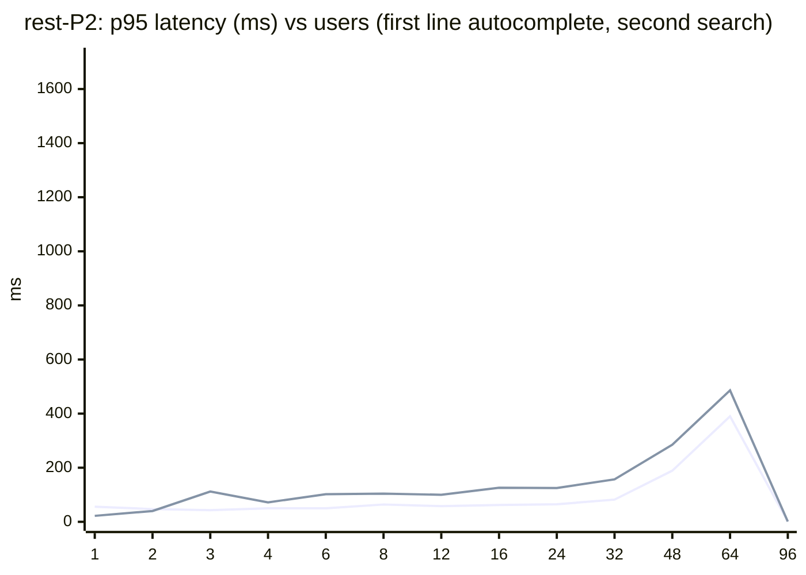

| Users | req/s | Errors | ac p95 | search p95 | struct p95 | rev p95 | miss p95 | Stack CPU p95 | Busiest service | Peak mem (MB) | Result |
|---|---|---|---|---|---|---|---|---|---|---|---|
| 1 | 1.4 | 0.0% | 56 | 22 | 92 | 5 | - | 12% | db (12%) | 562 | pass |
| 2 | 2.2 | 0.0% | 47 | 40 | 116 | 4 | - | 13% | db (12%) | 562 | pass |
| 3 | 3.5 | 0.0% | 43 | 112 | 78 | 4 | - | 27% | db (27%) | 567 | pass |
| 4 | 5.4 | 0.0% | 50 | 72 | 106 | 4 | 14 | 35% | db (33%) | 599 | pass |
| 6 | 7.8 | 0.0% | 50 | 102 | 91 | 7 | - | 37% | db (35%) | 668 | pass |
| 8 | 9.6 | 0.0% | 64 | 104 | 90 | 17 | 60 | 40% | db (38%) | 680 | pass |
| 12 | 13.0 | 0.0% | 58 | 100 | 96 | 8 | 35 | 68% | db (66%) | 692 | pass |
| 16 | 18.7 | 0.0% | 62 | 126 | 120 | 6 | 53 | 85% | db (82%) | 696 | pass |
| 24 | 27.1 | 0.0% | 65 | 125 | 131 | 14 | 41 | 108% | db (104%) | 710 | pass |
| 32 | 37.2 | 0.0% | 82 | 157 | 169 | 19 | 38 | 143% | db (137%) | 712 | pass |
| 48 | 53.1 | 0.0% | 189 | 285 | 337 | 55 | 108 | 202% | db (188%) | 717 | pass |
| 64 | 63.9 | 0.0% | 390 | 486 | 446 | 413 | 330 | 202% | db (191%) | 717 | fail |
| 96 | 67.3 | 0.0% | 1,453 | 1,564 | 1,112 | 1,960 | 1,521 | 203% | db (190%) | 722 | broken |

### rest-P4: 4 CPU / 3.0 GB / shared_buffers 512MB / 10 connections

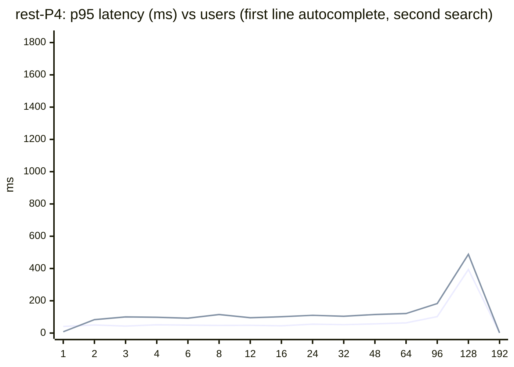

| Users | req/s | Errors | ac p95 | search p95 | struct p95 | rev p95 | miss p95 | Stack CPU p95 | Busiest service | Peak mem (MB) | Result |
|---|---|---|---|---|---|---|---|---|---|---|---|
| 1 | 1.5 | 0.0% | 41 | 8 | 33 | 4 | 8 | 14% | db (14%) | 646 | pass |
| 2 | 2.0 | 0.0% | 50 | 83 | - | 7 | 26 | 17% | db (16%) | 667 | pass |
| 3 | 3.4 | 0.0% | 43 | 100 | 56 | 5 | - | 26% | db (25%) | 685 | pass |
| 4 | 4.1 | 0.0% | 51 | 98 | 75 | 5 | 3 | 23% | db (22%) | 744 | pass |
| 6 | 7.2 | 0.0% | 49 | 92 | 92 | 10 | 60 | 32% | db (30%) | 829 | pass |
| 8 | 10.4 | 0.0% | 47 | 115 | 84 | 4 | 31 | 46% | db (44%) | 831 | pass |
| 12 | 15.5 | 0.0% | 48 | 95 | 104 | 6 | 16 | 71% | db (67%) | 987 | pass |
| 16 | 17.9 | 0.0% | 45 | 101 | 101 | 4 | 30 | 71% | db (66%) | 992 | pass |
| 24 | 27.4 | 0.0% | 55 | 110 | 106 | 6 | 62 | 110% | db (105%) | 997 | pass |
| 32 | 35.8 | 0.0% | 52 | 104 | 118 | 9 | 41 | 147% | db (141%) | 1,002 | pass |
| 48 | 55.3 | 0.0% | 57 | 115 | 115 | 9 | 61 | 229% | db (219%) | 1,017 | pass |
| 64 | 76.6 | 0.0% | 63 | 121 | 121 | 12 | 43 | 297% | db (285%) | 1,030 | pass |
| 96 | 107.5 | 0.0% | 102 | 183 | 249 | 19 | 82 | 389% | db (367%) | 1,042 | pass |
| 128 | 122.6 | 0.0% | 394 | 488 | 588 | 355 | 336 | 411% | db (365%) | 1,043 | fail |
| 192 | 125.6 | 0.0% | 1,672 | 1,671 | 2,248 | 1,664 | 1,562 | 408% | db (358%) | 1,055 | broken |

### rest-PM: all CPU / unlimited / shared_buffers 1GB / 16 connections

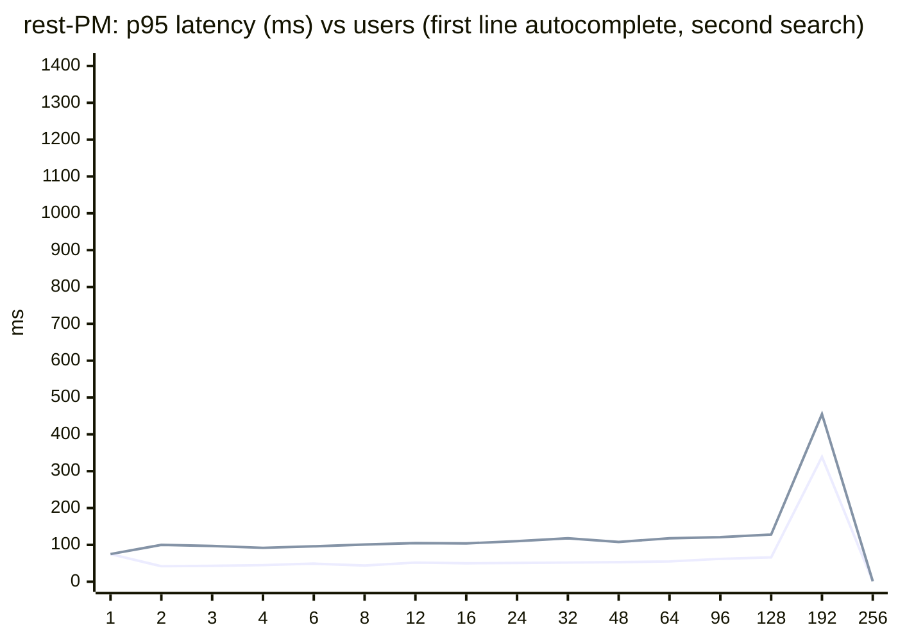

| Users | req/s | Errors | ac p95 | search p95 | struct p95 | rev p95 | miss p95 | Stack CPU p95 | Busiest service | Peak mem (MB) | Result |
|---|---|---|---|---|---|---|---|---|---|---|---|
| 1 | 1.3 | 0.0% | 75 | 75 | - | - | - | 15% | db (14%) | 678 | pass |
| 2 | 2.0 | 0.0% | 42 | 100 | 14 | 6 | - | 18% | db (17%) | 705 | pass |
| 3 | 3.8 | 0.0% | 43 | 97 | 89 | 5 | 32 | 28% | db (27%) | 738 | pass |
| 4 | 4.5 | 0.0% | 45 | 92 | 95 | 6 | 9 | 35% | db (34%) | 803 | pass |
| 6 | 6.6 | 0.0% | 49 | 96 | 105 | 5 | 49 | 48% | db (45%) | 910 | pass |
| 8 | 9.9 | 0.0% | 44 | 101 | 101 | 7 | 29 | 43% | db (42%) | 1,034 | pass |
| 12 | 14.1 | 0.0% | 52 | 105 | 99 | 12 | 22 | 82% | db (78%) | 1,205 | pass |
| 16 | 19.2 | 0.0% | 50 | 104 | 107 | 13 | 66 | 74% | db (71%) | 1,406 | pass |
| 24 | 27.2 | 0.0% | 51 | 110 | 101 | 14 | 44 | 112% | db (108%) | 1,441 | pass |
| 32 | 38.7 | 0.0% | 52 | 118 | 112 | 12 | 41 | 182% | db (169%) | 1,459 | pass |
| 48 | 56.7 | 0.0% | 53 | 108 | 123 | 13 | 54 | 224% | db (212%) | 1,491 | pass |
| 64 | 72.5 | 0.0% | 55 | 118 | 123 | 13 | 45 | 290% | db (277%) | 1,517 | pass |
| 96 | 114.2 | 0.0% | 62 | 121 | 132 | 13 | 38 | 474% | db (454%) | 1,554 | pass |
| 128 | 143.9 | 0.0% | 66 | 128 | 136 | 14 | 59 | 715% | db (685%) | 1,581 | pass |
| 192 | 202.7 | 0.0% | 339 | 455 | 448 | 229 | 268 | 1,118% | db (880%) | 1,606 | fail |
| 256 | 187.0 | 0.0% | 1,279 | 1,204 | 1,344 | 1,099 | 1,230 | 1,131% | db (785%) | 1,624 | broken |

### rest-Pmin: 1 CPU / 1.6 GB / shared_buffers 128MB / 4 connections

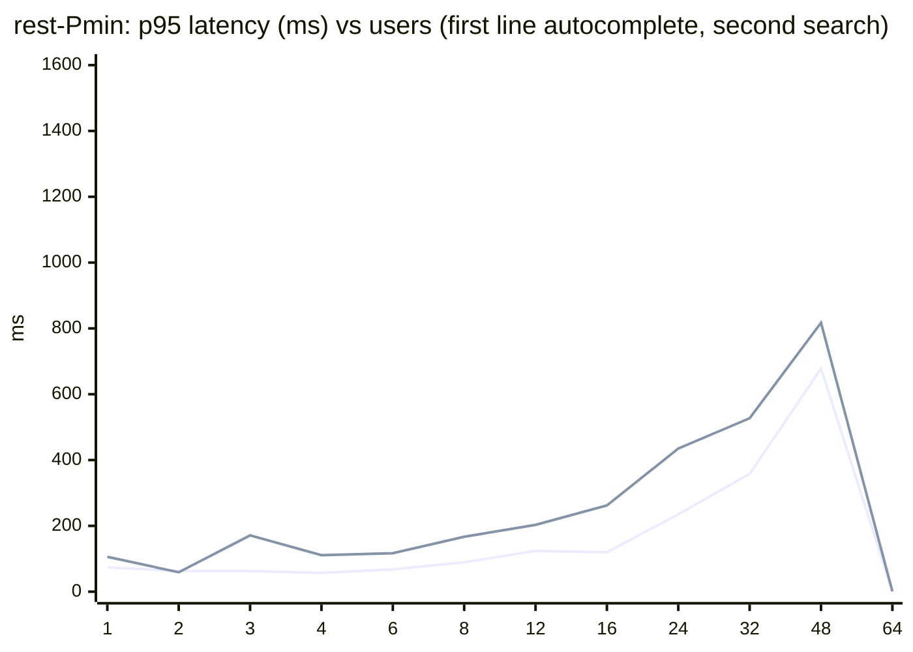

| Users | req/s | Errors | ac p95 | search p95 | struct p95 | rev p95 | miss p95 | Stack CPU p95 | Busiest service | Peak mem (MB) | Result |
|---|---|---|---|---|---|---|---|---|---|---|---|
| 1 | 1.2 | 0.0% | 74 | 106 | - | 17 | 19 | 17% | db (16%) | 279 | pass |
| 2 | 2.5 | 0.0% | 63 | 59 | 111 | 14 | 10 | 21% | db (21%) | 279 | pass |
| 3 | 3.6 | 0.0% | 63 | 171 | 123 | 17 | 31 | 19% | db (18%) | 281 | pass |
| 4 | 5.2 | 0.0% | 57 | 111 | 119 | 13 | 66 | 24% | db (23%) | 314 | pass |
| 6 | 7.9 | 0.0% | 68 | 117 | 144 | 16 | 29 | 31% | db (30%) | 315 | pass |
| 8 | 9.8 | 0.0% | 89 | 167 | 196 | 19 | 34 | 49% | db (48%) | 331 | pass |
| 12 | 13.8 | 0.0% | 124 | 203 | 173 | 20 | 52 | 64% | db (61%) | 320 | pass |
| 16 | 18.0 | 0.0% | 120 | 262 | 279 | 23 | 109 | 85% | db (82%) | 320 | pass |
| 24 | 24.2 | 0.0% | 235 | 435 | 408 | 107 | 183 | 101% | db (96%) | 322 | pass |
| 32 | 31.8 | 0.0% | 358 | 527 | 570 | 141 | 314 | 101% | db (97%) | 324 | fail |
| 48 | 36.7 | 0.0% | 678 | 817 | 950 | 589 | 663 | 101% | db (96%) | 326 | fail |
| 64 | 34.0 | 0.0% | 1,261 | 1,457 | 1,298 | 1,056 | 1,260 | 101% | db (96%) | 331 | broken |

