# Load Test Results: pgeo

> **Superseded.** These runs predate the reverse-geocoding index fix (`feature_admin_idx`,
> pgeo 0.7.0), which cut reverse p95 from 225-393 ms to 5-18 ms and raised one-vCPU capacity
> from 4 users to 24. They are kept as the before side of that comparison; the current results
> are in the study report ([REPORT.md](REPORT.md), Sections 3.3-3.4) and
> [TUNING_REPORT.md](TUNING_REPORT.md) section 5. Regenerate this file for the post-fix runs
> with:
>
> ```bash
> uv run --with matplotlib python tests/load/report.py \
>     data/loadtest/20260919-1135-pgeo data/loadtest/20260919-1543-pgeo \
>     --engine pgeo --out docs/LOAD_TEST_RESULTS_PGEO.md --png-dir docs/loadtest_pgeo
> ```

Runs `20260918-2343-pgeo`, `20260919-0350-pgeo`; method and SLOs in [LOAD_TEST_PLAN.md](LOAD_TEST_PLAN.md). Latencies in ms (steady state, warm caches). Direct to the API, no edge rate limits.

## Summary

| Config | Resources | 3 users: pass | ac p95 | search p95 | struct p95 | rev p95 | Stack CPU p95 at 3 | Max users in SLO | Breaking point | First limit hit |
|---|---|---|---|---|---|---|---|---|---|---|
| api-P1 | 1 CPU / 2.0 GB / shared_buffers 256MB / 4 connections | yes | 61 | 109 | 104 | 340 | 26% | 6 | 64 | p95 over target: reverse at 8 users; busiest service db (33% CPU) |
| api-P2 | 2 CPU / 2.7 GB / shared_buffers 384MB / 6 connections | yes | 39 | 127 | 81 | 291 | 24% | 32 | 128 | p95 over target: reverse at 48 users; busiest service db (166% CPU) |
| api-P4 | 4 CPU / 3.3 GB / shared_buffers 512MB / 10 connections | yes | 41 | 116 | 99 | 224 | 35% | 96 | 256 | p95 over target: reverse at 128 users; busiest service db (376% CPU) |
| api-PM | all CPU / unlimited / shared_buffers 1GB / 16 connections | yes | 39 | 89 | 106 | 257 | 24% | 192 | 512 | p95 over target: autocomplete, reverse at 256 users; busiest service db (1043% CPU) |
| api-Pmin | 1 CPU / 1.6 GB / shared_buffers 128MB / 4 connections | yes | 53 | 98 | 91 | 325 | 28% | 8 | 64 | p95 over target: reverse at 12 users; busiest service db (63% CPU) |
| api-svc-P2 | 2 CPU / 4.7 GB / shared_buffers 384MB / 6 connections | yes | 46 | 109 | 116 | 225 | 24% | 24 | 128 | p95 over target: reverse at 32 users; busiest service db (131% CPU) |
| api-svc-P4 | 4 CPU / 5.3 GB / shared_buffers 512MB / 10 connections | yes | 45 | 108 | 106 | 232 | 27% | 32 | 32 | container died at 32 users (db, api, libpostal) |
| rest-P1 | 1 CPU / 2.0 GB / shared_buffers 256MB / 4 connections | yes | 42 | 101 | 197 | 348 | 30% | 4 | 64 | p95 over target: reverse at 6 users; busiest service db (49% CPU) |
| rest-P2 | 2 CPU / 2.5 GB / shared_buffers 384MB / 6 connections | yes | 35 | 100 | 100 | 226 | 32% | 24 | 96 | p95 over target: reverse at 32 users; busiest service db (143% CPU) |
| rest-P4 | 4 CPU / 3.0 GB / shared_buffers 512MB / 10 connections | yes | 40 | 107 | 116 | 225 | 33% | 64 | 192 | p95 over target: reverse at 96 users; busiest service db (360% CPU) |
| rest-PM | all CPU / unlimited / shared_buffers 1GB / 16 connections | yes | 42 | 106 | 116 | 255 | 22% | 128 | 384 | p95 over target: reverse at 192 users; busiest service db (889% CPU) |
| rest-Pmin | 1 CPU / 1.6 GB / shared_buffers 128MB / 4 connections | yes | 56 | 142 | 124 | 393 | 26% | 4 | 64 | p95 over target: reverse at 6 users; busiest service db (44% CPU) |

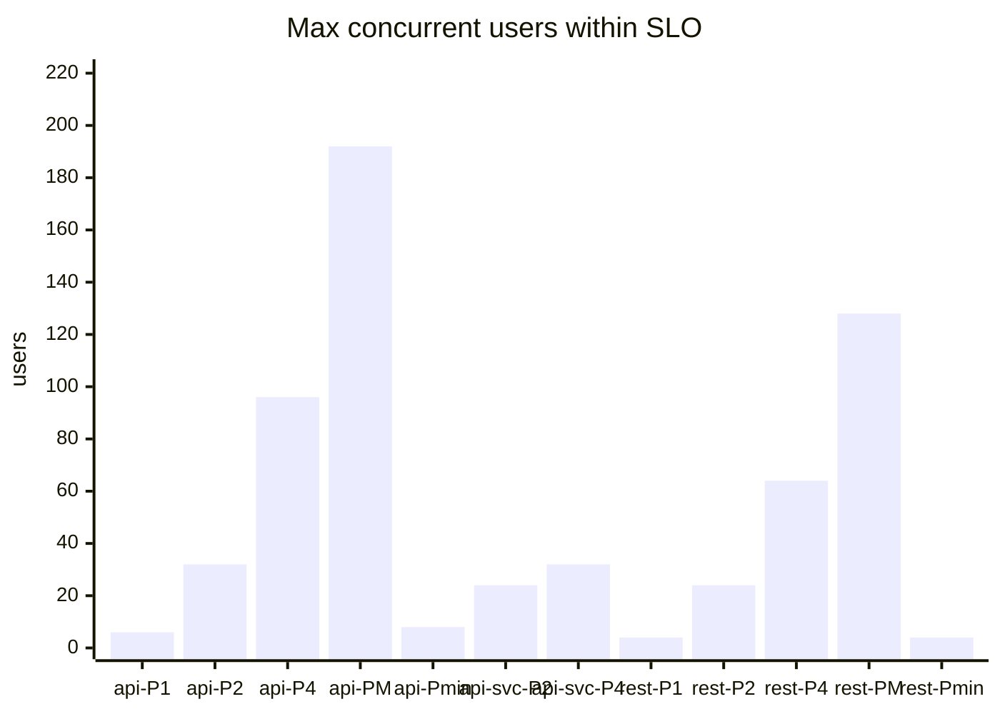


## Latency and throughput vs users


## Query types at 3 users

p50 / p95 ms by query quality (exact, typo, off-name variant, complete miss).

| Config | exact | typo | variant | miss |
|---|---|---|---|---|
| api-P1 | 20 / 86 | 19 / 73 | 14 / 73 | 14 / 51 |
| api-P2 | 18 / 52 | 17 / 50 | 16 / 42 | 8 / 30 |
| api-P4 | 15 / 61 | 14 / 62 | 16 / 60 | 6 / 29 |
| api-PM | 18 / 64 | 16 / 33 | 16 / 40 | 7 / 21 |
| api-Pmin | 21 / 91 | 17 / 38 | 27 / 57 | 15 / 57 |
| api-svc-P2 | 18 / 56 | 13 / 26 | 21 / 49 | 11 / 44 |
| api-svc-P4 | 19 / 94 | 18 / 45 | 17 / 42 | 47 / 60 |
| rest-P1 | 18 / 61 | 19 / 33 | 19 / 68 | 10 / 29 |
| rest-P2 | 18 / 56 | 16 / 34 | 17 / 37 | 8 / 45 |
| rest-P4 | 15 / 44 | 14 / 23 | 21 / 61 | 9 / 29 |
| rest-PM | 16 / 61 | 12 / 35 | 14 / 38 | 11 / 28 |
| rest-Pmin | 24 / 110 | 24 / 52 | 26 / 76 | 16 / 60 |

## Ramp detail per configuration

### api-P1: 1 CPU / 2.0 GB / shared_buffers 256MB / 4 connections

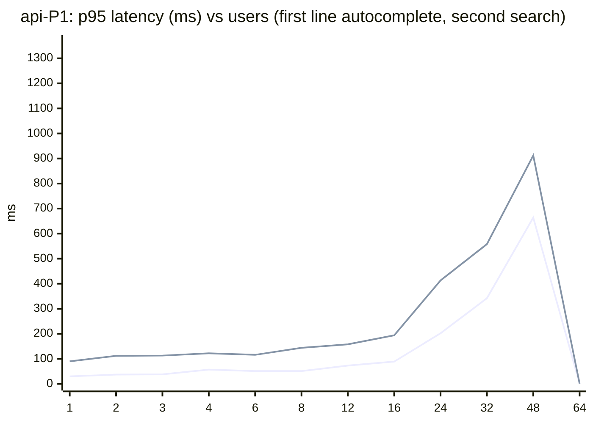

| Users | req/s | Errors | ac p95 | search p95 | struct p95 | rev p95 | miss p95 | Stack CPU p95 | Busiest service | Peak mem (MB) | Result |
|---|---|---|---|---|---|---|---|---|---|---|---|
| 1 | 1.5 | 0.0% | 30 | 90 | - | 291 | 35 | 10% | db (10%) | 413 | pass |
| 2 | 2.6 | 0.0% | 37 | 112 | 112 | 297 | 19 | 18% | db (18%) | 413 | pass |
| 3 | 4.0 | 0.0% | 38 | 113 | 79 | - | 10 | 17% | db (16%) | 416 | pass |
| 4 | 5.0 | 0.0% | 57 | 122 | 127 | 314 | 35 | 28% | db (27%) | 449 | pass |
| 6 | 7.5 | 0.0% | 51 | 116 | 126 | 384 | 24 | 40% | db (39%) | 449 | pass |
| 8 | 7.8 | 0.0% | 51 | 144 | 156 | 409 | 50 | 35% | db (33%) | 450 | fail |
| 12 | 15.3 | 0.0% | 73 | 158 | 128 | 511 | 31 | 64% | db (59%) | 451 | fail |
| 16 | 19.4 | 0.0% | 89 | 194 | 300 | 570 | 88 | 77% | db (71%) | 465 | fail |
| 24 | 25.4 | 0.0% | 202 | 413 | 527 | 1,149 | 139 | 101% | db (96%) | 463 | fail |
| 32 | 31.5 | 0.0% | 342 | 558 | 620 | 1,207 | 296 | 102% | db (96%) | 467 | fail |
| 48 | 38.2 | 0.0% | 664 | 912 | 1,028 | 1,609 | 606 | 102% | db (96%) | 465 | fail |
| 64 | 37.4 | 0.0% | 1,124 | 1,242 | 1,802 | 2,039 | 1,070 | 102% | db (96%) | 466 | broken |

### api-P2: 2 CPU / 2.7 GB / shared_buffers 384MB / 6 connections

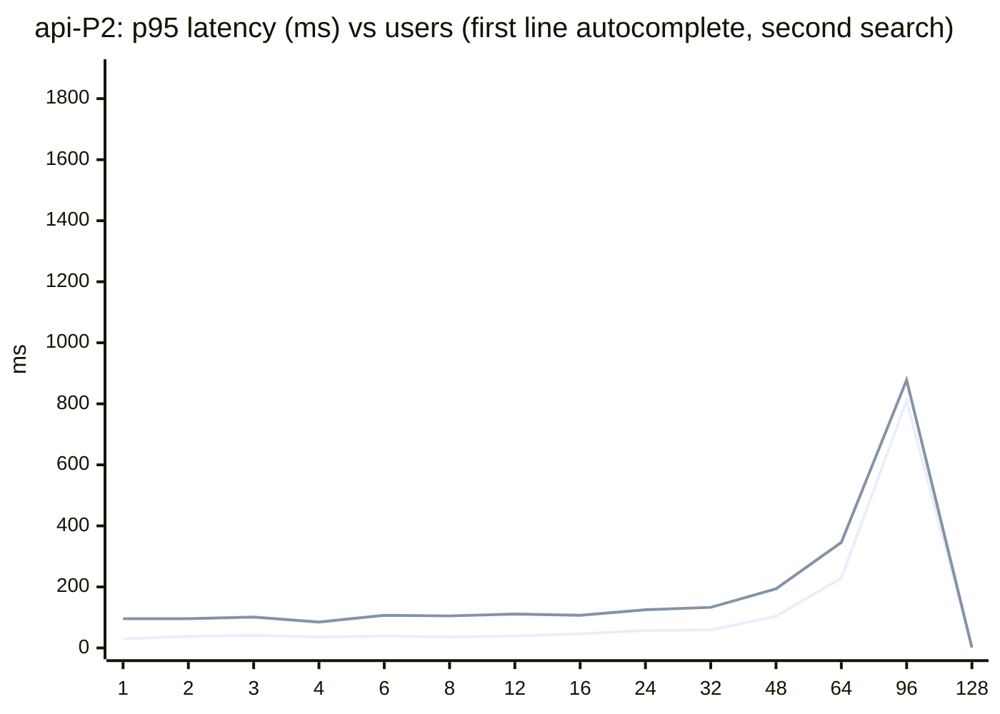

| Users | req/s | Errors | ac p95 | search p95 | struct p95 | rev p95 | miss p95 | Stack CPU p95 | Busiest service | Peak mem (MB) | Result |
|---|---|---|---|---|---|---|---|---|---|---|---|
| 1 | 1.1 | 0.0% | 30 | 96 | 90 | 270 | - | 8% | db (8%) | 625 | pass |
| 2 | 3.2 | 0.0% | 38 | 96 | 54 | 219 | - | 13% | db (12%) | 639 | pass |
| 3 | 4.2 | 0.0% | 41 | 101 | 124 | - | 15 | 20% | db (18%) | 645 | pass |
| 4 | 4.5 | 0.0% | 36 | 85 | 128 | 247 | 16 | 21% | db (20%) | 643 | pass |
| 6 | 6.5 | 0.0% | 39 | 107 | 102 | 269 | 22 | 33% | db (29%) | 699 | pass |
| 8 | 9.6 | 0.0% | 36 | 105 | 124 | 264 | 78 | 41% | db (38%) | 702 | pass |
| 12 | 15.2 | 0.0% | 39 | 111 | 122 | 292 | 43 | 48% | db (43%) | 709 | pass |
| 16 | 16.6 | 0.0% | 46 | 107 | 133 | 302 | 25 | 93% | db (88%) | 719 | pass |
| 24 | 28.1 | 0.0% | 57 | 125 | 130 | 390 | 36 | 102% | db (97%) | 725 | pass |
| 32 | 36.9 | 0.0% | 59 | 133 | 160 | 391 | 93 | 123% | db (116%) | 726 | pass |
| 48 | 49.0 | 0.0% | 104 | 194 | 228 | 510 | 71 | 173% | db (166%) | 727 | fail |
| 64 | 69.9 | 0.0% | 229 | 346 | 424 | 773 | 211 | 202% | db (190%) | 737 | fail |
| 96 | 75.6 | 0.0% | 810 | 878 | 838 | 1,365 | 799 | 204% | db (190%) | 741 | fail |
| 128 | 75.6 | 0.0% | 1,623 | 1,721 | 1,881 | 2,179 | 1,593 | 205% | db (192%) | 739 | broken |

### api-P4: 4 CPU / 3.3 GB / shared_buffers 512MB / 10 connections

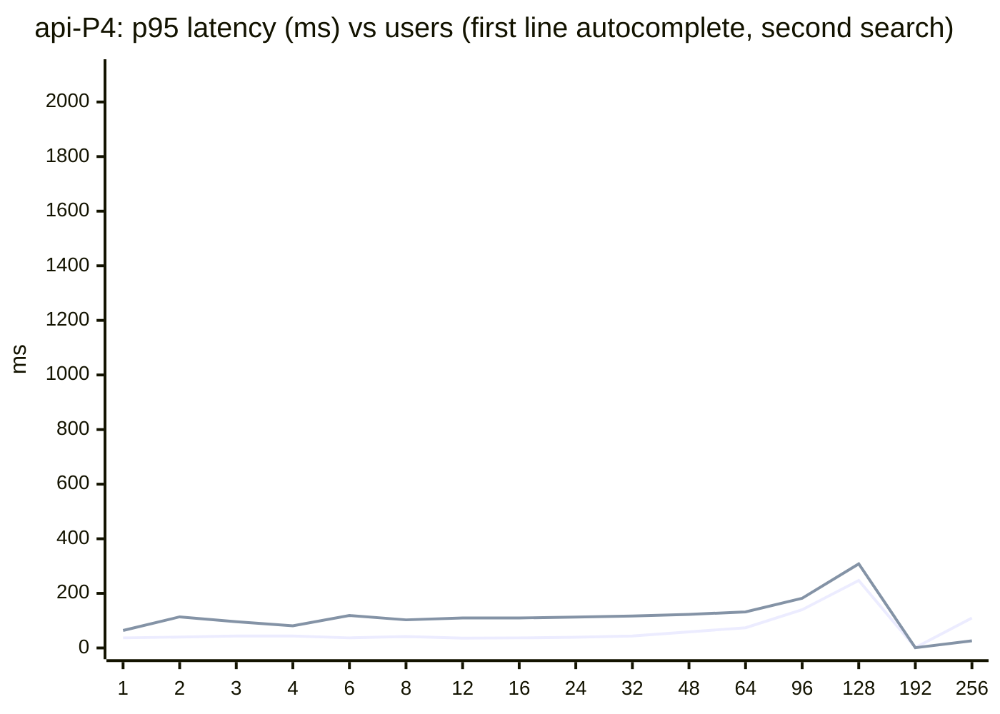

| Users | req/s | Errors | ac p95 | search p95 | struct p95 | rev p95 | miss p95 | Stack CPU p95 | Busiest service | Peak mem (MB) | Result |
|---|---|---|---|---|---|---|---|---|---|---|---|
| 1 | 1.8 | 0.0% | 37 | 64 | - | - | - | 15% | db (14%) | 799 | pass |
| 2 | 2.0 | 0.0% | 40 | 114 | 97 | 222 | - | 21% | db (19%) | 838 | pass |
| 3 | 4.2 | 0.0% | 44 | 96 | - | 257 | 17 | 30% | db (28%) | 856 | pass |
| 4 | 4.7 | 0.0% | 44 | 81 | 115 | 228 | 20 | 29% | db (28%) | 918 | pass |
| 6 | 7.3 | 0.0% | 37 | 119 | 72 | 219 | 38 | 44% | db (42%) | 931 | pass |
| 8 | 9.5 | 0.0% | 42 | 103 | 122 | 223 | 22 | 58% | db (54%) | 942 | pass |
| 12 | 12.6 | 0.0% | 36 | 110 | 107 | 234 | 36 | 60% | db (55%) | 956 | pass |
| 16 | 19.4 | 0.0% | 37 | 110 | 95 | 220 | 49 | 79% | db (74%) | 965 | pass |
| 24 | 27.3 | 0.0% | 39 | 113 | 113 | 224 | 28 | 120% | db (112%) | 978 | pass |
| 32 | 37.8 | 0.0% | 44 | 117 | 115 | 228 | 32 | 147% | db (139%) | 990 | pass |
| 48 | 58.6 | 0.0% | 59 | 123 | 122 | 244 | 46 | 228% | db (211%) | 1,007 | pass |
| 64 | 71.7 | 0.0% | 74 | 132 | 136 | 256 | 62 | 236% | db (219%) | 1,016 | pass |
| 96 | 108.5 | 0.0% | 140 | 182 | 210 | 373 | 129 | 370% | db (338%) | 1,017 | pass |
| 128 | 136.7 | 0.0% | 247 | 308 | 317 | 595 | 230 | 400% | db (376%) | 1,020 | fail |
| 192 | 146.5 | 0.0% | 1,110 | 1,026 | 1,398 | 1,638 | 1,154 | 404% | db (376%) | 1,024 | fail |
| 256 | 148.8 | 0.0% | 1,894 | 1,923 | 1,839 | 2,323 | 1,975 | 406% | db (375%) | 1,029 | broken |

### api-PM: all CPU / unlimited / shared_buffers 1GB / 16 connections

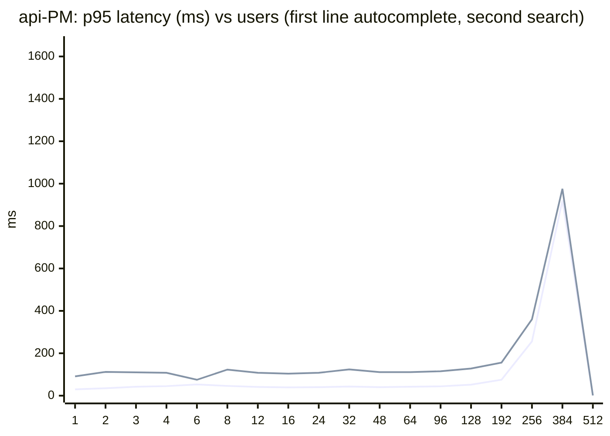

| Users | req/s | Errors | ac p95 | search p95 | struct p95 | rev p95 | miss p95 | Stack CPU p95 | Busiest service | Peak mem (MB) | Result |
|---|---|---|---|---|---|---|---|---|---|---|---|
| 1 | 1.1 | 0.0% | 30 | 91 | 99 | - | - | 10% | db (9%) | 890 | pass |
| 2 | 2.1 | 0.0% | 35 | 112 | 104 | 229 | 8 | 16% | db (14%) | 890 | pass |
| 3 | 3.4 | 0.0% | 42 | 110 | 97 | 12 | 16 | 23% | db (20%) | 930 | pass |
| 4 | 5.0 | 0.0% | 45 | 108 | 88 | 264 | 27 | 31% | db (29%) | 936 | pass |
| 6 | 6.4 | 0.0% | 53 | 75 | 174 | 333 | 32 | 37% | db (34%) | 967 | pass |
| 8 | 9.0 | 0.0% | 46 | 123 | 107 | 263 | 26 | 52% | db (50%) | 1,018 | pass |
| 12 | 13.8 | 0.0% | 41 | 108 | 118 | 225 | 34 | 64% | db (62%) | 1,110 | pass |
| 16 | 18.4 | 0.0% | 39 | 104 | 109 | 224 | 20 | 80% | db (74%) | 1,166 | pass |
| 24 | 29.1 | 0.0% | 40 | 108 | 112 | 225 | 32 | 120% | db (110%) | 1,230 | pass |
| 32 | 38.0 | 0.0% | 43 | 124 | 123 | 226 | 31 | 161% | db (152%) | 1,241 | pass |
| 48 | 57.4 | 0.0% | 40 | 111 | 118 | 236 | 41 | 217% | db (200%) | 1,255 | pass |
| 64 | 73.6 | 0.0% | 42 | 111 | 117 | 234 | 25 | 274% | db (252%) | 1,270 | pass |
| 96 | 110.5 | 0.0% | 44 | 115 | 131 | 252 | 35 | 409% | db (380%) | 1,282 | pass |
| 128 | 149.6 | 0.0% | 52 | 128 | 133 | 272 | 39 | 567% | db (510%) | 1,310 | pass |
| 192 | 218.3 | 0.0% | 75 | 156 | 197 | 332 | 70 | 952% | db (894%) | 1,329 | pass |
| 256 | 264.5 | 0.0% | 256 | 360 | 394 | 628 | 228 | 1,122% | db (1043%) | 1,344 | fail |
| 384 | 284.3 | 0.0% | 921 | 976 | 1,039 | 1,337 | 924 | 1,132% | db (1051%) | 1,353 | fail |
| 512 | 293.0 | 0.0% | 1,439 | 1,512 | 1,628 | 1,843 | 1,432 | 1,124% | db (1046%) | 1,359 | broken |

### api-Pmin: 1 CPU / 1.6 GB / shared_buffers 128MB / 4 connections

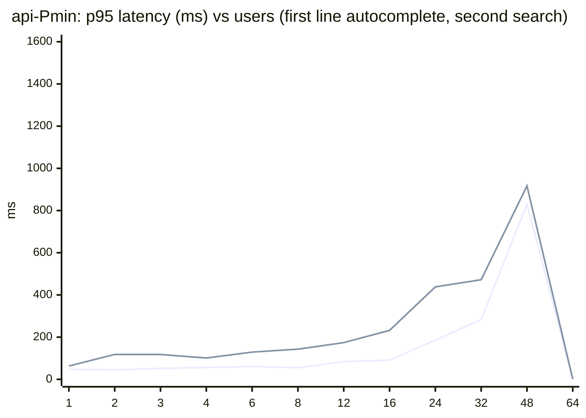

| Users | req/s | Errors | ac p95 | search p95 | struct p95 | rev p95 | miss p95 | Stack CPU p95 | Busiest service | Peak mem (MB) | Result |
|---|---|---|---|---|---|---|---|---|---|---|---|
| 1 | 1.3 | 0.0% | 47 | 63 | 98 | - | - | 13% | db (12%) | 285 | pass |
| 2 | 2.8 | 0.0% | 45 | 118 | - | 287 | - | 14% | db (13%) | 284 | pass |
| 3 | 3.1 | 0.0% | 52 | 118 | 73 | 291 | 16 | 29% | db (28%) | 285 | pass |
| 4 | 4.7 | 0.0% | 56 | 101 | 96 | 362 | 69 | 22% | db (20%) | 312 | pass |
| 6 | 7.5 | 0.0% | 61 | 129 | 115 | 354 | 18 | 27% | db (26%) | 310 | pass |
| 8 | 10.0 | 0.0% | 55 | 143 | 181 | 343 | 48 | 33% | db (31%) | 316 | pass |
| 12 | 11.9 | 0.0% | 84 | 174 | 164 | 622 | 85 | 66% | db (63%) | 316 | fail |
| 16 | 18.5 | 0.0% | 91 | 232 | 229 | 544 | 53 | 83% | db (79%) | 322 | fail |
| 24 | 26.0 | 0.0% | 186 | 438 | 394 | 1,072 | 193 | 101% | db (95%) | 325 | fail |
| 32 | 31.8 | 0.0% | 283 | 472 | 661 | 1,072 | 270 | 100% | db (95%) | 328 | fail |
| 48 | 34.7 | 0.0% | 830 | 917 | 1,181 | 1,576 | 790 | 102% | db (96%) | 328 | fail |
| 64 | 33.6 | 0.0% | 1,269 | 1,456 | 1,796 | 1,797 | 1,238 | 102% | db (96%) | 330 | broken |

### api-svc-P2: 2 CPU / 4.7 GB / shared_buffers 384MB / 6 connections

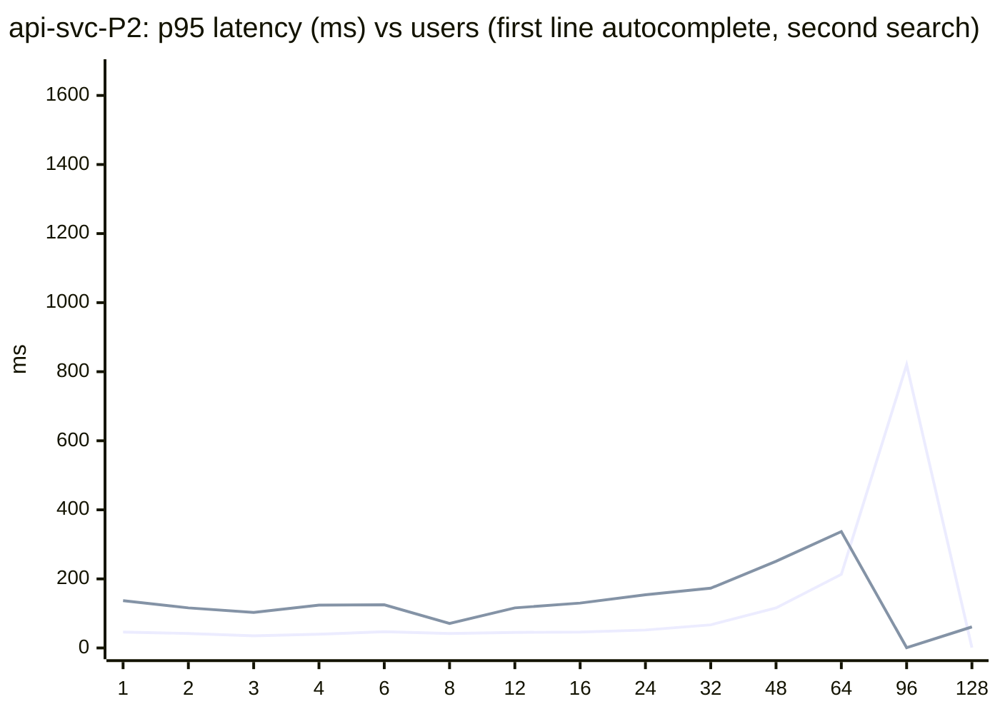

| Users | req/s | Errors | ac p95 | search p95 | struct p95 | rev p95 | miss p95 | Stack CPU p95 | Busiest service | Peak mem (MB) | Result |
|---|---|---|---|---|---|---|---|---|---|---|---|
| 1 | 1.6 | 0.0% | 46 | 137 | - | 211 | 13 | 12% | db (10%) | 2,594 | pass |
| 2 | 2.2 | 0.0% | 42 | 116 | 100 | 220 | 12 | 10% | db (9%) | 2,613 | pass |
| 3 | 4.1 | 0.0% | 35 | 103 | - | 220 | 93 | 26% | db (25%) | 2,642 | pass |
| 4 | 3.8 | 0.0% | 40 | 124 | 112 | 230 | 94 | 39% | db (36%) | 2,646 | pass |
| 6 | 6.9 | 0.0% | 47 | 125 | 103 | 312 | 22 | 47% | db (42%) | 2,670 | pass |
| 8 | 9.5 | 0.0% | 42 | 71 | 134 | 286 | 30 | 38% | db (36%) | 2,674 | pass |
| 12 | 12.8 | 0.0% | 45 | 116 | 107 | 249 | 21 | 61% | db (57%) | 2,674 | pass |
| 16 | 17.5 | 0.0% | 46 | 130 | 110 | 283 | 49 | 86% | db (81%) | 2,682 | pass |
| 24 | 28.6 | 0.0% | 52 | 154 | 145 | 351 | 43 | 117% | db (108%) | 2,686 | pass |
| 32 | 35.2 | 0.0% | 67 | 173 | 222 | 432 | 76 | 141% | db (131%) | 2,690 | fail |
| 48 | 52.7 | 0.0% | 116 | 251 | 237 | 544 | 118 | 175% | db (162%) | 2,691 | fail |
| 64 | 66.0 | 0.0% | 213 | 337 | 417 | 809 | 186 | 201% | db (190%) | 2,692 | fail |
| 96 | 72.5 | 0.0% | 820 | 1,061 | 1,164 | 1,529 | 715 | 203% | db (190%) | 2,696 | fail |
| 128 | 76.0 | 0.0% | 1,356 | 1,520 | 1,602 | 1,887 | 1,290 | 202% | db (189%) | 2,701 | broken |

### api-svc-P4: 4 CPU / 5.3 GB / shared_buffers 512MB / 10 connections

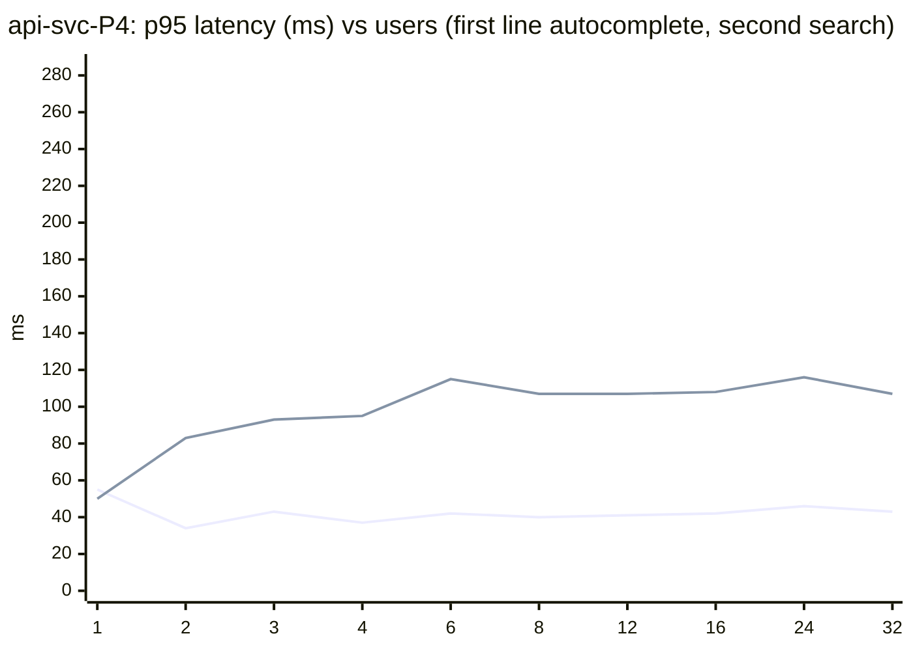

| Users | req/s | Errors | ac p95 | search p95 | struct p95 | rev p95 | miss p95 | Stack CPU p95 | Busiest service | Peak mem (MB) | Result |
|---|---|---|---|---|---|---|---|---|---|---|---|
| 1 | 1.1 | 0.0% | 55 | 50 | 56 | - | 12 | 13% | db (12%) | 2,729 | pass |
| 2 | 1.7 | 0.0% | 34 | 83 | 146 | 234 | 24 | 26% | db (26%) | 2,772 | pass |
| 3 | 3.5 | 0.0% | 43 | 93 | 108 | 237 | 12 | 19% | db (18%) | 2,833 | pass |
| 4 | 4.2 | 0.0% | 37 | 95 | 112 | 232 | 29 | 34% | db (32%) | 2,878 | pass |
| 6 | 7.2 | 0.0% | 42 | 115 | 116 | 224 | 68 | 41% | db (39%) | 2,898 | pass |
| 8 | 9.4 | 0.0% | 40 | 107 | 110 | 222 | 34 | 61% | db (58%) | 2,908 | pass |
| 12 | 14.6 | 0.0% | 41 | 107 | 112 | 218 | 42 | 64% | db (58%) | 2,923 | pass |
| 16 | 16.2 | 0.0% | 42 | 108 | 112 | 220 | 51 | 74% | db (69%) | 2,936 | pass |
| 24 | 30.2 | 0.0% | 46 | 116 | 140 | 293 | 40 | 121% | db (111%) | 2,953 | pass |
| 32 | 28.9 | 0.0% | 43 | 107 | 102 | 229 | 58 | 168% | db (156%) | 2,947 | DIED |

### rest-P1: 1 CPU / 2.0 GB / shared_buffers 256MB / 4 connections

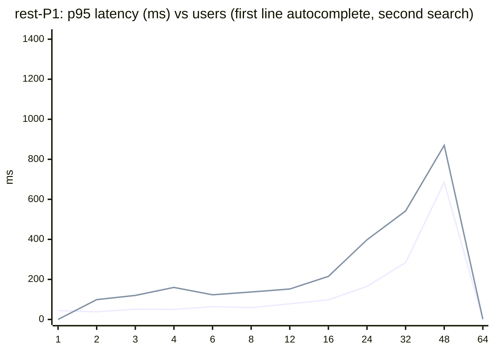

| Users | req/s | Errors | ac p95 | search p95 | struct p95 | rev p95 | miss p95 | Stack CPU p95 | Busiest service | Peak mem (MB) | Result |
|---|---|---|---|---|---|---|---|---|---|---|---|
| 1 | 1.6 | 0.0% | 44 | - | - | - | 25 | 10% | db (9%) | 396 | pass |
| 2 | 1.9 | 0.0% | 38 | 99 | 93 | 382 | 13 | 14% | db (13%) | 400 | pass |
| 3 | 3.6 | 0.0% | 51 | 120 | 102 | 350 | 18 | 33% | db (32%) | 398 | pass |
| 4 | 3.5 | 0.0% | 50 | 160 | 71 | 360 | 27 | 33% | db (33%) | 423 | pass |
| 6 | 6.4 | 0.0% | 64 | 123 | 181 | 413 | 27 | 50% | db (49%) | 426 | fail |
| 8 | 9.0 | 0.0% | 59 | 137 | 153 | 424 | 37 | 63% | db (62%) | 442 | fail |
| 12 | 13.6 | 0.0% | 78 | 152 | 109 | 536 | 73 | 56% | db (54%) | 448 | fail |
| 16 | 17.3 | 0.0% | 98 | 215 | 171 | 593 | 95 | 80% | db (77%) | 446 | fail |
| 24 | 26.5 | 0.0% | 165 | 398 | 375 | 930 | 153 | 101% | db (97%) | 453 | fail |
| 32 | 31.4 | 0.0% | 284 | 542 | 553 | 1,117 | 268 | 101% | db (98%) | 452 | fail |
| 48 | 37.1 | 0.0% | 685 | 870 | 823 | 1,700 | 663 | 101% | db (98%) | 456 | fail |
| 64 | 36.8 | 0.0% | 1,115 | 1,293 | 1,423 | 2,021 | 1,088 | 101% | db (97%) | 461 | broken |

### rest-P2: 2 CPU / 2.5 GB / shared_buffers 384MB / 6 connections

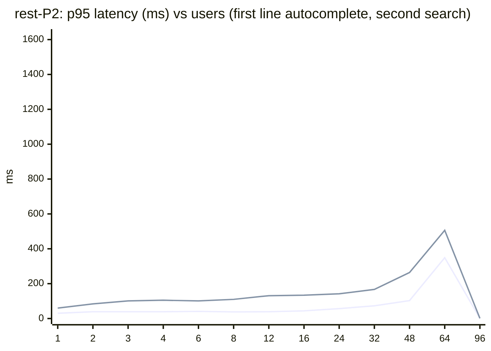

| Users | req/s | Errors | ac p95 | search p95 | struct p95 | rev p95 | miss p95 | Stack CPU p95 | Busiest service | Peak mem (MB) | Result |
|---|---|---|---|---|---|---|---|---|---|---|---|
| 1 | 1.5 | 0.0% | 30 | 60 | - | - | 30 | 8% | db (7%) | 525 | pass |
| 2 | 1.9 | 0.0% | 39 | 84 | - | 209 | 20 | 19% | db (18%) | 537 | pass |
| 3 | 2.8 | 0.0% | 39 | 101 | 94 | 236 | 14 | 20% | db (19%) | 538 | pass |
| 4 | 4.3 | 0.0% | 39 | 105 | 117 | 246 | 46 | 31% | db (30%) | 565 | pass |
| 6 | 7.7 | 0.0% | 41 | 101 | 109 | 244 | 30 | 34% | db (33%) | 629 | pass |
| 8 | 9.6 | 0.0% | 38 | 110 | 91 | 251 | 35 | 34% | db (32%) | 633 | pass |
| 12 | 12.6 | 0.0% | 39 | 131 | 126 | 260 | 28 | 55% | db (52%) | 638 | pass |
| 16 | 19.3 | 0.0% | 44 | 134 | 119 | 317 | 28 | 69% | db (66%) | 644 | pass |
| 24 | 26.4 | 0.0% | 57 | 142 | 115 | 332 | 38 | 94% | db (90%) | 646 | pass |
| 32 | 35.1 | 0.0% | 73 | 167 | 187 | 479 | 42 | 148% | db (143%) | 652 | fail |
| 48 | 53.2 | 0.0% | 103 | 264 | 277 | 665 | 93 | 199% | db (191%) | 654 | fail |
| 64 | 65.3 | 0.0% | 349 | 506 | 578 | 1,069 | 350 | 203% | db (190%) | 659 | fail |
| 96 | 71.9 | 0.0% | 1,211 | 1,481 | 1,273 | 2,103 | 1,374 | 203% | db (190%) | 664 | broken |

### rest-P4: 4 CPU / 3.0 GB / shared_buffers 512MB / 10 connections


| Users | req/s | Errors | ac p95 | search p95 | struct p95 | rev p95 | miss p95 | Stack CPU p95 | Busiest service | Peak mem (MB) | Result |
|---|---|---|---|---|---|---|---|---|---|---|---|
| 1 | 1.3 | 0.0% | 29 | 103 | 97 | 216 | 27 | 13% | db (12%) | 548 | pass |
| 2 | 2.1 | 0.0% | 47 | 109 | 64 | 237 | 41 | 22% | db (21%) | 594 | pass |
| 3 | 4.3 | 0.0% | 42 | 117 | 86 | 231 | - | 25% | db (24%) | 617 | pass |
| 4 | 5.8 | 0.0% | 47 | 105 | - | 5 | 54 | 25% | db (23%) | 662 | pass |
| 6 | 7.6 | 0.0% | 39 | 104 | 117 | 216 | 30 | 33% | db (31%) | 748 | pass |
| 8 | 9.0 | 0.0% | 41 | 106 | 110 | 229 | 15 | 65% | db (61%) | 811 | pass |
| 12 | 13.9 | 0.0% | 38 | 107 | 106 | 228 | 29 | 67% | db (63%) | 875 | pass |
| 16 | 20.1 | 0.0% | 37 | 113 | 112 | 221 | 26 | 76% | db (73%) | 888 | pass |
| 24 | 28.1 | 0.0% | 44 | 118 | 103 | 226 | 24 | 115% | db (110%) | 898 | pass |
| 32 | 39.3 | 0.0% | 40 | 112 | 103 | 236 | 35 | 152% | db (147%) | 917 | pass |
| 48 | 53.6 | 0.0% | 44 | 118 | 114 | 251 | 37 | 210% | db (195%) | 935 | pass |
| 64 | 73.1 | 0.0% | 51 | 119 | 135 | 279 | 49 | 279% | db (266%) | 937 | pass |
| 96 | 110.9 | 0.0% | 89 | 201 | 224 | 527 | 69 | 404% | db (360%) | 947 | fail |
| 128 | 127.3 | 0.0% | 379 | 483 | 640 | 1,039 | 360 | 408% | db (365%) | 954 | fail |
| 192 | 136.1 | 0.0% | 1,606 | 1,652 | 1,603 | 2,204 | 1,696 | 410% | db (359%) | 964 | broken |

### rest-PM: all CPU / unlimited / shared_buffers 1GB / 16 connections

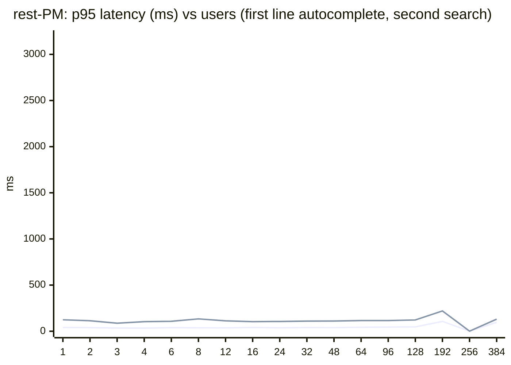

| Users | req/s | Errors | ac p95 | search p95 | struct p95 | rev p95 | miss p95 | Stack CPU p95 | Busiest service | Peak mem (MB) | Result |
|---|---|---|---|---|---|---|---|---|---|---|---|
| 1 | 1.3 | 0.0% | 41 | 124 | - | 221 | - | 15% | db (14%) | 624 | pass |
| 2 | 2.4 | 0.0% | 39 | 114 | 25 | 228 | 8 | 24% | db (23%) | 642 | pass |
| 3 | 3.2 | 0.0% | 35 | 87 | 113 | 232 | 19 | 28% | db (26%) | 674 | pass |
| 4 | 4.7 | 0.0% | 34 | 104 | 113 | 220 | - | 29% | db (27%) | 715 | pass |
| 6 | 5.7 | 0.0% | 39 | 108 | 108 | 222 | 20 | 41% | db (39%) | 789 | pass |
| 8 | 9.3 | 0.0% | 37 | 134 | - | 222 | 32 | 39% | db (37%) | 852 | pass |
| 12 | 11.3 | 0.0% | 36 | 113 | 108 | 223 | 30 | 52% | db (50%) | 896 | pass |
| 16 | 19.1 | 0.0% | 41 | 104 | 103 | 229 | 49 | 69% | db (67%) | 987 | pass |
| 24 | 27.8 | 0.0% | 37 | 106 | 110 | 240 | 27 | 100% | db (95%) | 1,115 | pass |
| 32 | 38.9 | 0.0% | 40 | 110 | 110 | 228 | 29 | 144% | db (137%) | 1,145 | pass |
| 48 | 56.3 | 0.0% | 39 | 111 | 114 | 231 | 37 | 189% | db (181%) | 1,162 | pass |
| 64 | 76.9 | 0.0% | 43 | 116 | 126 | 237 | 29 | 268% | db (256%) | 1,186 | pass |
| 96 | 116.1 | 0.0% | 45 | 116 | 129 | 258 | 41 | 466% | db (423%) | 1,201 | pass |
| 128 | 145.1 | 0.0% | 47 | 122 | 129 | 270 | 42 | 568% | db (543%) | 1,224 | pass |
| 192 | 212.6 | 0.0% | 107 | 220 | 258 | 504 | 77 | 1,061% | db (889%) | 1,244 | fail |
| 256 | 202.0 | 0.0% | 1,096 | 1,131 | 1,426 | 1,503 | 1,103 | 1,116% | db (759%) | 1,263 | fail |
| 384 | 196.0 | 0.0% | 2,704 | 2,908 | 2,983 | 3,302 | 2,659 | 1,116% | db (764%) | 1,288 | broken |

### rest-Pmin: 1 CPU / 1.6 GB / shared_buffers 128MB / 4 connections

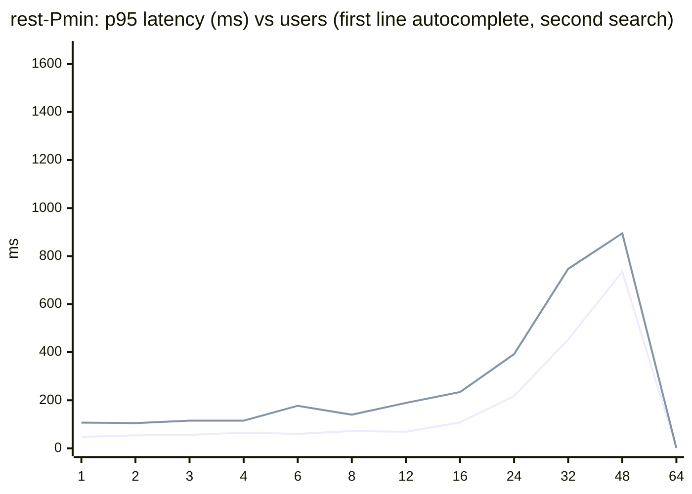

| Users | req/s | Errors | ac p95 | search p95 | struct p95 | rev p95 | miss p95 | Stack CPU p95 | Busiest service | Peak mem (MB) | Result |
|---|---|---|---|---|---|---|---|---|---|---|---|
| 1 | 1.0 | 0.0% | 48 | 107 | - | 303 | 16 | 14% | db (13%) | 286 | pass |
| 2 | 2.3 | 0.0% | 54 | 105 | 110 | 353 | 73 | 12% | db (12%) | 286 | pass |
| 3 | 3.1 | 0.0% | 56 | 115 | 136 | 361 | 117 | 18% | db (18%) | 288 | pass |
| 4 | 4.4 | 0.0% | 65 | 115 | 146 | 398 | 29 | 26% | db (25%) | 317 | pass |
| 6 | 7.6 | 0.0% | 60 | 177 | 120 | 424 | 59 | 46% | db (44%) | 319 | fail |
| 8 | 10.1 | 0.0% | 72 | 140 | 19 | 471 | 36 | 53% | db (51%) | 320 | fail |
| 12 | 14.5 | 0.0% | 69 | 189 | 102 | 555 | 55 | 59% | db (57%) | 324 | fail |
| 16 | 17.0 | 0.0% | 108 | 234 | 308 | 760 | 101 | 76% | db (73%) | 304 | fail |
| 24 | 24.4 | 0.0% | 217 | 392 | 441 | 943 | 184 | 97% | db (94%) | 306 | fail |
| 32 | 28.8 | 0.0% | 453 | 747 | 790 | 1,246 | 342 | 102% | db (97%) | 314 | fail |
| 48 | 35.1 | 0.0% | 735 | 895 | 1,250 | 1,418 | 745 | 102% | db (97%) | 314 | fail |
| 64 | 34.8 | 0.0% | 1,391 | 1,512 | 1,603 | 2,037 | 1,315 | 102% | db (97%) | 317 | broken |

