# Self-Hosted Geocoding for Maine

**Pelias and a PostgreSQL/PostGIS geocoder (pgeo): design, tuning, accuracy and capacity**

Project version 0.11.0 (pgeo 0+unknown) · built 2026-09-19 from commit
`f4694d9 (with uncommitted changes)` · data snapshot 2026-09-19 · load-test runs 20260918-1834, 20260918-2051, 20260919-0718, 20260919-1135-pgeo, 20260919-1543-pgeo.
Generated by `scripts/build_report.sh`; every number, table and chart in this report is computed from the
saved results listed in `report/inputs.toml`.

## Executive summary

This study built and compared two self-hosted geocoders for the State of Maine on the same
open data: **Pelias**, the established open-source geocoder (Elasticsearch plus five Node.js and
C++ services), and **pgeo**, a geocoder written for this project that runs entirely inside
PostgreSQL 18 with PostGIS, served either by a thin FastAPI application or, with no application
code at all, by PostgREST ("pure SQL"). Pelias served as the reference and as the test oracle
for pgeo's API.

**Accuracy.** On 1,560 engine-independent test cases whose answers come from the
source data, pgeo answers **95.8%** correctly against **75.5%**
for Pelias. The gap is largest where people make mistakes: queries with typos
(87% vs 30%), places that do not exist
(95% vs 41% handled correctly), lakes and summits
(95% vs 41%) and venues
(94% vs 68%). Under progressive
corruption of 300 base queries, pgeo still answers 75% with two
character errors per query, where Pelias answers 10%.

**Capacity.** Pelias is the faster engine: at every tested CPU size it keeps
4 times as many concurrent users within the latency targets as pgeo
(96 against 24 on one vCPU, 384 against
96 on four). pgeo is the smaller one: it meets every target for the 3-user goal
of this project in a 1.6 GB memory budget on one vCPU, and holds
24 users there, where Pelias needs about 8.3 GB to run at all. A
single missing index had made pgeo's reverse geocoding 20 to 45 times slower; fixing it raised pgeo's
one-vCPU capacity from 4 to 24 users.
**The smallest server.** Shrinking one resource at a time until the three-user load stopped
meeting its targets (Section 3.12) put pgeo's floor at **0.25 vCPU and
1.40 GB** of memory and Pelias's at **[missing value floor_pelias_vcpu] vCPU and
[missing value floor_pelias_gb]**. Both idle below a quarter of a core, so at this scale the bill is set
by memory: pgeo fits the cheapest shared-CPU plans providers sell, Pelias needs a mid-range server.
<!-- PENDING: temporary-VM confirmation of both floors -->

**Compatibility and extensions.** pgeo passes all 27 cases of a Pelias API
compatibility contract on both front ends, so existing Pelias clients work unchanged, and adds
a structured-address endpoint (USPS Publication 28) for the LANCER dispatch application.

**Recommendation.** For the stated need (a handful of users, a small VM or VPS, messy input,
fewest components) pgeo in its pure-SQL form is the better fit; Pelias remains the choice for
hundreds of concurrent users per vCPU. Section "Conclusions" maps scenarios to tools.


> **Key result.** On the same open data and the same hardware, pgeo answers 95.8% of 1,560 test queries correctly against 75.5% for Pelias, and it does so in about a quarter of the memory. Pelias remains about 4 times faster per CPU. For a small, self-hosted Maine geocoder, accuracy and memory decide, and both favour pgeo.


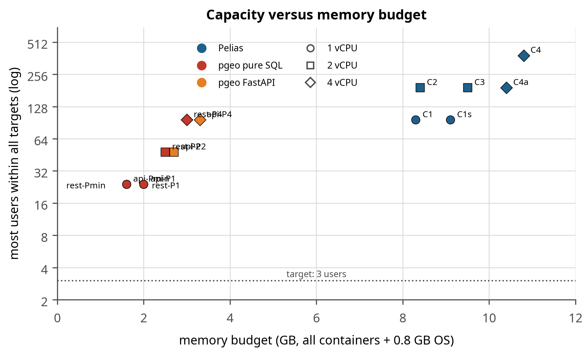

**Figure 1.** Capacity against memory budget for every tested configuration of both engines. Each point is one configuration; the vertical axis is the most concurrent users for which every endpoint stayed within its latency target (log scale). pgeo configurations sit at the left (1.6-3.3 GB), Pelias at the right (8.3-10.8 GB). The dotted line is the project's 3-user goal.


**Table 1.** Key findings.

| Question | Answer | Evidence |
|---|---|---|
| Which engine is more accurate? | pgeo, by about 20 points overall and 50+ points on typos | Section 3.1 |
| Which is faster under load? | Pelias, four times as many users per CPU | Section 3.4, Table 30 |
| Smallest server for 3 users? | pgeo: 0.25 vCPU, 1.4 GB total. Pelias: see Section 3.12 | Section 3.12 |
| Can PostgreSQL alone be the API? | Yes: PostgREST in front of SQL functions, identical accuracy | Sections 2.1, 3.8 |
| Does more data slow Pelias? | Addresses barely; OSM and Overture places cost one ramp step each | Section 3.6 |
| Drop-in replacement for Pelias clients? | Yes for the documented API (27 of 27 contract cases) | Section 3.8 |


## 1. Introduction

### 1.1 Motivation

Geocoding (turning a typed address or place name into coordinates) and reverse geocoding
(turning a map position into an address) are basic services for any application that deals
with places. Commercial geocoding APIs charge per request, send every query to a third party,
and change without notice. This project set out to host a feature-rich geocoder for Maine (and
later New Hampshire) on the owner's own infrastructure: a Proxmox server on the home LAN,
reachable over HTTPS, with a map-based demonstration page.

Two further needs shaped the work. First, the geocoder is meant to feed **LANCER**, a
dispatch-and-billing application whose client sites carry sensitive, encrypted street
addresses; queries that contain such addresses should not leave the owner's network or linger
in logs. Second, a guiding principle (G6) asked for **the stack with the fewest additional
components, keeping data in PostgreSQL, unless that produces an inferior or overly complex
product**. That principle motivated building pgeo alongside Pelias and measuring both.

### 1.2 Starting conditions

| Item | State at the start |
|---|---|
| Infrastructure | Proxmox VE 9.2 node (prox82): AMD Ryzen 5 7600X (Zen 4, 6 cores / 12 threads), 46 GB RAM, guests configured `cpu=host` with ballooning off; Debian 13 cloud-init template; a TLS-terminating Caddy on the "wharf" VM with public DNS-01 certificates; Forgejo for source control |
| Target host | VM 120 (`geocoder.example.org`), 4 vCPU and 10 GB RAM, NVMe storage, LAN only |
| Build and test host | Workstation: AMD Ryzen 5 3600 6-Core Processor, 12 threads, 31 GB RAM. Two CPU generations behind the Proxmox host (Zen 2 against Zen 4), so a VM core on the host is the faster core: the controlled results in Section 3 are, if anything, conservative for the production VM |
| Reference recipe | The Pelias `docker` project for Texas, adapted for Maine |
| Data | Open data only. No OpenAddresses API token is needed: the statewide Maine file is downloaded without one |
| Where things run | Builds and all controlled tests run on the workstation; the service runs on VM 120 on the Proxmox host (192.0.2.10) and is reached through the wharf Caddy |
| Goals | G1 accurate Maine geocoding; G2 LAN-only, HTTPS; G3 reproducible build; G4 demo page; G5 minimum resources for 3 users; G6 fewest components |

### 1.3 Questions

1. How accurate is each engine on Maine data, including misspelled, variant and impossible queries?
2. What are the minimum server resources for 3 concurrent users, and where does each engine break when users are added?
3. How does adding data layers change performance?
4. Can PostgreSQL itself be the API endpoint (G6) without an inferior product?
5. Can pgeo replace Pelias for existing clients, and what does it add?

## 2. Methods

### 2.1 Systems built

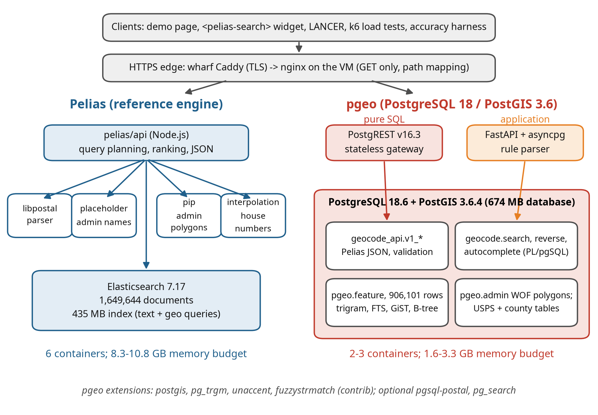

**Figure 2.** System architecture. Clients reach both engines through the same HTTPS edge. Pelias (left) is an API service coordinating four helper services and Elasticsearch. pgeo (right) keeps data, parsing, ranking and JSON formatting inside PostgreSQL; the HTTP front end is either PostgREST (a stateless gateway, no application code) or a thin FastAPI application.


Figure 2 contrasts the two designs, and the contrast explains most of the
results that follow. Pelias divides the work among six processes in three languages, so each part
can be scaled or replaced, and Elasticsearch does the text matching in compiled code. pgeo puts
everything in one process family: the query, the ranking and the JSON all happen inside the
database. That is why pgeo needs a quarter of the memory and fewer moving parts, and why it costs
more CPU per request.

**Pelias** was deployed from pinned images (API, libpostal parser, placeholder, point-in-polygon,
interpolation, Elasticsearch 7.17.27) with the index built on the workstation and
shipped to VM 120 as an Elasticsearch snapshot. Nginx on the VM serves the demo page and the API
under strict security headers; the wharf Caddy terminates TLS.

**pgeo** runs on PostgreSQL PostgreSQL 18.6 (Debian 18.6-1.pgdg13+2) with PostGIS 3.6.4 and only
core and contrib extensions (`pg_trgm` for trigram similarity, `unaccent`, `fuzzystrmatch`).
Every query step is a SQL or PL/pgSQL function (Figure 3 shows the
forward-search path). The public API is a schema of functions (`geocode_api.v1_search`,
`v1_reverse`, ...) that return Pelias-shaped GeoJSON, so any HTTP layer that can call a
function can serve it. Two front ends were built and measured:

- **PostgREST** (pure SQL): maps `GET /rpc/v1_search?text=...` to the function; an nginx edge
  maps Pelias paths (`/v1/search`) to RPC paths. Chosen over an in-database HTTP server
  (Omnigres) because it keeps third-party code out of the database process, and over
  OpenResty because it needs no custom code (docs/HTTP_OPTIONS.md).
- **FastAPI** (application): the same SQL functions behind a Python service, kept as the
  baseline to show what an application layer adds or costs.

PostgreSQL core and its contrib extensions contain no HTTP server, so "Postgres as the endpoint"
always needs either third-party code inside the database or a small gateway beside it. The options
were weighed as follows (docs/HTTP_OPTIONS.md has the full research and sources):


**Table 2.** HTTP options for serving the SQL API.

| Option | For | Against | Decision |
|---|---|---|---|
| PostgREST (external gateway) | no business logic outside SQL; mature; database roles as the security model; crash-isolated from the database; pooling built in | one more process; `/rpc/` paths and dotted parameters need an edge mapping | chosen |
| Omnigres `omni_httpd` (in the database) | literally "Postgres is the API"; no extra hop; full URL control | third-party C code in the database process; early maturity; upgrades tied to PostgreSQL releases; HTTP workers compete with queries | rejected |
| OpenResty + pgmoon (nginx + Lua) | nginx already present; full control of paths and parameters | a custom nginx build and Lua code to own | fallback |
| pg_featureserv, pREST, GraphQL gateways | publish functions quickly | OGC or GraphQL shapes, not the Pelias API | not suitable |
| FastAPI (application) | flexible; any parser | application code to maintain | kept as baseline |


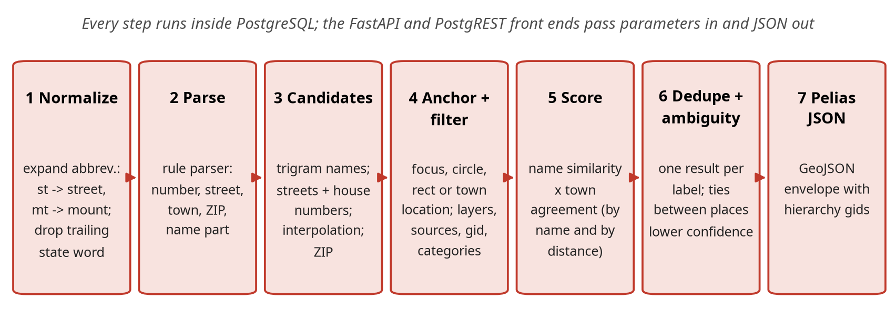

**Figure 3.** The pgeo forward-search pipeline. Each step is SQL; the tuning work in Section 2.7 changed steps 1, 3, 4, 5 and 6.


Figure 3 matters for anyone who wants to change the ranking: each step is
plain SQL in a file under version control, so a change is a pull request and the accuracy gate
measures it. In Pelias the equivalent logic is spread across the API service's query builders and
Elasticsearch scoring.

### 2.2 Data

**Table 3.** Data sources, raw input sizes, and what each engine holds from them. Pelias counts are Elasticsearch documents; pgeo counts are rows in its feature table.

| Source | Content | Raw input | Pelias documents | pgeo features |
|:--|:--|--:|--:|--:|
| OpenAddresses | address points (Maine statewide E911 feed) | 222 MB | 780,260 | 677,229 |
| OpenStreetMap | addresses, streets, venues (Geofabrik extract) | 87 MB | 768,992 | 128,471 |
| Overture Maps | places (businesses, landmarks), 2026-08-19 release | 16 MB | 76,582 | 76,582 |
| USGS GNIS | named features: lakes, summits, streams, populated places | 4 MB | 20,104 | 20,104 |
| Who's On First | admin polygons: towns, counties, ZIPs, neighbourhoods | 5,254 MB | 3,280 | 3,289 |
| Census ZCTA | ZIP code centroids | 1 MB | 426 | 426 |
| TIGER / OpenAddresses | street ranges for the Pelias interpolation service | 332 MB | (not indexed) | - |
| Total |  |  | 1,649,644 | 906,101 |


The two engines load the same inputs but store different numbers of records. The largest
difference is addresses: Pelias holds **1,421,745** address documents and pgeo
**702,701** (2.02 times as many in Pelias). OpenAddresses
(the state's E911 address points) and OpenStreetMap both carry most Maine addresses; Pelias
indexes both copies and removes duplicates when it answers a query, while pgeo removes them once
at build time (same house number, street and town; OpenAddresses preferred). The data a user sees
is the same; the index Pelias searches is roughly twice as large for addresses.

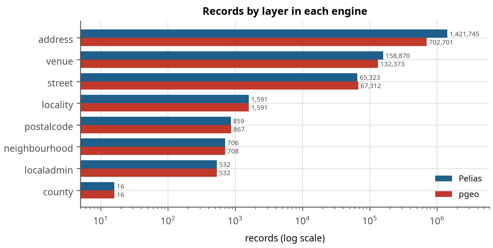

**Figure 4.** Records by layer in each engine (log scale). The address layer shows the build-time deduplication in pgeo; venues differ because pgeo also deduplicates OSM and Overture places that share a name and position.


Figure 4 shows where the engines hold the same data differently. The address
bar is the one to read: Pelias stores 1,421,745 address documents and pgeo
702,701, because the two open sources carry most Maine addresses twice and pgeo
merges them at build time while Pelias keeps both and filters at query time. The consequence is
visible later in memory and disk (Section 3.5): pgeo searches a smaller store.

**Table 4.** Records by layer.

| Layer | Pelias | pgeo | pgeo / Pelias |
|:--|--:|--:|--:|
| address | 1,421,745 | 702,701 | 0.49 |
| venue | 158,870 | 132,373 | 0.83 |
| street | 65,323 | 67,312 | 1.03 |
| locality | 1,591 | 1,591 | 1.00 |
| localadmin | 532 | 532 | 1.00 |
| neighbourhood | 706 | 708 | 1.00 |
| postalcode | 859 | 867 | 1.01 |
| county | 16 | 16 | 1.00 |
| region | 1 | 1 | 1.00 |
| country | 1 | 0 | 0.00 |


**Overture Maps.** Every Overture theme was evaluated for Maine (2026-08-19 release), 203 MB of
Parquet extracts in total, of which only the 16 MB *places* file was loaded. *Places* add
value and were loaded (76,582 after quality and boundary rules). *Addresses* add nothing for Maine:
all 772,684 come from the national address database, which is built from the same Maine E911 address
points as OpenAddresses; every apparently unique record has an OpenAddresses twin within 5 m that
differs only in spelling ("78 East Grand Avenue" vs "78 E Grand Ave"), and 90% of pairs have
identical coordinates. They remain a token-free fallback and a source of spelled-out street aliases,
and should be re-checked for New Hampshire. *Divisions* parallel Who's On First (1,145 localities, 916
polygons) and cannot feed Pelias's point-in-polygon service; they were not used. *Water, land and
roads* are derived from OpenStreetMap, which is already loaded.

Data problems found and fixed during preparation (all in `prep/`): GNIS points outside Maine,
a pipe-delimited ZCTA gazetteer, an Overture extract that leaked into Portsmouth, New
Hampshire, and the Pelias interpolation builder needing OpenAddresses in its legacy CSV form.

### 2.3 Build pipelines

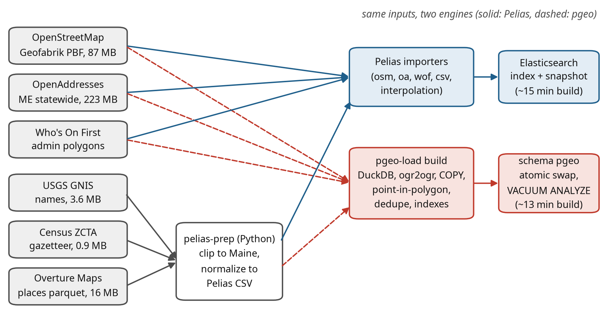

**Figure 5.** Data flow from the sources to each engine. Both engines read the same inputs; small sources pass through a preparation package that clips them to Maine.


Figure 5 is the reproducibility picture: both engines consume the same
downloaded inputs, and everything is scripted, so a rebuild is one command and a data refresh is
the same command with newer downloads (docs/REBUILD.md).

The Pelias build (OSM, OpenAddresses, Who's On First, CSV and interpolation importers) takes
about 15 minutes on the workstation and produces a 435 MB index plus helper databases. The pgeo
build (`pgeo-load build`) loads the same inputs with DuckDB, ogr2ogr and COPY, assigns each
point its admin hierarchy by point-in-polygon, deduplicates, indexes, and swaps the new schema
in atomically; it took 13 min in the latest run on one core.

**Table 5.** pgeo build steps and their duration (latest build).

| Build step | Seconds |
|:--|--:|
| osm | 43 |
| stage | 20 |
| enrich_index | 727 |


Both builds, the verification suites and the deployment are scripted; `docs/REBUILD.md` in the
repository is the step-by-step runbook and `scripts/rebuild_all.sh` runs it end to end
(Appendix A).

<!-- PENDING: build resource profiles (CPU, peak memory, disk) for both engines from the dedicated measurement runs -->

### 2.4 Accuracy testing

The accuracy test set was built from the source data, independently of both engines: the
correct answer for each case is the source record's position (for addresses, also the house
number). A case counts as correct when the first result lies within the case's radius (for
example 50 m for an address, 8 km for a town); a "miss" case (a place that does not exist in
Maine) counts as correct when the engine returns nothing, or nothing with confidence of at
least 0.8.

**Table 6.** Composition of the accuracy test set by endpoint, category and query quality.

| Endpoint | Category | Exact | Typo | Variant | Miss | Total |
|:--|:--|--:|--:|--:|--:|--:|
| autocomplete | Towns | 75 |  |  |  | 75 |
| autocomplete | Venues | 75 |  |  |  | 75 |
| reverse | Reverse | 200 |  |  |  | 200 |
| search | Addresses | 220 | 87 | 93 |  | 400 |
| search | Lakes, summits | 83 | 35 | 32 |  | 150 |
| search | Misses |  |  |  | 150 | 150 |
| search | Towns | 92 | 34 | 24 |  | 150 |
| search | Venues | 108 | 42 |  |  | 150 |
| search | ZIP codes | 60 |  |  |  | 60 |
| structured | Addresses | 150 |  |  |  | 150 |


Non-unique names (there are dozens of "Mud Pond"s in Maine) were qualified with the nearest
town, because a bare "Mud Pond" has no single right answer. A separate **fuzz set** of
1,800 cases corrupts 300 exact queries at six levels:


**Table 7.** Fuzz levels. House numbers are never corrupted, so every query stays answerable.

| Level | Corruption |
|---|---|
| F0 | none (baseline) |
| F1 | one character error (swap, drop, double, keyboard neighbour) |
| F2 | two character errors in different words |
| F3 | three errors, abbreviation flips (St <-> Street), commas dropped, lowercase |
| F4 | F3 plus a component dropped (town, suffix or state) and word-order changes |
| F5 | heavy: about 25% of letters corrupted, phonetic spellings (ph -> f, ck -> k) |


### 2.5 Load and capacity testing

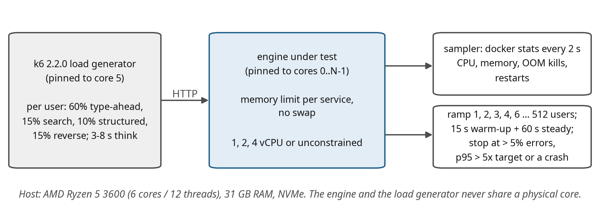

**Figure 6.** Load-test harness. The load generator and the engine under test are pinned to different physical cores; each engine service runs with a memory limit and no swap.


Figure 6 shows why the comparison is fair: one engine at a time, pinned to
its own physical cores, with the load generator on a separate core, the same corpus and the same
stopping rules. Readers reproducing this on other hardware should expect different absolute
numbers but the same ordering.

Each simulated user behaves like a person using the demo page: 60% of sessions type an address
or place letter by letter (autocomplete requests), 15% run a full search, 10% a structured
search and 15% click the map (reverse), each followed by 3 to 8 seconds of think time. Text
queries are 65% exact, 12% with typos, 13% off-name variants and 10% impossible places; 10% of
map clicks fall offshore.

**Table 8.** Load-test query corpus (drawn at random per request).

| Corpus pool | Items | Used for |
|:--|--:|:--|
| addresses | 3,000 | type-ahead and search, exact form |
| places | 800 | towns, lakes, summits |
| venues | 1,000 | businesses and landmarks |
| zips | 200 | ZIP code searches |
| structured | 1,000 | structured search field sets |
| typos | 1,200 | one or two character errors |
| variants | 1,200 | off-name variants (abbreviations, missing town) |
| misses | 600 | places that do not exist in Maine |
| oa_points / random_points | 1,000 / 1,000 | reverse geocoding on land |
| miss_points | 300 | reverse geocoding offshore (misses) |
| foci | 120 | focus points (map centers) for type-ahead |


**Table 9.** Example requests from the load session.

| Endpoint | Example request (as sent by the load generator) |
|---|---|
| Autocomplete | `/v1/autocomplete?text=389 cong&size=8&focus.point.lat=43.66&focus.point.lon=-70.26` |
| Search | `/v1/search?text=389 Congress St, Portland, ME&size=8&focus.point.lat=...` |
| Search (typo) | `/v1/search?text=Moosehed Lake&size=8` |
| Structured | `/v1/search/structured?address=389 Congress St&locality=Portland&region=ME&postalcode=04101&size=8` |
| Reverse | `/v1/reverse?point.lat=43.6568&point.lon=-70.2626&size=6` |


**Table 10.** Latency targets (95th percentile) used as the pass criterion.

| Endpoint | p95 target | Why |
|:--|--:|:--|
| Autocomplete | 250 ms | type-ahead must keep up with typing |
| Search | 750 ms | a full search after pressing Enter |
| Structured search | 750 ms | form-based search |
| Reverse | 400 ms | map click; feels immediate |
| All | errors < 1% | no restarts or out-of-memory kills during a run |


For every configuration the harness recreates the services with their CPU and memory limits,
warms them up, runs a 3-user validation (3 minutes), then ramps through 1, 2, 3, 4, 6, 8, 12, 16,
24, 32, 48, 64, 96, 128, 192, 256, 384 and 512 users (15 s warm-up plus 60 s measured at each
step). A step **passes** when every endpoint's p95 is within target and errors stay below 1%;
the run stops when errors exceed 5%, any p95 exceeds five times its target, or a service dies.
**Caching.** No response caching is configured anywhere (nginx, Caddy, the Pelias API and pgeo
all answer every request afresh). The caches that do exist are warmed on purpose and are the same for
both engines: containers are recreated for every configuration (clearing the Elasticsearch query
cache and PostgreSQL's shared buffers), a fixed warm-up runs before measuring, and warm-up requests
are excluded from the results. The operating system's page cache survives container recreation.
All numbers therefore describe a server in continuous use, not a cold start. The query corpus is
large (Table 8) and drawn at random, so exact repeats are rare.

**Scope.** Every test in this section was run on both engines with the same session, corpus, targets
and ramp; pgeo additionally with both of its front ends.


**Table 11.** Tested configurations. pgeo configurations were run with each front end (rest = pure SQL through PostgREST, api = FastAPI); budgets include 0.8 GB for the operating system.

| Engine | Config | vCPU | Memory budget | Notes |
|---|---|---|---|---|
| Pelias | M0 | all | unlimited | reference, 1 API worker |
| Pelias | C1 / C1s | 1 | 8.3 / 9.1 GB | floor and standard memory profiles |
| Pelias | C2 / C3 | 2 | 8.4 / 9.5 GB | floor / standard |
| Pelias | C4 / C4a | 4 | 10.8 / 10.4 GB | 4 API workers / 1 API worker |
| pgeo | Pmin | 1 | 1.6 GB | database 0.6 GB: smaller than the data |
| pgeo | P1 | 1 | 2.0 GB | database 1.0 GB |
| pgeo | P2 | 2 | 2.5-2.7 GB | database 1.5 GB |
| pgeo | P4 | 4 | 3.0-3.3 GB | database 2.0 GB |
| pgeo | PM | all | unlimited | reference |


### 2.6 Compatibility testing

A contract test (`tests/compat/compat_test.py`) sends 27 documented Pelias
requests to Pelias and to both pgeo front ends and checks each response for status code, envelope
shape, property names, filter behaviour (results inside the requested circle, rectangle or area;
no results for another country) and Pelias-shaped errors. Pelias is the reference: a check that
Pelias itself fails is reported but not counted against pgeo.

### 2.7 Tuning procedure

pgeo was tuned in rounds. Each round started from the failing test cases (what came back, what
was expected, which query step lost the right answer), changed one thing, and re-ran the full
accuracy set, the fuzz set and a per-category comparison that listed every flipped case. A
change was kept only if overall accuracy did not drop and no category lost more than noise.
**Parallelism.** PostgreSQL uses several cores in two ways. Between queries, every connection is
its own backend process, so concurrent users spread across all available cores; pgeo's connection
pools are sized to about two per core, and capacity grew in proportion to the cores given
(Section 3.4), which shows the cores are used. Within a single query, PostgreSQL can split large
scans across parallel workers; this is switched off (`max_parallel_workers_per_gather = 0`) for
serving, because pgeo's queries take 5-100 ms and read small, indexed row sets, where starting
workers costs more than it saves and would take cores away from other users. It was not measured
(experiment T2 in docs/PGEO_TUNING.md). The build, which scans whole tables, does use four parallel
workers.

The final state is protected by:

- **tuning profiles** (`pgeo-tune`): measured PostgreSQL and front-end settings per machine size,
  applied and verified against the running server;
- an **accuracy gate** (`tests/accuracy/gate.py`) that fails a build if accuracy, any category,
  calibration or any fuzz level regresses beyond small tolerances. Replayed against results from
  before the town-aware ranking step it reports five regressions, so it does catch the kind of
  tuning this project could otherwise lose silently;
- a **rebuild pipeline** (`scripts/pgeo_rebuild.sh`): build, profile, known-answer checks, gate.

## 3. Results

### 3.1 Accuracy

**Table 12.** Accuracy on 1,560 cases. Correct = right answer at rank 1 (misses: nothing, or low confidence); Hit@5 = right answer in the top five; confidence columns are the mean confidence of the first result when right and when wrong.

| Engine | Correct | Hit@1 | Hit@5 | Exact | Typo | Variant | Miss | Conf. right / wrong | p50 ms |
|:--|--:|--:|--:|--:|--:|--:|--:|:-:|--:|
| Pelias | 75.5% | 77.0% | 83.5% | 88% | 30% | 85% | 41% | 0.98 / 0.87 | 13 |
| pgeo pure SQL | 95.8% | 94.4% | 98.2% | 98% | 87% | 95% | 95% | 0.92 / 0.69 | 39 |
| pgeo FastAPI (rule parser) | 95.8% | 94.4% | 98.2% | 98% | 87% | 95% | 95% | 0.92 / 0.69 | 46 |
| pgeo FastAPI (libpostal service) | 94.0% | 92.4% | 96.9% | 95% | 87% | 93% | 94% | 0.92 / 0.60 | 45 |


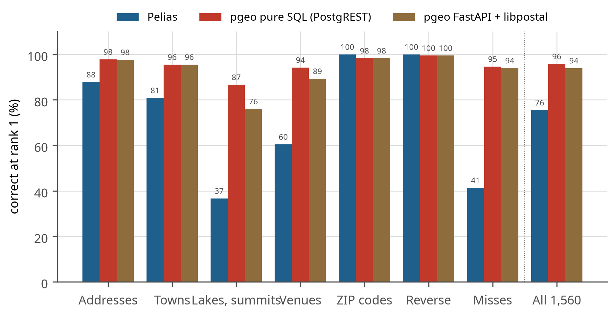

**Figure 7.** Correct answers by category. pgeo leads in every category except ZIP codes and reverse geocoding, where both engines are near perfect.


**Table 13.** Accuracy by category (all query qualities).

| Category | Cases | Pelias | pgeo pure SQL | pgeo FastAPI (rule parser) | pgeo FastAPI (libpostal service) |
|:--|--:|--:|--:|--:|--:|
| Addresses | 550 | 88% | 98% | 98% | 98% |
| Towns | 225 | 81% | 96% | 96% | 96% |
| Lakes, summits | 150 | 37% | 87% | 87% | 76% |
| Venues | 225 | 60% | 94% | 94% | 89% |
| ZIP codes | 60 | 100% | 98% | 98% | 98% |
| Reverse | 200 | 100% | 100% | 100% | 100% |
| Misses | 150 | 41% | 95% | 95% | 94% |


The categories where pgeo gains most are the ones where the query and the data use different
words for the same place. Pelias ranks text with Elasticsearch's term matching over analysed
tokens; a misspelled token matches nothing, and its admin lookup (placeholder) needs exact town
names. pgeo compares whole strings by trigram similarity and treats the queried town as a
**location** rather than a name to match exactly: "Calvary Bible Church, Stratton" is found
although the church lies in Eustis, because it is near Stratton. That single change raised venue
accuracy from 81% to 94%.


> **What this means.** Two thirds of pgeo's advantage is on input people actually type: misspellings, half-remembered venue names and places that do not exist. In a dispatch application this is the difference between an address that resolves on the first try and one an operator has to correct by hand: on this test set Pelias leaves 382 of 1,560 queries wrong or unanswered, pgeo 65.


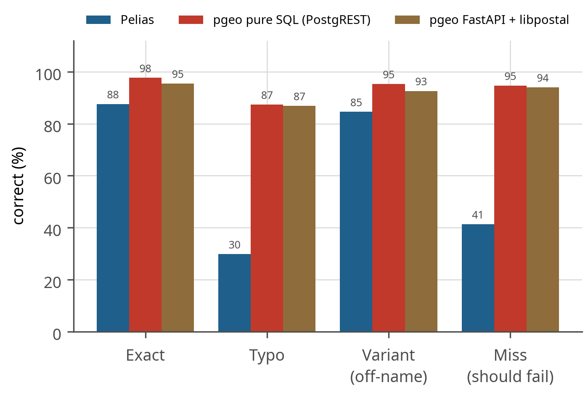

**Figure 8.** Accuracy by query quality. Typos separate the engines most; "miss" means the engine correctly returned nothing or only low-confidence results for a place that does not exist.


Figure 8 separates the engines by input quality. On clean input both are
strong (88% and 98%); the gap opens on the input people actually type. Typos are the extreme case:
30% against 87%.

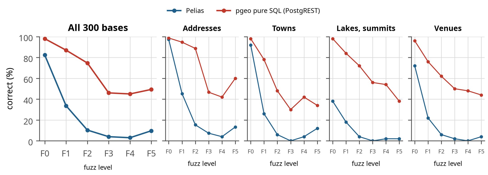

**Figure 9.** Accuracy as queries are progressively corrupted (fuzz levels F0-F5), overall and by category. Pelias falls to near zero from two character errors; pgeo degrades gradually.


**Table 14.** Fuzz results (correct, %).

| Engine | F0 | F1 | F2 | F3 | F4 | F5 |
|:--|--:|--:|--:|--:|--:|--:|
| Pelias | 82% | 34% | 10% | 4% | 3% | 10% |
| pgeo pure SQL | 98% | 87% | 75% | 46% | 45% | 49% |


**Calibration.** A confidence score is useful only if wrong answers get lower scores than right
ones. pgeo's first-result confidence averages 0.92 when right and
0.69 when wrong; Pelias scores 0.98 and
0.87, so a client can use pgeo's confidence to decide when to ask the user.

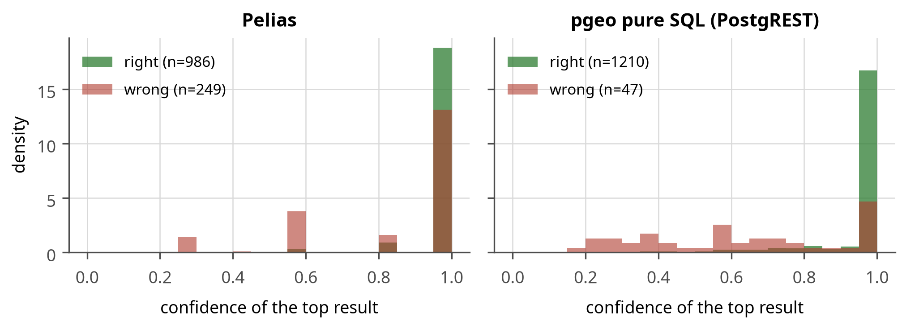

**Figure 10.** Distribution of first-result confidence for right and wrong answers (misses excluded). pgeo separates the two groups more clearly.


Figure 10 is about trust rather than accuracy: it shows how well each engine's
confidence separates its right answers from its wrong ones. Pelias reports high confidence for both
(0.98 and 0.87), so a client cannot use the number to decide anything. pgeo's wrong answers cluster
low (0.69 on average against 0.92 when right), so
an application such as LANCER can accept matches above a threshold and queue the rest for a human.

**Remaining failures.** 65 of 1,560 cases still fail on
pgeo (Table 15). Eight "misses" are test-set errors (Death Valley in
Minot and "The Eiffel Tower of Paris, Maine" exist); about ten are genuinely ambiguous (chain
branches, two towns with the same name); short autocomplete prefixes without a focus point
("Nor", "Tim Ho") cannot be resolved by any engine; the hardest remaining class is typos in both
the place name and the town.

**Table 15.** Remaining pgeo failures by category.

| Category (query quality) | Failures |
|:--|--:|
| Lakes, summits (typo) | 14 |
| Venues (exact) | 11 |
| Misses (miss) | 8 |
| Addresses (typo) | 5 |
| Towns (exact) | 5 |
| Addresses (variant) | 4 |
| Towns (typo) | 4 |
| Lakes, summits (exact) | 4 |
| Addresses (exact) | 3 |
| Lakes, summits (variant) | 2 |
| Venues (typo) | 2 |
| Reverse (exact) | 1 |
| Towns (variant) | 1 |
| ZIP codes (exact) | 1 |


### 3.2 Tuning trajectory

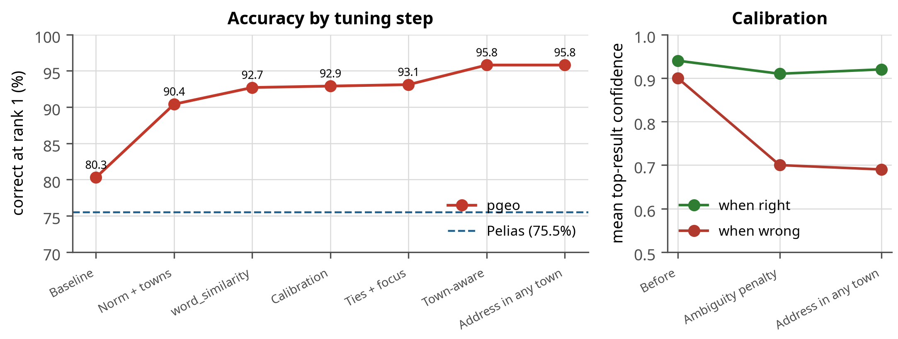

**Figure 11.** Left: pgeo accuracy after each tuning step, with Pelias for reference. Right: first-result confidence when right and when wrong; the ambiguity penalty widened the gap.


Figure 11 is the tuning history: nine rounds took pgeo from 80.3% to
95.8%. Two things stand out. Most of the gain came from understanding how people
write place names (abbreviations, the town as a location, ties), not from more powerful matching.
And the calibration panel shows the ambiguity penalty pulling wrong-answer confidence down from 0.90
to 0.69 while right answers barely moved (0.94 to
0.92), which is what makes the confidence score usable.

Two failures behind these steps are worth naming, because they are the kind a test set catches and
a demonstration does not. "Portlnd, ME" returned venues literally named "Portland, ME" rather than
the city, which is why similarity is measured in the direction (query, name). And in autocomplete
"st" expanded to "saint" as readily as to "street", so a half-typed street query returned saints'
places until the expansion became context-dependent. One caveat belongs with the trajectory: the
word_similarity round also corrected the test set (non-unique names such as "Mud Pond" were
qualified with their town, for both engines), so the step before it and the step after it are not
measured on an identical set.


> **Key result.** One missing database index (the join from admin polygons to their features) made every reverse request scan all 906,101 features. Adding it cut reverse latency from 225-393 ms to 5-18 ms and raised the number of users one vCPU can serve from 4 to 24, six times as many, from a single line of DDL -- found only because the load tests measured each endpoint separately.


**Table 16.** Tuning changes, the problem each solved, and the measured effect.

| Step | Change | Problem solved | Effect |
|---|---|---|---|
| Normalization | Abbreviations expanded (rd -> road, st -> street or saint) | typos in spelled-out words failed (similarity 0.25 vs 0.81) | part of 80.3% -> 90.4% |
| Towns | towns matched on WOF and postal city; ZIP only a fallback | structured search 0% at rank 1 (ZIP outranked the address) | structured 0% -> 100% |
| Dedupe | OA/OSM addresses merged; results one per label | duplicated towns and addresses | clean lists |
| word_similarity | direction (query, name) | "Mountain" matched every query containing the word | lakes/summits 59% -> 77% |
| Calibration | confidence divided among tied distinct places | wrong answers were mostly ties (70 of 85) | confidence wrong 0.90 -> 0.70 |
| Ties + focus | candidates ordered by distance to the focus before the row limits | hundreds of "Main Street"s cut to 40 before the focus applied | "main st" near Bangor returns Bangor |
| Town-aware | the queried town is a location (distance-based agreement) | village or nearest town given instead of the containing one | venues 81% -> 94%; 93.1% -> 95.8% |
| Address in any town | house number looked up on the best street names statewide | 25 of 150 "Church Street" towns kept arbitrarily | confidence wrong 0.73 -> 0.69 |
| Reverse index | index on the admin join | every reverse request scanned all features | see Section 3.4 |


### 3.3 Latency at the 3-user target

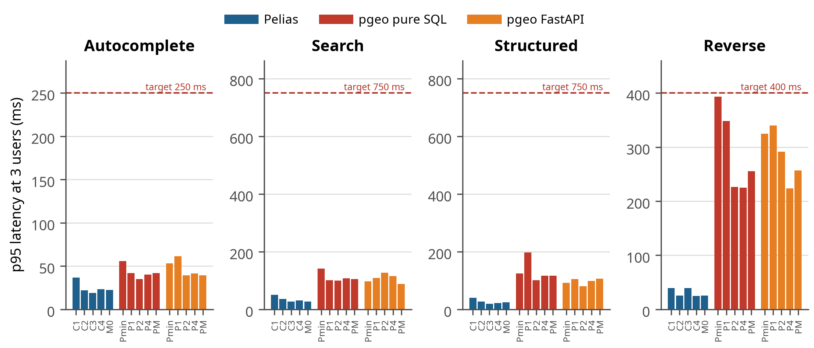

**Figure 12.** p95 latency per endpoint at 3 users for each configuration, against its target (dashed). Every configuration of both engines meets every target.


Figure 12 answers the question this project started with: at the 3-user
target every configuration of both engines, down to the smallest, sits well inside every latency
target. Nothing in the 3-user scenario forces a choice between the engines; the differences appear
only under heavier load or in accuracy.

**Table 17.** Median and p95 latency at 3 users (ms).

| Config | Autocomplete p50 / p95 ms | Search p50 / p95 ms | Structured p50 / p95 ms | Reverse p50 / p95 ms |
|:--|--:|--:|--:|--:|
| C1 | 15 / 37 | 26 / 50 | 28 / 40 | 24 / 40 |
| C2 | 9 / 22 | 20 / 36 | 19 / 27 | 19 / 26 |
| C3 | 8 / 19 | 14 / 27 | 13 / 20 | 10 / 39 |
| C4 | 8 / 23 | 21 / 30 | 17 / 22 | 22 / 25 |
| M0 | 8 / 23 | 20 / 27 | 20 / 25 | 20 / 25 |
| rest-Pmin | 19 / 52 | 42 / 114 | 81 / 120 | 13 / 18 |
| rest-P1 | 19 / 59 | 44 / 111 | 60 / 100 | 5 / 12 |
| rest-P2 | 15 / 44 | 30 / 97 | 88 / 105 | 4 / 5 |
| rest-P4 | 15 / 43 | 43 / 101 | 91 / 98 | 4 / 6 |
| rest-PM | 17 / 46 | 28 / 100 | 42 / 85 | 5 / 6 |
| api-Pmin | 17 / 62 | 62 / 112 | 73 / 117 | 13 / 15 |
| api-P1 | 18 / 59 | 39 / 109 | 103 / 127 | 11 / 14 |
| api-P2 | 15 / 54 | 34 / 95 | 91 / 106 | 5 / 14 |
| api-P4 | 18 / 49 | 41 / 108 | 108 / 116 | 4 / 15 |
| api-PM | 17 / 57 | 50 / 99 | 92 / 104 | 4 / 15 |
| api-svc-P2 | 14 / 47 | 41 / 101 | 48 / 93 | 4 / 16 |
| api-svc-P4 | 17 / 51 | 45 / 111 | 93 / 101 | 5 / 14 |


At 3 users every configuration of both engines meets every target with a wide margin, so the
3-user goal is not what separates them. Pelias answers in 20-50 ms at the 95th percentile on every
endpoint: Elasticsearch resolves text and geography in compiled index lookups. pgeo's autocomplete
takes about 40 ms and its search and structured search about 100 ms, because a forward search runs
several candidate queries and a scoring step in PL/pgSQL inside one database backend. Reverse
geocoding was pgeo's slow endpoint (225-393 ms, close to its 400 ms target on one vCPU) until the
missing admin-join index was added; it now takes 5-18 ms (Table 20).

### 3.4 Capacity under load

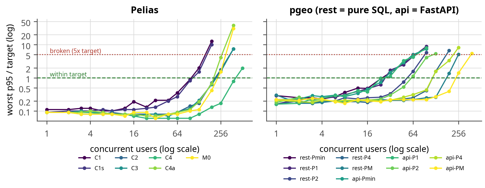

**Figure 13.** Worst endpoint p95 relative to its target as users are added. Above 1 the configuration misses a target; above 5 the run stops. At 1-4 users some endpoints receive only a few requests per window, so single points are noisy.


Figure 13 shows how each configuration degrades as users are added: flat while there is
headroom, then rising steeply once the CPUs saturate. The practical consequence is that these
services give little warning: a configuration comfortably inside its targets at 24 users can be
three times over them at 48. Capacity planning should therefore leave a factor of two, not ten
percent.

**Table 18.** Pelias capacity by configuration.

| Config | vCPU | Budget | Settings | Users within SLO | Broken at | First over target | req/s at limit | Memory at 3 users |
|:--|--:|--:|:--|--:|--:|:--|--:|--:|
| C1 | 1 | 8.3 GB | heap 768m, 1 worker(s) | 96 | 192 | autocomplete, search, reverse at 128 | 99 | 5.9 GB |
| C1s | 1 | 9.1 GB | heap 768m, 1 worker(s) | 96 | 192 | autocomplete, reverse at 128 | 102 | 5.8 GB |
| C2 | 2 | 8.4 GB | heap 768m, 2 worker(s) | 192 | 384 | autocomplete, reverse at 256 | 209 | 6.1 GB |
| C3 | 2 | 9.5 GB | heap 1g, 2 worker(s) | 192 | 384 | autocomplete, reverse at 256 | 213 | 6.3 GB |
| C4 | 4 | 10.8 GB | heap 2g, 4 worker(s) | 384 | not reached | autocomplete, search, structured, reverse at 512 | 403 | 7.5 GB |
| C4a | 4 | 10.4 GB | heap 2g, 1 worker(s) | 192 | 384 | autocomplete, search, structured, reverse at 256 | 194 | 7.1 GB |
| M0 | all | - | heap 4g, 1 worker(s) | 192 | 384 | autocomplete, reverse at 256 | 215 | 9.3 GB |


**Table 19.** pgeo capacity by configuration (after the reverse-geocoding index fix).

| Config | vCPU | Budget | Settings | Users within SLO | Broken at | First over target | req/s at limit | Memory at 3 users |
|:--|--:|--:|:--|--:|--:|:--|--:|--:|
| rest-Pmin | 1 | 1.6 GB | sb 128MB, 4 conn. | 24 | 64 | autocomplete at 32 | 24 | 0.3 GB |
| rest-P1 | 1 | 2.0 GB | sb 256MB, 4 conn. | 24 | 96 | autocomplete at 32 | 25 | 0.4 GB |
| rest-P2 | 2 | 2.5 GB | sb 384MB, 6 conn. | 48 | 96 | autocomplete, reverse at 64 | 53 | 0.5 GB |
| rest-P4 | 4 | 3.0 GB | sb 512MB, 10 conn. | 96 | 192 | autocomplete at 128 | 108 | 0.6 GB |
| rest-PM | all | - | sb 1GB, 16 conn. | 128 | 256 | autocomplete at 192 | 144 | 0.6 GB |
| api-Pmin | 1 | 1.6 GB | sb 128MB, 4 conn. | 24 | 96 | autocomplete at 32 | 26 | 0.3 GB |
| api-P1 | 1 | 2.0 GB | sb 256MB, 4 conn. | 24 | 96 | autocomplete at 32 | 27 | 0.4 GB |
| api-P2 | 2 | 2.7 GB | sb 384MB, 6 conn. | 48 | 128 | autocomplete at 64 | 52 | 0.7 GB |
| api-P4 | 4 | 3.3 GB | sb 512MB, 10 conn. | 96 | 256 | autocomplete, reverse at 128 | 103 | 0.8 GB |
| api-PM | all | - | sb 1GB, 16 conn. | 192 | 384 | autocomplete at 256 | 213 | 0.8 GB |
| api-svc-P2 | 2 | 4.7 GB | sb 384MB, 6 conn. | 48 | 128 | autocomplete at 64 | 52 | 2.5 GB |
| api-svc-P4 | 4 | 5.3 GB | sb 512MB, 10 conn. | 96 | 192 | autocomplete at 128 | 106 | 2.8 GB |


**Table 20.** Effect of the reverse-geocoding index on pgeo capacity and reverse latency.

| Config | Users within SLO, before | after | Reverse p95 at 3 users (ms), before | after |
|:--|--:|--:|--:|--:|
| rest-Pmin | 4 | 24 | 393 | 18 |
| rest-P1 | 4 | 24 | 348 | 12 |
| rest-P2 | 24 | 48 | 226 | 5 |
| rest-P4 | 64 | 96 | 225 | 6 |
| rest-PM | 128 | 128 | 255 | 6 |
| api-Pmin | 8 | 24 | 325 | 15 |
| api-P1 | 6 | 24 | 340 | 14 |
| api-P2 | 32 | 48 | 291 | 14 |
| api-P4 | 96 | 96 | 224 | 15 |
| api-PM | 192 | 192 | 257 | 15 |


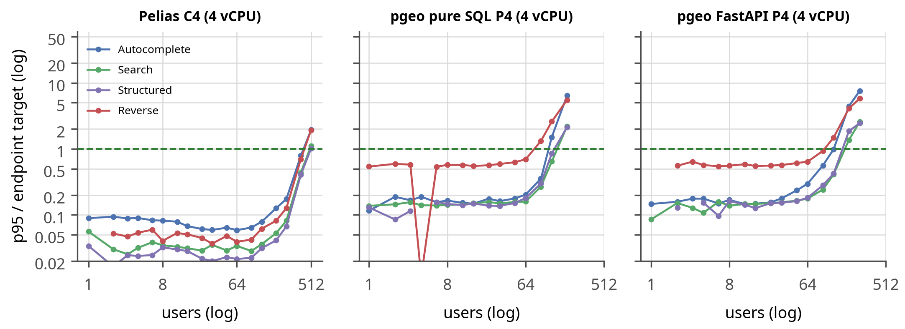

**Figure 14.** p95 per endpoint relative to its target on 4 vCPU. The first line to cross 1 is the endpoint that limits capacity.


Figure 14 shows which endpoint fails first, which is where tuning effort
belongs. On pgeo it is autocomplete, because it has the tightest target (250 ms) and fires several
times per typed word; on Pelias the four endpoints rise together because they share one
Elasticsearch.

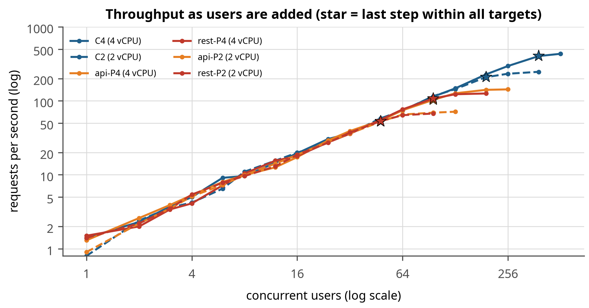

**Figure 15.** Throughput as users are added; the star marks the last step within all targets.


Figure 15 shows throughput still climbing after the latency targets are missed
(the stars): both engines keep answering, just too slowly. An operator watching only requests per
second would not notice the service becoming unpleasant, which is why the targets, not throughput,
define capacity here.

**How each engine scales.** Both engines are CPU-bound under this load, and both scale close to
linearly with vCPUs as long as their workers can use them: pgeo holds about 24 users per vCPU
(24, 48 and 96 users on 1, 2 and 4 vCPU)
and Pelias about 96 (96, 192 and 384). The ratio of four
is the difference in CPU cost per request: compiled index lookups in Elasticsearch against
interpreted candidate queries and scoring in PL/pgSQL.


> **What this means.** Plan capacity as about 24 concurrent users per vCPU for pgeo and about 96 for Pelias, then halve it for headroom: both engines go from comfortable to three times over target within one doubling of load.


**What gives out first.** After the index fix, autocomplete is the first endpoint over its target on
every pgeo configuration (Figure 14): it has the tightest target (250 ms) and runs
most often (60% of sessions type ahead, several requests per word). On Pelias the endpoints degrade
more evenly (which one crosses first varies by configuration), because they share Elasticsearch.

**Memory is not pgeo's limit.** The configuration whose database memory (0.6 GB) is smaller than
the data holds as many users as the one with 1.0 GB (24 and
24): the working set of hot index pages is far smaller than the 654 MB of tables and indexes.
Pelias, in contrast, has a memory floor set by its services (libpostal's model, the interpolation
database, placeholder's in-memory tables) regardless of load.

**Front end.** PostgREST and FastAPI hold the same number of users up to 4 vCPU. Unconstrained,
FastAPI reached 192 users and PostgREST 128: only at high
concurrency does the gateway's per-request overhead show.

Pelias spreads work across services in different languages: Elasticsearch does the text and
geo matching in compiled code, and the Node.js API adds parsing and ranking. With four API
workers on 4 vCPU (C4) it reaches 384 users; with one worker on the same CPUs (C4a)
only 192, because a single Node.js worker becomes the bottleneck.

### 3.5 Resources

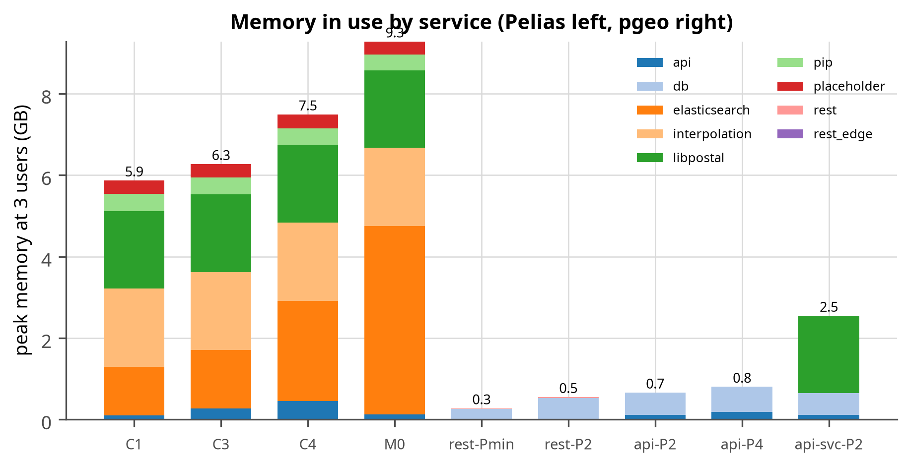

**Figure 16.** Peak memory in use by service at 3 users. Pelias carries the libpostal model (~2 GB), the interpolation database and Elasticsearch's heap regardless of load; pgeo's memory is mostly the PostgreSQL page cache for a 654 MB database.


Figure 16 explains the memory gap in one picture. Pelias pays for the libpostal
model, the interpolation database and an Elasticsearch heap before it serves a single request;
pgeo's memory is mostly page cache for a 654 MB database, which is why it still works when the
budget is cut to a fraction. This is the difference between a $5 and a $48 server (Section 3.5).

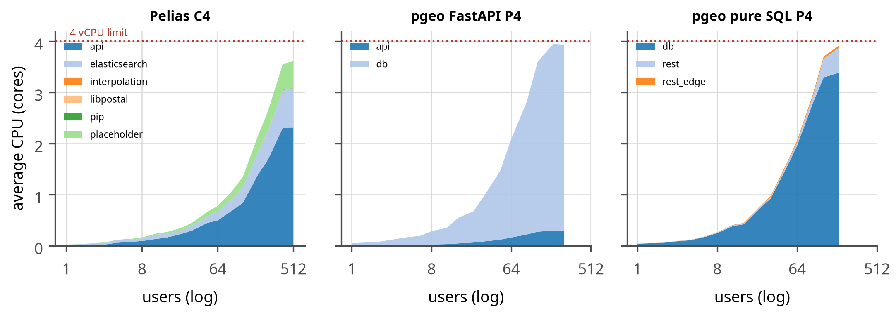

**Figure 17.** Average CPU by service as users are added on 4 vCPU.


Figure 17 shows where the CPU goes. In pgeo almost all of it is the database process
doing the matching; in Pelias it is split between Elasticsearch and the Node.js API, and the API
becomes the bottleneck when it runs with too few workers (configuration C4a reached only
192 users against 384 for C4 with the same CPUs). Anyone deploying Pelias
should set one API worker per vCPU.

#### Resource requirements

**Operation.** Table 21 turns the capacity results into a sizing guide: for a
target number of concurrent users, the smallest tested configuration of each engine that kept every
endpoint within its latency target. Budgets include 0.8 GB for the operating system. One "user" is a
person actively using the search page (a request every 3 to 8 seconds); a service with many
occasional users needs far fewer concurrent slots than it has users.

**Table 21.** Sizing guide: smallest tested configuration that meets all latency targets for a given number of concurrent users. Only configurations with a memory budget are considered; "not reached in tests" means not reached within the tested budgets (the unconstrained reference runs M0 and PM appear in the capacity tables).

| Concurrent users | Pelias | pgeo pure SQL | pgeo FastAPI |
|:--|:--|:--|:--|
| 3 | 1 vCPU, 8.3 GB (C1) | 1 vCPU, 1.6 GB (rest-Pmin) | 1 vCPU, 1.6 GB (api-Pmin) |
| 10 | 1 vCPU, 8.3 GB (C1) | 1 vCPU, 1.6 GB (rest-Pmin) | 1 vCPU, 1.6 GB (api-Pmin) |
| 25 | 1 vCPU, 8.3 GB (C1) | 2 vCPU, 2.5 GB (rest-P2) | 2 vCPU, 2.7 GB (api-P2) |
| 50 | 1 vCPU, 8.3 GB (C1) | 4 vCPU, 3.0 GB (rest-P4) | 4 vCPU, 3.3 GB (api-P4) |
| 100 | 2 vCPU, 8.4 GB (C2) | not reached in tests | not reached in tests |
| 200 | 4 vCPU, 10.8 GB (C4) | not reached in tests | not reached in tests |
| 400 | not reached in tests | not reached in tests | not reached in tests |


**Table 22.** Operating requirements of each platform (Maine data).

| Resource | Pelias | pgeo |
|---|---|---|
| Containers | 6 (Elasticsearch, API, libpostal, placeholder, pip, interpolation) | 2 (PostgreSQL, PostgREST) or 2 (PostgreSQL, FastAPI) |
| Memory floor (runs at all) | ~8.3 GB: libpostal model ~2 GB, interpolation ~2 GB, Elasticsearch heap 0.8-2 GB | ~1.6 GB (database 0.6 GB) |
| Memory that grows with load | placeholder, OOM-killed at 0.4-0.5 GB once load arrives (at 16 users on one vCPU, 12 on two, 128 on the four-vCPU configurations); 0.8 GB needed. pip is OOM-killed at 0.4 GB and the interpolation service crash-loops below 1.9 GB | PostgreSQL backends (a few MB each), page cache |
| Disk (Maine) | ~1.4 GB Elasticsearch data plus ~0.9 GB helper databases; 435 MB snapshot to ship | 654 MB of tables and indexes; data directory ~2.6 GB, the difference being write-ahead log (`max_wal_size` 4 GB) and space still held by tables the build replaced; dump to ship. Size the disk for three to four times the database |
| CPU scaling | add API workers with CPUs (1 worker on 4 vCPU halves capacity) | add connections with CPUs; front end workers for FastAPI |
| Scaling out | Elasticsearch replicas and more API instances | read replicas behind PostgREST |
| Updating data | rebuild index on a workstation, ship snapshot, restore | rebuild database on a workstation, ship dump, restore |


> **What this means.** The memory floors put the two platforms in different price classes: pgeo fits the cheapest shared-CPU plans most providers sell, while Pelias needs a server roughly ten times the price for the same three users. Over a year that is the difference between about $60 and about $580 at advertised rates.


**Build.** Both engines are built on a workstation and shipped to the query host, so the query host
never needs the raw data or the build tools. Table 23 gives the measured
cost of a full build of each engine.

**Table 23.** Build resources: a full build of each engine, measured with `tests/build/measure_build.py` (wall time, peak memory of all build containers and processes, average and peak CPU, disk used by the result).

| Engine | Wall time | Peak memory | CPU cores (avg / peak) | Disk after build | Measured |
|:--|--:|--:|--:|--:|:--|
| pelias | pending measurement |  |  |  |  |
| pgeo | pending measurement |  |  |  |  |


#### What this costs on a shared-CPU VPS

The floors in Section 3.12 are small enough to matter commercially: the difference between the two
platforms is the difference between the cheapest tier a provider sells and a mid-range server.
Advertised shared-CPU plans (checked 2026-09-19; verify before ordering, and note that Hetzner
raised cloud prices in June 2026):


**Table 24.** Advertised shared-CPU VPS plans and whether each platform's measured floor fits. Sources: [Linode/Akamai](https://techdocs.akamai.com/cloud-computing/docs/shared-cpu-compute-instances), [DigitalOcean](https://www.digitalocean.com/pricing/droplets), [Vultr](https://www.vultr.com/products/regular-performance-compute/), [Hetzner](https://www.hetzner.com/cloud/), [AWS Lightsail](https://aws.amazon.com/lightsail/pricing/), [Oracle free tier](https://docs.oracle.com/en-us/iaas/Content/FreeTier/freetier_topic-Always_Free_Resources.htm).

| Provider and plan | vCPU (shared) | RAM | Disk | Price per month | Fits pgeo | Fits Pelias |
|---|---|---|---|---|---|---|
| DigitalOcean Basic 512 MB | 1 | 0.5 GB | 10 GB | $4 | no | no |
| Vultr Cloud Compute 512 MB (IPv4) | 1 | 0.5 GB | 10 GB | $3.50 | no | no |
| AWS Lightsail nano (IPv6 only) | 2 | 0.5 GB | 20 GB | $3.50 | no | no |
| Linode (Akamai) Nanode 1 GB | 1 | 1 GB | 25 GB | $5 | tight: see Section 3.12 | no |
| Vultr Cloud Compute 1 GB | 1 | 1 GB | 25 GB | $5 | tight: see Section 3.12 | no |
| DigitalOcean Basic 1 GB | 1 | 1 GB | 25 GB | $6 | tight: see Section 3.12 | no |
| DigitalOcean Basic 2 GB / Linode 2 GB | 1 | 2 GB | 50 GB | $12 | yes | no |
| Hetzner CX22 | 2 | 4 GB | 40 GB | EUR 3.79 | yes, with room | no |
| Hetzner CAX11 (Arm) | 2 | 4 GB | 40 GB | EUR 5.99 | yes, with room (Arm images needed) | no |
| Linode 8 GB / DigitalOcean 8 GB | 4 | 8 GB | 160 GB | $48 | yes | tight: see Section 3.12 |
| Oracle Cloud Always Free (Arm) | 2 OCPU | 12 GB | 200 GB | free tier (halved in June 2026) | yes | yes |


Measured against these plans: pgeo's 1.40 GB floor is 0.60 GB
of containers plus the 0.8 GB this study reserves for the operating system, so a 1 GB plan works
only with a minimal OS and nothing else resident, while a 2 GB plan leaves real headroom; Pelias's
[missing value floor_pelias_gb] floor needs the 8 GB tier, roughly ten times the monthly price for the
same three users. The 1 GB case is the one worth confirming on a real machine rather than a
container limit, which Section 3.12 does.
<!-- PENDING: replace the 1 GB expectation above with the temporary-VM result -->

**Data volume.** For Pelias, capacity fell from 384 users with admin areas only to
192 with every source (Section 3.6); the index grew to 435 MB. pgeo's database grows with
the same sources to 654 MB; capacity against data volume was not measured for pgeo (Next steps).
Doubling the data (for example adding New Hampshire) roughly doubles both stores; for Pelias the
extra venues and names cost capacity per query, and for pgeo the trigram candidate sets grow in the
same way, so both need more CPU per user as coverage grows.

### 3.6 Data volume

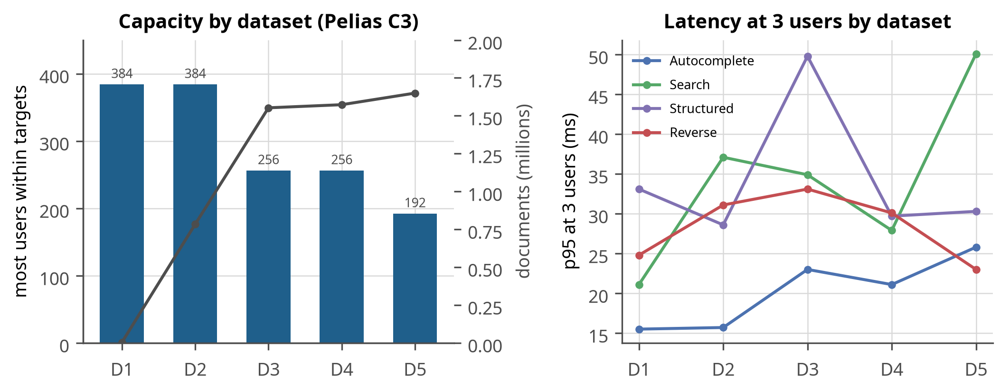

**Figure 18.** Pelias capacity (bars) and document count (line) for cumulative datasets D1-D5 at fixed resources (2 vCPU, 9.5 GB), and p95 latency at 3 users.


Figure 18 separates data volume from data kind. Adding 780,000 address documents
cost nothing measurable, while adding OpenStreetMap and Overture places each cost a ramp step: what
matters is not how many records exist but how many of them a text query can plausibly match. Adding
New Hampshire should therefore be judged by how many new names it brings, not by gigabytes.

**Table 25.** Pelias by dataset: D1 Who's On First; D2 + OpenAddresses; D3 + OpenStreetMap; D4 + GNIS and ZCTA; D5 + Overture places (full).

| Dataset | Documents | Index | Users within SLO | Broken at | Autocomplete p95 | Search p95 | Structured p95 | Reverse p95 |
|:--|--:|--:|--:|--:|--:|--:|--:|--:|
| D1 | 3,280 | 3 MB | 384 | not reached | 16 | 21 | 33 | 25 |
| D2 | 783,540 | 196 MB | 384 | not reached | 16 | 37 | 29 | 31 |
| D3 | 1,552,532 | 371 MB | 256 | 512 | 23 | 35 | 50 | 33 |
| D4 | 1,573,062 | 378 MB | 256 | 512 | 21 | 28 | 30 | 30 |
| D5 | 1,649,644 | 435 MB | 192 | 384 | 26 | 50 | 30 | 23 |


Adding 780,000 OpenAddresses documents (D2) changed nothing measurable: exact address terms
are cheap to match. Adding OpenStreetMap (D3) and Overture places (D5) each cost one ramp step,
because venue and place names are the documents that broad text queries match: more of them
means more candidates to score per query.

### 3.7 Query types

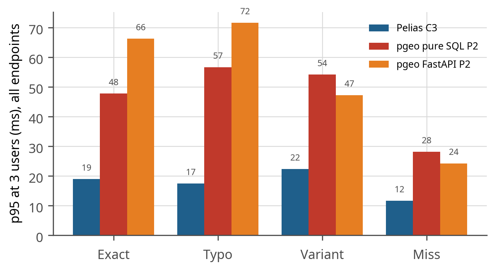

**Figure 19.** p95 latency at 3 users by query quality (all endpoints together).


Figure 19 shows latency by input quality. Both engines answer misspelled and
impossible queries about as fast as exact ones, so the accuracy differences in Section 3.1 are not
bought with slower responses.

### 3.8 Compatibility

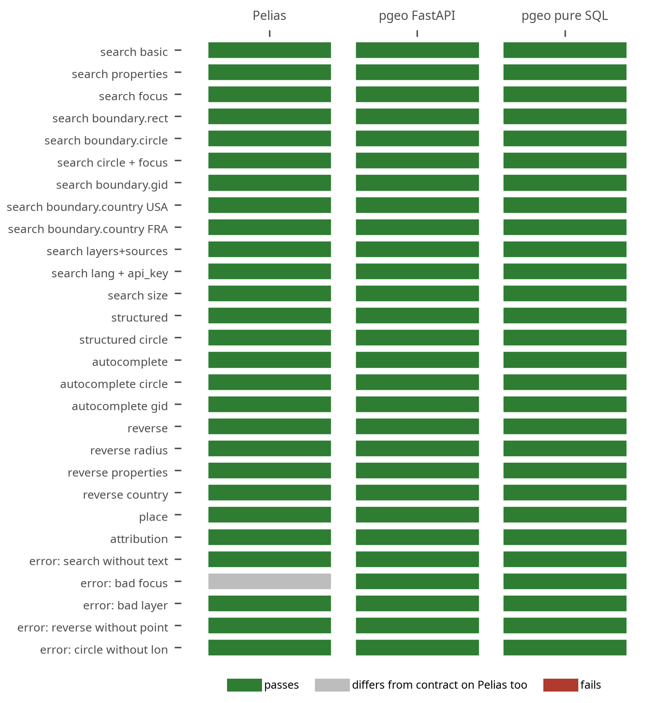

**Figure 20.** Compatibility contract results: each row is a documented Pelias request, each column an engine.


Figure 20 is the compatibility evidence: every documented Pelias request behaves the
same on both pgeo front ends. For a reader with existing Pelias clients, this is the row that
matters: no client changes are needed.

**Table 26.** Compatibility contract cases.

| Case | Request | Pelias | pgeo FastAPI | pgeo pure SQL |
|:--|:--|:-:|:-:|:-:|
| search basic | `/v1/search?text=389 Congress St, Portland, ME` | pass | pass | pass |
| search properties | `/v1/search?text=389 Congress St, Portland, ME` | pass | pass | pass |
| search focus | `/v1/search?text=main st&focus.point.lat=44.8016&focus.point.lon=-68.7712` | pass | pass | pass |
| search boundary.rect | `/v1/search?text=main st&boundary.rect.min_lat=44.7&boundary.rect.max_lat=44.9&boundary.rect.min_lon=-68.9&boundary.rect.max_lon=-68.6` | pass | pass | pass |
| search boundary.circle | `/v1/search?text=main st&boundary.circle.lat=44.8016&boundary.circle.lon=-68.7712&boundary.circle.radius=15` | pass | pass | pass |
| search circle + focus | `/v1/search?text=main st&boundary.circle.lat=44.8016&boundary.circle.lon=-68.7712&boundary.circle.radius=15&focus.point.lat=44.8016&focus.point.lon=-68.7712` | pass | pass | pass |
| search boundary.gid | `/v1/search?text=congress st&boundary.gid=whosonfirst:locality:85948877` | pass | pass | pass |
| search boundary.country USA | `/v1/search?text=bangor&boundary.country=USA` | pass | pass | pass |
| search boundary.country FRA | `/v1/search?text=bangor&boundary.country=FRA` | pass | pass | pass |
| search layers+sources | `/v1/search?text=portland&layers=locality&sources=wof` | pass | pass | pass |
| search lang + api_key | `/v1/search?text=bangor&lang=en&api_key=abc123` | pass | pass | pass |
| search size | `/v1/search?text=main st&size=3` | pass | pass | pass |
| structured | `/v1/search/structured?address=389 Congress St&locality=Portland&region=ME` | pass | pass | pass |
| structured circle | `/v1/search/structured?address=Main St&boundary.circle.lat=44.8016&boundary.circle.lon=-68.7712&boundary.circle.radius=15` | pass | pass | pass |
| autocomplete | `/v1/autocomplete?text=389 congress` | pass | pass | pass |
| autocomplete circle | `/v1/autocomplete?text=main&boundary.circle.lat=44.8016&boundary.circle.lon=-68.7712&boundary.circle.radius=15` | pass | pass | pass |
| autocomplete gid | `/v1/autocomplete?text=congress&boundary.gid=whosonfirst:locality:85948877` | pass | pass | pass |
| reverse | `/v1/reverse?point.lat=43.6568&point.lon=-70.2626` | pass | pass | pass |
| reverse radius | `/v1/reverse?point.lat=43.6568&point.lon=-70.2626&boundary.circle.radius=1` | pass | pass | pass |
| reverse properties | `/v1/reverse?point.lat=43.6568&point.lon=-70.2626&layers=address` | pass | pass | pass |
| reverse country | `/v1/reverse?point.lat=43.6568&point.lon=-70.2626&boundary.country=US` | pass | pass | pass |
| place | `/v1/place?ids=whosonfirst:locality:85948877` | pass | pass | pass |
| error: search without text | `/v1/search?` | pass | pass | pass |
| error: bad focus | `/v1/search?text=x&focus.point.lat=999&focus.point.lon=0` | differs | pass | pass |
| error: bad layer | `/v1/search?text=x&layers=planet` | pass | pass | pass |
| error: reverse without point | `/v1/reverse?` | pass | pass | pass |
| error: circle without lon | `/v1/search?text=x&boundary.circle.lat=44.8` | pass | pass | pass |


Before this work pgeo failed 28 contract checks; the fixes added `boundary.circle`,
`boundary.gid`, `boundary.country` and `categories` filtering, the Pelias hierarchy identifiers
(`locality_gid`, `county_gid`, ...), Pelias-shaped error responses from the pure-SQL path, and an
edge rule that renames `boundary.circle.lat/lon` (which PostgREST would otherwise read as the focus
point's `lat/lon`). Pelias-shaped errors come out of SQL through PostgREST's
`response.status` setting; a parameter PostgREST does not know produces a 404, which the edge
turns into the Pelias-shaped 400 a client expects.

Remaining differences (docs/PELIAS_COMPATIBILITY.md): OpenAddresses records carry different
identifiers in the two engines (Pelias `openaddresses:address:us/me/statewide:<hash>` against
pgeo's `openaddresses:address:<hash>`), so a gid saved from Pelias does not resolve in pgeo and
clients that store gids must re-resolve them after a switch; `categories` uses the sources' own
category names (Overture's `restaurant`, OpenStreetMap's `natural=water`) rather than the Pelias
category taxonomy; and the pure-SQL path rejects parameters it does not know where Pelias ignores
them. Pelias also names counties "Cumberland County" where pgeo stored "Cumberland"; pgeo now
appends " County" on output so the two agree.

### 3.9 Features


**Table 27.** Features of each platform as deployed here.

| Capability | Pelias | pgeo |
|---|---|---|
| Endpoints | search, structured, autocomplete, reverse, place (+ nearby, beta) | the same five, plus `/v1/address` |
| Filters | layers, sources, focus, rectangle, circle, country, gid, categories | the same |
| Parsing | libpostal (statistical, ~2 GB model) | rule parser in SQL (best measured); libpostal optional |
| Typo tolerance | limited (term fuzziness) | trigram similarity on whole names and streets |
| Town handling | exact admin names (placeholder) | town as a location: villages and nearest towns accepted |
| Interpolation | separate service (TIGER + OA) | SQL, between neighbouring house numbers |
| Confidence | per result | per result, lowered for ties between distinct places |
| Structured US addresses | no | USPS Publication 28 components, delivery and last lines, FIPS codes |
| Nearest street address for a venue | no | yes (`/v1/address`) |
| HTTP layer | Node.js API | PostgREST (no code) or FastAPI |
| Data store | Elasticsearch index | PostgreSQL tables |
| Components | 6 containers | 2-3 containers |
| Build | importers, ~15 min | one command, ~13 min |
| Operations tooling | Pelias CLI | tuning profiles, accuracy gate, rebuild script |
| Security posture here | read-only query services, pinned images, strict CSP | read-only database role, allowlisted tuning, no parameter logging |


#### Structured addresses for LANCER

pgeo's `/v1/address` returns a US address in USPS Publication 28 form (number, directionals,
street name, standard suffix, unit, city, state, ZIP; the delivery and last lines) with the
municipality, county and FIPS codes, for a selected search result, a typed address or a map
position. When the selected result is not an address (a business or landmark, for example "Just in
Time, Lewiston Maine"), it returns the nearest address point with its distance, as the project's
requirement asked. The street parser gives a standard suffix for 97.1% of Maine's 41,868 street
names; the rest have none in Publication 28 terms (Broadway, Rue Principale). Units come only from
the caller, because search merges a building's per-unit records. Queries carry client addresses, so
PostgreSQL never logs query parameters.

**ZIP+4.** The USPS ZIP+4 file would add ZIP+4 codes, USPS street spellings and the USPS preferred
city per ZIP (for example SOUTH PARIS for 04281, where the open data says PARIS). It costs $120 a
year for one state ($1,750 for all), and its licence allows "internal corporate or personal use on
one computer at one location", with no network distribution without a paid amendment (unlimited:
$24,000) and no use of data older than 105 days. The project decided against it; the address API
stays on open data and is not a deliverability check (docs/ADDRESS_API.md).


> **What this means.** For LANCER this endpoint replaces manual address tidying: a dispatcher picks a business by name and the system stores a correctly formatted mailing address, the town, the county and its FIPS code, with the nearest street address when the place itself has none.


The demo page exposes these features: autocomplete with map-centre bias, structured search,
reverse geocoding by map click, a CSV batch tool, and, where both engines are deployed, an engine
switch, an Address tab (type-ahead with a best-match suggestion, the USPS block with a copy
button, and the nearest street address drawn on the map for venues) and a Compare tab that runs
one query on both engines side by side.

### 3.10 Parity between the platforms

Do the two platforms now offer the same product? Feature for feature through the documented API,
yes; in accuracy, pgeo is ahead rather than level; in throughput, Pelias is ahead.


**Table 28.** Feature parity through the documented Pelias API.

| Area | Both | Only pgeo | Only Pelias |
|---|---|---|---|
| Endpoints | search, structured, autocomplete, reverse, place | `/v1/address` (USPS Publication 28, nearest street address) | `/v1/nearby` (beta) |
| Parameters | text, size, layers, sources, focus, boundary.rect, boundary.circle, boundary.country, boundary.gid, categories, lang and api_key accepted | | multilingual names (`lang` changes the output) |
| Response | GeoJSON envelope, Pelias properties, hierarchy identifiers (`*_gid`, `county_a`), errors as HTTP 400 with `geocoding.errors` | confidence lowered for ties between distinct places (better calibrated) | |
| Parsing | US addresses | rule parser tuned for Maine input | libpostal: international address parsing |
| Categories | the `categories` filter | | the Pelias category taxonomy (`food`, `health`, ...) |
| Scale | Maine (tested) | | planet-scale data |
| Differences to handle | | pure-SQL front end rejects unknown parameters (400) | OpenAddresses records have different identifiers than in pgeo |


**Table 29.** Accuracy parity by category: Pelias against pgeo (pure SQL), all query qualities. Pelias leads only where both are near perfect.

| Category | Pelias | pgeo | Gap (points) | Ahead |
|:--|--:|--:|--:|:--|
| Addresses | 88% | 98% | +10 | pgeo |
| Towns | 81% | 96% | +15 | pgeo |
| Lakes, summits | 37% | 87% | +50 | pgeo |
| Venues | 60% | 94% | +34 | pgeo |
| ZIP codes | 100% | 98% | -2 | Pelias |
| Reverse | 100.0% | 99.5% | -0.5 | Pelias |
| Misses | 41% | 95% | +53 | pgeo |
| All cases | 75.5% | 95.8% | +20.3 | pgeo |


**Table 30.** Throughput parity: most concurrent users within all latency targets at each CPU size, with each configuration's memory budget.

| CPU | Pelias users (budget) | pgeo pure SQL | pgeo FastAPI | Pelias / best pgeo |
|:--|--:|--:|--:|--:|
| 1 vCPU | 96 (8.3 GB) | 24 (1.6 GB) | 24 (1.6 GB) | 4.0x |
| 2 vCPU | 192 (8.4 GB) | 48 (2.5 GB) | 48 (2.7 GB) | 4.0x |
| 4 vCPU | 384 (10.8 GB) | 96 (3.0 GB) | 96 (3.3 GB) | 4.0x |


In short: an existing Pelias client can switch to pgeo without code changes (the contract in
Section 3.8) and gets more correct answers, especially for misspelled and vague queries, at a
fraction of the memory; it gives up throughput per CPU, multilingual names, international parsing
and planet scale, none of which this deployment uses.

### 3.11 Production validation on VM 120

Every number so far comes from the workstation, where the engine and the load generator are pinned
to separate physical cores and nothing else competes. That isolation is what makes the comparison
fair, and it is also what makes it artificial: the service people will actually use runs on VM 120
behind the wharf Caddy, so the last measurement repeats the three-user validation and the ramp
against the deployed service over HTTPS, one engine at a time, with the edge's rate limits raised
for the window and restored afterwards.

**Table 31.** Both engines on VM 120 through the production HTTPS path: the three-user validation, the p95 per endpoint and how far the ramp went.

_(table not available)_


Two differences from the controlled runs are built in and worth keeping in mind when comparing the
numbers. The request now crosses TLS termination, the nginx edge and the LAN, which adds a few
milliseconds that belong to the service rather than to the engine; and the VM's cores are two CPU
generations newer than the workstation's (Section 1.2), which works the other way. The purpose here
is not a cleaner comparison between engines but a check that the service, as deployed, meets the
targets it was designed for.

<!-- PENDING: interpretation of the VM 120 numbers once the run has been made -->

### 3.12 The smallest server that works

The headline question of this project is not which engine is fastest but how small a machine the
three-user service can run on. A search program answered it directly
(`tests/load/find_floor.py`): start from a configuration known to pass, shrink one resource at a
time -- first the CPU quota, then each service's memory -- and keep a step only when a five-minute
three-user run stays within every latency target with no errors, no container restarts and no
out-of-memory kill. A step that fails ends the search for that resource, because smaller values of
it will fail too. Table 32 is the whole path, pass and fail.

**Table 32.** Minimum-server search: every trial, in order, for both engines. Memory totals include 0.8 GB for the operating system.

| Engine | Trial | Configuration (vCPU quota; memory limits in GB) | Total | 3 users | Result |
|:--|--:|:--|--:|:-:|:--|
| pgeo (pure SQL) | 0 | cpus 1, db 0.6, rest 0.25 | 1.65 GB | pass | ok |
| pgeo (pure SQL) | 1 | cpus 0.5, db 0.6, rest 0.25 | 1.65 GB | pass | ok |
| pgeo (pure SQL) | 2 | cpus 0.25, db 0.6, rest 0.25 | 1.65 GB | pass | ok |
| pgeo (pure SQL) | 3 | cpus 0.25, db 0.45, rest 0.25 | 1.50 GB | pass | ok |
| pgeo (pure SQL) | 4 | cpus 0.25, db 0.35, rest 0.25 | 1.40 GB | fail | over target (worst 1.07x, errors 0) |
| pgeo (pure SQL) | 5 | cpus 0.25, db 0.45, rest 0.15 | 1.40 GB | pass | ok |
| pgeo (pure SQL) | 6 | cpus 0.25, db 0.45, rest 0.1 | 1.35 GB | fail | over target (worst 1.13x, errors 0) |


**pgeo** ran the three-user load inside **0.25 vCPU and
1.40 GB** of memory in total: a quarter of one core, 0.45 GB for PostgreSQL,
0.15 GB for PostgREST and 0.8 GB left for the operating system. Every failed step failed on
latency, not on memory: the database kept answering at 0.35 GB and at 0.1 GB for the front end,
just too slowly (7 to 13 percent over target). That is the practical signature of a database whose
working set is smaller than the machine: it degrades gently instead of being killed.

**Pelias** floors at **[missing value floor_pelias_vcpu] vCPU and [missing value floor_pelias_gb]**. Its limit
is the opposite kind: the memory is not a tuning choice but the sum of what five services load
before the first request (the libpostal model, the interpolation database, placeholder's in-memory
tables and the Elasticsearch heap), so the floor barely moves however little traffic it serves.


> **Key result.** The three-user service fits in 1.40 GB on pgeo and [missing value floor_pelias_gb] on Pelias. Both engines idle comfortably below a quarter of a core, so at this scale the machine is chosen by memory, not by CPU -- which is why the two platforms land in different price classes (Table 24).


**Confirmation on real machines.** A container limit is not a server: it shares the host's page
cache, its disk and its kernel. Each floor was therefore re-tested on a temporary Proxmox VM of
that size, created for the run and destroyed after it (`tests/load/floor_vm.sh`), with the same
three-user validation followed by a ramp to find how far that VM stretches.

**Table 33.** The measured floors confirmed on temporary VMs: the three-user validation and the ramp to the first configuration outside a latency target.

_(table not available)_


## 4. Discussion

**Why pgeo is more accurate.** The difference is in how text meets data. Elasticsearch matches
analysed tokens; a token with a typo or an unexpected abbreviation contributes nothing, and the
admin lookup requires exact names. pgeo compares normalized whole strings by trigram similarity,
expands abbreviations before comparing (so "moountain rd" meets "mountain road"), and scores the
queried town by distance as well as by name. It also knows the data is one state, which lets it
use tie-breaks (distance to the focus point or the named town) that a planet-scale engine cannot
assume.

**Why Pelias is faster.** Elasticsearch executes text matching as compiled index lookups and
caches aggressively, and Pelias parallelizes across services. pgeo's PL/pgSQL runs several
candidate queries and scoring steps per request in an interpreted language inside one backend.

**Is there still a reason to use Pelias?** Yes, in four situations: (1) many concurrent users per
server, where Pelias's four-fold throughput per CPU saves hardware once its ~8 GB memory floor is
paid; (2) coverage beyond one or two states, for which Pelias is designed and pgeo is untested;
(3) international addresses and multilingual names (libpostal, Pelias language support); (4) when a
maintained upstream project matters more than accuracy, since pgeo is this project's own code. For
the deployment studied here (Maine, a handful of users, messy input, LANCER), none of these applies.

**The tuning caveat.** pgeo was tuned in rounds that started from this test set's failing cases;
Pelias was run as published. The fuzz rounds (corruptions of queries the tuning never saw as such)
and the source-derived ground truth limit the effect, but part of the 20-point gap may be fit to the
test set. The decisive check is real queries neither engine was tuned on: running both engines side
by side on the query host and scoring the first weeks of actual searches (Next steps).


> **Caution.** pgeo was tuned against the same test set that measures it here, and Pelias was not. The fuzz rounds and source-derived ground truth limit the effect, but treat the 20-point gap as an upper bound until both engines have been scored on real queries neither has seen.


**Threats to validity.**

- The accuracy set comes from the same sources both engines load; it measures finding what is in
  the data, not whether the data is correct. Eight miss cases are test-set errors.
- Load tests ran on one workstation with CPU pinning and memory limits standing in for VM sizes;
  absolute numbers on other hardware differ (Section 3.11 validates on the production VM).
- At 1-4 users the per-endpoint p95 rests on few requests; the ramp's decisions at higher user
  counts rest on thousands.
- One pgeo run (api-svc-P4) was interrupted by a host event: the Docker daemon was stopped at
  04:32 on 2026-09-19, unrelated to the test, which ended the ramp at 32 users. That
  configuration was re-run from the start, and the results here are the complete re-run; no
  truncated run contributes a number to this report.
- The first Pelias data-volume run failed because Elasticsearch was not ready after the previous
  run's restart; it was repeated with a readiness wait.

## 5. Conclusions


**Table 34.** Which tool for which scenario.

| Scenario | Recommended | Why |
|---|---|---|
| A few users on a small VM or VPS (this project's target) | pgeo, pure SQL | meets all targets in 1.6-3.3 GB; most accurate; 2-3 containers |
| Messy input: typos, variants, venues, impossible places | pgeo | 87% vs 30% on typos; misses handled 95% vs 41% |
| Structured US addresses for another system (LANCER) | pgeo | `/v1/address`; nearest street address for venues |
| Hundreds of concurrent users per vCPU | Pelias | four times the throughput per CPU |
| Multi-state or national coverage | Pelias today | built for planet scale; pgeo's per-query cost grows with candidates |
| Fewest components, data in PostgreSQL (G6) | pgeo, pure SQL | database plus a stateless gateway |
| Existing Pelias clients | either | pgeo passes the compatibility contract |


<!-- PENDING: final conclusions paragraph once post-fix capacity and VM validation are in -->

## 6. Next steps

- **Reverse and autocomplete speed**: profile the remaining per-request cost in PL/pgSQL (prepared
  statements, fewer candidate queries, a GiST trigram index for ordered similarity).
- **Scale out for more users**: read replicas behind PostgREST, or caching of frequent queries at
  the edge; measure against the Pelias curve.
- **New Hampshire**: build both engines for two states; measure the data-volume effect on pgeo
  (subset builds) as was done for Pelias.
- **Category taxonomy**: map source categories to Pelias's taxonomy so `categories=food` works.
- **Test set**: remove the eight false misses; add real user queries once the service is in use.
- **Shadow comparison on real traffic**: keep Pelias beside pgeo on the query host for a few weeks,
  score both on real searches (neither engine tuned on them), then decide whether to retire Pelias
  (saving ~8.5 GB of memory on the host).
- **libpostal model update** (Senzing libpostal-data): re-test the libpostal arm for accuracy and
  memory.
- **Authorization** (Phase 11): single sign-on plus hashed API keys at the edge before LANCER uses
  the service; strip query strings from access logs.
- **Continuous checks**: run the accuracy gate and the compatibility contract on every build.

## Appendix A. Reproducing this study

Everything in this report can be rebuilt from the repository. The authoritative runbook is
**`docs/REBUILD.md`**: requirements, every stage with its commands, expected results and times,
the load tests and experiments, and troubleshooting. `scripts/rebuild_all.sh` runs the stages end
to end (data, Pelias, pgeo, verification, report; deployment on request):

```bash
scripts/rebuild_all.sh                     # check, data, pelias, pgeo, verify, report
scripts/rebuild_all.sh deploy              # ship both engines to the query host
```

The report itself:

```bash
scripts/build_report.sh                    # rebuild from saved results
scripts/build_report.sh --refresh          # refresh live snapshot and contract test first
scripts/build_report.sh --refresh-accuracy # also re-run the accuracy and fuzz sets
```

Inputs: `report/inputs.toml`. The build renders this document twice from one template, as
Markdown (`docs/REPORT.md`) and, through pandoc and XeLaTeX, as PDF (`docs/REPORT.pdf`); figures
are published as PNG at 300 dpi (used here) and SVG (editable) in `docs/report_figures/`. Load
tests: `tests/load/run_matrix.py` (Pelias) and `tests/load/run_matrix_pgeo.py` (pgeo); the
minimum-server search: `tests/load/find_floor.py`; accuracy: `tests/accuracy/`; compatibility:
`tests/compat/`.

The repository versions three components separately -- the project (`VERSION`), pgeo
(`pgeo/pyproject.toml`) and the data preparation tools (`prep/pyproject.toml`) -- under semantic
versioning, each with its own changelog and git tags (`vX.Y.Z`, `pgeo-vX.Y.Z`, `prep-vX.Y.Z`);
the tags for work that predates this scheme were applied retroactively. A full rebuild run end
to end against the accuracy gate scored 95.7% and passed, which is the check that a rebuilt
system reproduces the results in this report.

## Appendix B. Questions asked during the project

Every question the project owner asked during the work, with a short answer and where the report
answers it in full.


**Table 35.** Questions asked during the project, with short answers and the sections that answer them in full.

| Question | Short answer | Section |
|---|---|---|
| Can the search capabilities be reproduced with a web API straight from PostgreSQL/PostGIS and extensions? | Yes: pgeo, SQL functions behind PostgREST, more accurate than Pelias on Maine data | 2.1, 3 |
| Is Overture address data worth using, compared with OpenAddresses? | Not for Maine: the same E911 points packaged twice; places were loaded | 2.2 |
| Did the VM go on the Proxmox host or locally? | The service runs on VM 120 on the Proxmox host; builds and controlled tests run on the workstation | 1.2 |
| Is an OpenAddresses API key needed? | No: the statewide Maine file downloads without one | 1.2 |
| Can caching affect later results? | Caches are warmed the same way for both engines and warm-up is excluded; results are warm steady state | 2.5 |
| Is all the testing only with Pelias? | No: every test ran on both engines (pgeo with both front ends) | 2.5 |
| How long do the tests take? | Accuracy 3-5 min per engine; a capacity matrix 2-7 hours; the minimum-server search 2-3 hours | Appendix A, `docs/REBUILD.md` section 4 |
| What are the latency targets? | p95: autocomplete 250 ms, search and structured 750 ms, reverse 400 ms; errors below 1% | 2.5 |
| How many users does the ramp go to? | 1 up to 512, stopping when a configuration breaks | 2.5 |
| Does pgeo use PostgreSQL's parallelism across cores? | Yes between queries (one backend per connection; capacity scales with cores); intra-query parallelism is off for short queries and not measured | 2.7, 3.4 |
| Can pgeo replace Pelias for existing clients, with extensions? | Yes for the documented API (27 of 27 contract cases), plus `/v1/address` | 3.8, 3.10 |
| Is testing on the Proxmox VM needed for accurate results? | Both: the workstation isolates the engines for a fair comparison; the VM measures the real service | 2.5, 3.11 |
| Which machine does the builds? | The workstation (Ryzen 5 3600, 31 GB); builds are shipped to the VM as a snapshot and a dump | 1.2, 2.3 |
| Do the platforms now have feature and accuracy parity? | Feature parity for the documented API; pgeo is more accurate; Pelias has about four times the throughput per CPU | 3.10 |
| Is there still a reason to use Pelias? | For many users per server, multi-state or international coverage, or a maintained upstream | 4 |
| Can USPS ZIP+4 data improve the addresses? | Yes technically, but it is licensed for internal use on one computer; declined | 3.9 |
| Does the newer libpostal model (Senzing libpostal-data) help in the US? | Not evaluated in this study; pgeo's rule parser already beats the current libpostal (95.8% vs 94.0%), so it would matter mainly for Pelias | 6 |
| Can a non-address search result return the nearest street address? | Yes: `/v1/address` returns the nearest address point and its distance | 3.9 |
| Which engine performs better, and is pgeo good enough on the same or fewer resources? | Pelias is faster; pgeo meets the 3-user goal in a quarter of the memory and is more accurate | Summary, 3.4, 3.10 |
| How do more data layers affect performance? | Pelias: addresses barely; OSM and Overture places cost one ramp step each | 3.6 |
| What are the arguments for and against the external HTTP options? | PostgREST chosen; Omnigres rejected (code in the database); OpenResty as fallback | 2.1 |
| What does each platform need to build and to run, and what loads and data can it support? | Sizing guide by load; operating and build requirements | 3.5 |
| What features does each platform provide? | Feature matrix and parity table | 3.9, 3.10 |
| How small can a server be for 3 concurrent users, and how many users does it then scale to? | See Section 3.12 | 3.12 |
| What do the measured floors mean in shared-CPU VPS plans (Linode, DigitalOcean, Vultr, Hetzner and others)? | pgeo fits the cheapest 1-2 GB plans; Pelias needs an 8 GB plan, roughly ten times the price | 3.5 (Table 24), 3.12 |


## Appendix C. pgeo storage

The schema holds 654 MB in tables and their indexes. Dropping the tables the build needs
only while loading is what keeps it that small: on the build where it was measured it took the
database from 971 MB to 674 MB. The database file is larger -- 1,335 MB
when this snapshot was taken -- because the atomic schema swap leaves the previous schema in place
until it is dropped and vacuumed, and that is the number a disk has to hold. Trigram indexes on
names dominate: they are what makes a misspelled query answerable, and they cost roughly as much
space as the rows they index.

**Table 36.** pgeo tables (including their indexes).

| Table | Size (incl. indexes) |
|:--|--:|
| feature | 612 MB |
| admin | 22 MB |
| street_name | 16 MB |
| ac_prefix | 3 MB |
| town | 0 MB |
| build_info | 0 MB |


**Table 37.** Largest pgeo indexes.

| Index | Size |
|:--|--:|
| feature_gid_idx | 52 MB |
| feature_geom_idx | 36 MB |
| feature_addr_idx | 33 MB |
| feature_addr_street_hn_idx | 23 MB |
| feature_addr_hn_idx | 23 MB |
| feature_pkey | 19 MB |
| feature_tokens_idx | 17 MB |
| feature_name_trgm_idx | 13 MB |
| feature_layer_idx | 6 MB |
| feature_name_idx | 6 MB |
| street_name_pkey | 5 MB |
| street_name_trgm_idx | 4 MB |

