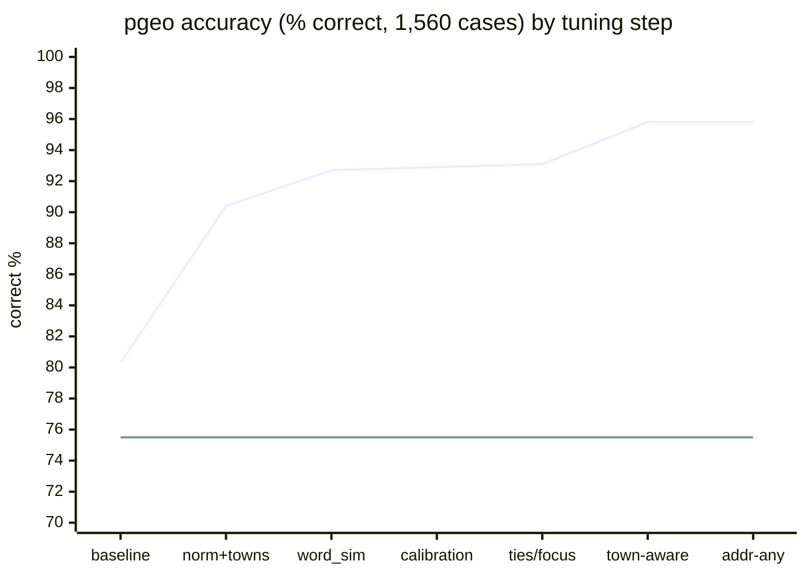

# Tuning Report

Everything tuned so far in this project, why, what it measurably changed, and how the
tuning is carried into later builds. Written 2026-09-18 (project 0.9.0, pgeo 0.5.0).

Companion documents: the change-by-change log with every measurement is
[PGEO_TUNING.md](PGEO_TUNING.md); accuracy tables and plots are in
[ACCURACY_RESULTS.md](ACCURACY_RESULTS.md); load-test method and results are in
[LOAD_TEST_PLAN.md](LOAD_TEST_PLAN.md) and LOAD_TEST_RESULTS.md (generated when the runs
finish).

## 1. Summary

| Measure | Before tuning | Now | Pelias (reference) |
|---------|---------------|-----|--------------------|
| Accuracy, 1,560 engine-independent cases (correct at rank 1) | 80.3% (first pgeo baseline) | **95.8%** | 75.5% |
| Venues / lakes and summits (exact names) | 81% / 86% (before the town-aware round) | **94% / 95%** | 68% / 41% |
| Queries with typos | 69% | **87%** | 30% |
| Misses handled (nothing, or low confidence) | not measured | **95%** | 41% |
| Fuzz level F1 / F2 (1 and 2 character errors) | 75% / 68% | **87% / 75%** | 34% / 10% |
| Confidence when right / when wrong (a wider gap is better) | 0.94 / 0.90 | **0.92 / 0.69** | 0.98 / 0.87 |
| Database size | 971 MB | **674 MB** | (Elasticsearch index larger; see load results) |
| Median query time, unloaded | 50-80 ms | ~40 ms (pure SQL) | ~13 ms |

The pure-SQL API (PostgREST) and the FastAPI application return identical results
(95.8%), so every gain below applies to both. What remains to be tuned is server-side
performance under load. The pgeo load tests ran overnight: every profile meets the 3-user
target, and reverse geocoding is the bottleneck to tune next (section 5).

### How accuracy moved, step by step



Second line: Pelias on the same set, for reference. The "word_sim" step also corrected the
test set (non-unique names qualified with a town, applied to both engines), so the jump
there is partly a fairer test, not only better ranking.

## 2. How the tuning was done

1. **A fixed, engine-independent test set.** 1,560 cases whose truth comes from the source
   data, not from either engine (addresses, towns, lakes and summits, venues, ZIPs, reverse,
   and 150 deliberate misses), each in exact, typo and variant form, plus 1,800 fuzz cases in
   six levels of corruption (F0 exact to F5 heavy). Method: [TESTING_GUIDE.md](TESTING_GUIDE.md).
2. **Failure analysis before any change.** Each round started from the failing cases: what
   was returned, what was expected, and which step of the query lost the right answer. Most
   fixes came from two or three shared root causes, not from case-by-case patches.
3. **One change at a time, measured on everything.** After each change: the full set, the
   fuzz rounds, and a per-category comparison listing every case that flipped. A change was
   kept only if overall accuracy did not drop and no category lost more than noise; speed
   gains that cost accuracy were rejected.
4. **Parity checks.** The same run through FastAPI (rule parser, libpostal service) and the
   pure-SQL API, to prove the engines stay identical.
5. **Recorded.** Every change, its reason and its numbers are in PGEO_TUNING.md; findings
   in PROJECT_LOG.md (F16-F30).

## 3. Ranking and search tuning (pgeo)

All of these live in `pgeo/sql/010_base.sql`, `pgeo/sql/040_functions.sql` and
`pgeo/sql/050_api.sql`, so every build applies them automatically (section 7).

### 3.1 Normalization

| Change | Problem it solved | Effect |
|--------|-------------------|--------|
| `norm()` expands abbreviations instead of shortening ("rd" -> "road", "mt" -> "mount", "st" -> "street", or "saint" before a name) | Typos in spelled-out words failed: similarity("mtn rd", "moountain rd") = 0.25, but ("mountain road", "moountain road") = 0.81 | Part of 80.3% -> 90.4%; typos 69% -> 73% |
| Name targets drop a trailing state or country ("portlnd me" -> "portlnd") | Overture venues literally named "Portland, ME" matched the state word better than the town did; "Portlnd, ME" returned no town | Town ranks first |
| Autocomplete: "st" before a word matches "street" or "saint"; the last token also matches its raw form as a prefix | "389 congress st portland" became "congress saint portland" and missed the address; "congress s" was locked to "south" | Address found while typing |

### 3.2 Candidate generation

| Change | Problem it solved | Effect |
|--------|-------------------|--------|
| Full text searched as a name unless an address was parsed; parser's name part and bare town also searched | A town outranked the exact address; libpostal misread odd input ("T4 R9 WELS") | Exact addresses rank 1 |
| Towns matched against both the WOF town and the postal city; ZIP only a fallback when an address is present | Structured search was 0% at rank 1 (the ZIP outranked the address) | Structured 0% -> 100% |
| Rule-parser street fallback when libpostal finds a number but no street | libpostal read misspelled streets as venue names | Part of addresses 68% -> 98% (same round as the rows above) |
| Interpolation and street fallback require street similarity >= 0.6 | Interpolation placed Park St on Pine St | Wrong interpolations removed |
| Name candidates ordered by distance to the focus point (or the queried town) before the 40/60-row limits | Hundreds of exact "Main Street" rows were cut to an arbitrary 40 before the focus boost applied, so Bangor's never competed | "main st" near Bangor returns Bangor |
| House number looked up on the three best street names in every town | The street step keeps 25 of ~150 (Church Street, town) pairs; only one had #21, so an ambiguous query looked unique at confidence 1.0 | Confidence when wrong 0.73 -> 0.69 |
| The bare town is a name target only when no name part was parsed | In "Subway, Cumberland Mills" the town matched exactly (confidence 1.0) and beat the venue | Part of 93.1% -> 95.8% |

### 3.3 Scoring and town agreement

| Change | Problem it solved | Effect |
|--------|-------------------|--------|
| Continuous town-agreement factor `0.4 + 0.6 x agree` | A wrong-town result kept most of its score | Part of 80.3% -> 90.4% |
| `word_similarity(query, name)`, not the reverse | One-word generic names ("Mountain", "Hill") matched any query containing the word | Lakes/summits 59% -> 77% |
| +0.1 x whole-string similarity as a tie-breaker | Every name containing "portland" tied at the same word_similarity | Closest name wins ties |
| **The queried town is a location, not only a name**: resolved to its point(s); agreement by distance (exp(-d / 6 km)) for places and venues; admin results auto-agree only for bare-town queries | Users qualify a place with a village or the nearest town, not the containing one ("Calvary Bible Church, Stratton" is in Eustis) | **Venues 81% -> 94%, lakes/summits 86% -> 95%**; overall 93.1% -> 95.8% |

### 3.4 Duplicates, ambiguity and confidence

| Change | Problem it solved | Effect |
|--------|-------------------|--------|
| Results deduplicated by label and layer group; OSM/OA duplicate addresses merged on number + street + town, preferring OpenAddresses | The same town or address appeared two or three times | Clean result lists |
| Ambiguity-aware confidence: when several distinct places (~1 km grid) tie with the top confidence, it is divided by 1 + 0.35 x (places - 1) | Wrong answers were mostly ties (70 of 85 wrong exact matches had 2+ equal candidates) | Confidence right/wrong 0.94/0.90 -> 0.91/0.70 |
| When a town is among the ties, only other towns count as rivals | "Portland, Maine" scored 0.59 because venues named "Portland" counted as rivals | Bare towns back to 1.0 |
| Lower-ranked results capped at the reduced top confidence | Confidence rose down the list after the ambiguity adjustment | Monotonic confidence |
| Autocomplete typo fallback deduplicated by label | Portland listed as locality and localadmin | One entry per place |

### 3.5 Parsing

| Option | Accuracy | Notes |
|--------|----------|-------|
| Rule parser (Python, and its PL/pgSQL port in the SQL API) | **95.8%** | Default in every profile; no model to load |
| libpostal service | 94.0% | Needs the ~2 GB libpostal model; its misreadings of misspelled input are the difference |
| libpostal extension | 90% (measured before the ranking rounds; to be re-run in T7) | Model loaded per backend unless preloaded |

Finding F26: the ~2 GB libpostal model buys nothing measurable on this test set, which
supports the goal of the fewest components (G6).

## 4. Build tuning (pgeo)

| Change | Why | Effect |
|--------|-----|--------|
| Enrichment runs with `maintenance_work_mem = 1GB`, `work_mem = 256MB`, 4 parallel workers (session settings in the loader) | Index builds and point-in-polygon joins dominate the build | Full Maine build ~13 min |
| Point-in-polygon hierarchy computed once at build time | Query-time joins to admin polygons would cost every search | Admin fields are plain columns |
| `street_name` keyed by both the WOF town and the postal city | Mail addresses use postal cities ("South Paris") | Town agreement works for both |
| Trigram (GIN), token (GIN), B-tree address and street indexes; partial indexes by layer | Each query path has its own index | All query paths index-backed |
| Staging tables and `feature_raw` dropped after the build | Not used at query time | 971 MB -> 674 MB |
| `VACUUM (ANALYZE)` after the swap (new in pgeo 0.5.0) | A fresh table has no visibility map, so index-only scans fall back to the heap | Index-only scans from the first query |
| Atomic schema swap (`pgeo_build` -> `pgeo`) with SQL functions and grants in the same transaction | No window where the API sees half a build | Zero-downtime rebuilds |

## 5. Server configuration tuning (pgeo)

Base settings (`pgeo/docker/db/postgresql.conf`, all builds):

| Setting | Value | Reason |
|---------|-------|--------|
| `random_page_cost` | 1.1 | SSD storage: random reads cost about the same as sequential |
| `effective_io_concurrency` | 200 | SSD |
| `jit` | off | Queries run in tens of milliseconds; JIT compilation would cost more than it saves (T4 will measure) |
| `max_parallel_workers_per_gather` | 0 | Concurrency comes from many small queries on separate backends (T1); intra-query parallelism is T2, not yet measured |
| `wal_level = minimal`, `synchronous_commit = off` | | The data is rebuildable; no replication; cheap bulk loads |
| `max_connections` | 40 | Pools are small (2 x cores + 2); headroom for the loader and admin sessions |

Per-machine settings are **profiles** (section 7). Their values are the ones the pgeo load
test measures (`tests/load/run_matrix_pgeo.py`, configurations Pmin, P1, P2, P4, PM). A
test keeps each profile in step with its load-test configuration.

| Profile | Machine | shared_buffers | effective_cache_size | work_mem | API workers x pool | PostgREST pool |
|---------|---------|----------------|----------------------|----------|--------------------|----------------|
| tiny | 1 vCPU, ~1.7 GB | 128MB | 384MB | 8MB | 1 x 4 | 4 |
| small | 1 vCPU, ~2 GB | 256MB | 768MB | 16MB | 1 x 4 | 4 |
| medium | 2 vCPU, ~2.6 GB | 384MB | 1GB | 16MB | 2 x 3 | 6 |
| large | 4 vCPU, ~3.2 GB | 512MB | 1536MB | 16MB | 4 x 2 | 10 |
| workstation | unconstrained | 1GB | 4GB | 32MB | 4 x 4 | 16 |

**Sizing rules** (used by `pgeo-tune auto` for machines between the tested sizes):
memory for the database = machine memory - 0.8 GB for the OS - the HTTP front end
(0.25 GB + 0.1 GB per vCPU); `shared_buffers` about 25% of that (PostgreSQL also uses the
OS page cache for the rest); `effective_cache_size` about 75%; connections = 2 x vCPUs + 2,
because the queries are CPU bound. The whole Maine database (674 MB) fits in the page cache
from the "small" profile up; "tiny" tests what happens when it does not.

**Measured** (pgeo load test 2026-09-18/19, run `20260918-2343-pgeo`; same k6 session,
SLOs and ramp as Pelias; "limit" = most concurrent users with every endpoint within its
SLO and < 1% errors):

| Profile (config) | Budget pure SQL / FastAPI | Limit, pure SQL | Limit, FastAPI | Broken at (SQL / FastAPI) | First endpoint over its SLO |
|------------------|---------------------------|-----------------|----------------|---------------------------|-----------------------------|
| tiny (Pmin) | 1.6 / 1.6 GB | 4 | 8 | 64 / 64 | reverse |
| small (P1) | 2.0 / 2.0 GB | 4 | 6 | 64 / 64 | reverse |
| medium (P2) | 2.5 / 2.7 GB | 24 | 32 | 96 / 128 | reverse |
| large (P4) | 3.0 / 3.3 GB | 64 | 96 | 192 / 256 | reverse |
| workstation (PM) | unconstrained | 128 | 192 | 384 / 512 | reverse (and autocomplete) |

- Every profile, including the smallest, meets the SLOs at the 3-user target; no errors
  and no out-of-memory kills in any run.
- **Reverse geocoding is the bottleneck everywhere**: at 3 users its p95 is 225-390 ms
  against a 400 ms target, while search is ~100 ms (target 750) and autocomplete ~40 ms
  (target 250). It is the next tuning target (below).
- FastAPI sustains more users than PostgREST at 2 and 4 vCPUs (32 vs 24, 96 vs 64); the
  database work is identical, so the difference is in the gateway (connection handling,
  per-request overhead). T10 examines it.
- The libpostal service arm (api-svc) needs ~1.95 GB more memory for the same limits; its
  P4 run was cut at 32 users (passing) when the Docker daemon on the test host was stopped
  at 04:32, a host event unrelated to the test.

Next experiments (plan in PGEO_TUNING.md):

| # | Experiment | Status |
|---|------------|--------|
| T1 | Workers and pool size vs cores | Measured (table above); pool sizing vs the reverse bottleneck next |
| T2 | Intra-query parallelism | Pending |
| T3 | Memory per budget | Measured: the 1.6 GB budget holds 3 users; database peak 240-680 MB |
| T4 | JIT on/off | Pending |
| T5 | GIN vs GiST trigram, partial indexes | Pending |
| T6 | Autocomplete depth and thresholds | Partly (st/saint, dedupe) |
| T7 | libpostal service vs extension vs rule parser | Accuracy done (rule parser best); memory/latency pending |
| T8 | pg_trgm/FTS vs ParadeDB pg_search | Pending |
| T9 | WOF vs Overture divisions | Pending |
| T10 | Prepared statements, PgBouncer; PostgREST vs FastAPI gap | Pending |
| T11 | Reverse geocoding: the bottleneck in every profile (KNN plus point-in-polygon admin lookup per request) | Next |

## 6. Pelias tuning (reference engine)

| Area | Change | Why |
|------|--------|-----|
| Synonyms | `projects/pelias_maine/synonyms/`: route/rte/rt, US Route 1 variants, mount/mt, fort/ft, UMaine/USM, Portland Jetport/PWM | Local abbreviations and names Pelias does not know |
| Memory floors (load-test profile "floor") | pip 0.7 GB (OOM-killed at 0.4 GB), interpolation 2.1 GB (crash-looped at 1.9 GB), placeholder 0.8 GB (OOM-killed at 0.4 GB at 12-16 users) | Found by the capacity trials |
| Memory "standard" profile | placeholder 0.5 GB -> 0.8 GB | OOM-killed at 128 users in C3, C4, C4a |
| Elasticsearch heap | 768 MB to 2 GB by configuration; 4 GB unconstrained | Sized per budget in the load matrix |

Result of the reruns with placeholder at 0.8 GB (run `20260918-2051`): no service was
OOM-killed or restarted in any configuration; limits 96 users (1 vCPU), 192 (2 vCPU),
384 (4 vCPU with 4 API workers). Recommended Pelias memory for a VM: the "standard"
profile with placeholder 0.8 GB (libpostal 2.2, interpolation 2.3, pip 0.9, Elasticsearch
2-3 GB with a 1-2 GB heap) plus ~0.8 GB for the OS: about 9.5-10.8 GB. Head-to-head with
pgeo: [ENGINE_COMPARISON.md](ENGINE_COMPARISON.md).

## 7. Applying the tuning to later builds

| Tuning | Lives in | Applied by | Manual step |
|--------|----------|------------|-------------|
| Ranking, search, normalization, confidence (section 3) | `pgeo/sql/*.sql` | every `pgeo-load build` (in the swap transaction) or `pgeo-load functions` | none |
| Build tuning (section 4) | `pgeo/src/pgeo/load/cli.py`, `pgeo/sql/030_enrich_index.sql` | every `pgeo-load build` | none |
| Server settings (section 5) | `pgeo/tuning/profiles/<name>.toml` | `pgeo-tune apply <name>` | choose the profile for the machine |
| API workers, pools, parser | same profile, `[frontend]` | `pgeo-tune apply <name>` | none |
| Proof that nothing was lost | `tests/accuracy/baseline.json` | `tests/accuracy/gate.py` | none |

One command does all of it and checks the result:

```bash
scripts/pgeo_rebuild.sh --profile medium          # build, tune, verify, gate
scripts/pgeo_rebuild.sh --skip-build              # re-tune and re-check an existing build
scripts/pgeo_rebuild.sh -f pgeo/compose.pinned.yml  # workstation: keep pgeo on its own cores
```

The steps, individually:

```bash
uv run --project pgeo pgeo-load build                  # data + all SQL tuning + VACUUM
uv run --project pgeo pgeo-tune list                   # profiles
uv run --project pgeo pgeo-tune apply medium           # server + front-end settings, restart, check
uv run --project pgeo pgeo-tune auto --cpus 8 --mem-gb 16 --write   # another machine size
uv run --project pgeo pgeo-tune show                   # what the database is actually using
uv run --project pgeo pgeo-tune verify                 # known answers through both APIs
uv run --project pgeo python tests/accuracy/run_accuracy.py --engine pgeo \
    --base http://127.0.0.1:4700 --label check --concurrency 2
uv run --project pgeo python tests/accuracy/gate.py data/accuracy/pgeo-check.json
```

What the checks prove:

- `pgeo-tune apply` reads the settings back from `pg_settings` after the restart and
  fails if any value did not take effect.
- `pgeo-tune verify` runs eight known-answer queries, one for each tuned path (exact
  address, bare town, misspelled town, venue qualified by a village, focus point,
  structured, autocomplete with "st", reverse), through FastAPI and the pure-SQL API.
- `gate.py` fails if overall accuracy drops more than 0.5 points, any category loses more
  than max(2 cases, 2%), confidence on wrong answers rises more than 0.05, or any fuzz
  level drops more than 2 points. The tolerances absorb data refreshes (a new OSM extract
  moves a few answers); a lost tuning change does not pass. Run against the results from
  just before the town-aware round, the gate reports five regressions (overall, venues,
  venue typos, lakes exact, lakes variant).

### Safety of the tuning tools

- Profile names must match `[a-z0-9-]` and name an existing file (no path traversal).
- Only allowlisted PostgreSQL settings are accepted, each with a value check (sizes, integer
  ranges, fixed choices). Settings that could run code (`archive_command`, arbitrary
  `shared_preload_libraries`) are rejected; tests cover this.
- Commands run without a shell (fixed argument lists). Secrets stay in `pgeo/pgeo.secrets`;
  the generated files (`active.conf`, `active.vars`) hold no secrets and are not tracked.

### Adding a new tuning change

1. Analyze the failing cases; change the SQL (or a profile).
2. `pgeo-load functions` (SQL) or `pgeo-tune apply <profile>` (settings).
3. Run the accuracy set and the fuzz set; compare per category (every flipped case).
4. Keep it only if the gate passes; if it improves on the baseline, record the new baseline
   (`gate.py ... --write-baseline`) in the same commit.
5. Log it in PGEO_TUNING.md, bump the pgeo version and add a pgeo/CHANGELOG.md entry.

## 8. Remaining failures and open items

66 of 1,560 cases fail (4.2%):

| Group | Cases | Assessment |
|-------|-------|------------|
| Misses that are not misses | 8 | "Death Valley" (x7) exists in Minot and "The Eiffel Tower of Paris, Maine" in South Paris: test-set errors, to be removed from the miss list when both engines are re-run |
| Lake and summit names with typos, often in the town too | 14 | The hardest class ("Sawyer Moumtain, Suoth Arm") |
| Genuinely ambiguous | ~10 | Chain branches, two towns with the same name, a ZIP in two towns; confidence is low, as intended |
| Short autocomplete prefixes without a focus point | 7 | "Nor", "Tim Ho", "Lighthouse": dozens of equal candidates; no engine can know which is meant |
| Other addresses, towns, venues | ~27 | Individual data issues (postal vs WOF town names, missing house numbers) |

Open: reverse-geocoding speed (T11, the measured bottleneck), the other performance experiments (section 5), final Pelias limits (section 6),
the test-set miss corrections, and a re-run of the libpostal extension arm.
